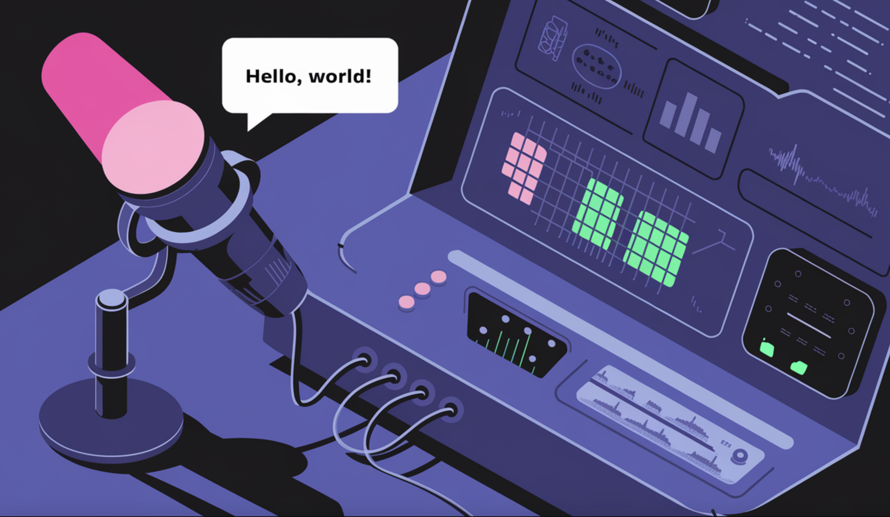

# Alibaba Speech Lab Releases ClearerVoice-Studio: An Open-Sourced Voice Processing Framework Supporting Speech Enhancement, Separation, and Target Speaker Extraction

> Clear communication can be surprisingly difficult in today’s audio environments. Background noise, overlapping conversations, and the mix of audio and video signals often create challenges that disrupt clarity and understanding. These issues impact everything from personal calls to professional meetings and even content production. Despite improvements in audio technology, most existing solutions struggle to consistently […]

Clear communication can be surprisingly difficult in today’s audio environments. Background noise, overlapping conversations, and the mix of audio and video signals often create challenges that disrupt clarity and understanding. These issues impact everything from personal calls to professional meetings and even content production. Despite improvements in audio technology, most existing solutions struggle to consistently provide high-quality results in complex scenarios. This has led to an increasing need for a framework that not only handles these challenges but also adapts to the demands of modern applications like virtual assistants, video conferencing, and creative media production.

To address these challenges, Alibaba Speech Lab has introduced **[ClearerVoice-Studi](https://huggingface.co/spaces/alibabasglab/ClearVoice)o**, a comprehensive voice processing framework. It brings together advanced features such as speech enhancement, speech separation, and audio-video speaker extraction. These capabilities work in tandem to clean up noisy audio, separate individual voices from complex soundscapes, and isolate target speakers by combining audio and visual data.

Developed by Tongyi Lab, ClearerVoice-Studio aims to support a wide range of applications. Whether it’s improving daily communication, enhancing professional audio workflows, or advancing research in voice technology, this framework offers a robust solution. The tools are accessible through platforms like [GitHub](https://github.com/modelscope/ClearerVoice-Studio) and [Hugging Face](https://huggingface.co/spaces/alibabasglab/ClearVoice), inviting developers and researchers to explore its potential.

### Technical Highlights

ClearerVoice-Studio incorporates several innovative models designed to tackle specific voice processing tasks. The **FRCRN model** is one of its standout components, recognized for its exceptional ability to enhance speech by removing background noise while preserving the natural quality of the audio. This model’s success was validated when it earned second place in the 2022 IEEE/INTER Speech DNS Challenge.

Another key feature is the **MossFormer series models**, which excel at separating individual voices from complex audio mixtures. These models have surpassed previous benchmarks, such as SepFormer, and have extended their utility to include speech enhancement and target speaker extraction. This versatility makes them particularly effective in diverse scenarios.

For applications requiring high fidelity, ClearerVoice-Studio offers a 48kHz speech enhancement model based on MossFormer2. This model ensures minimal distortion while effectively suppressing noise, delivering clear and natural sound even in challenging conditions. The framework also provides fine-tuning tools, enabling users to customize models for their specific needs. Additionally, its integration of audio-video modeling allows precise target speaker extraction, a critical feature for multi-speaker environments.

ClearerVoice-Studio has demonstrated strong results across benchmarks and real-world applications. The FRCRN model’s recognition in the IEEE/INTER Speech DNS Challenge highlights its capability to enhance speech clarity and suppress noise effectively. Similarly, the MossFormer models have proven their value by handling overlapping audio signals with precision.

The 48kHz speech enhancement model stands out for its ability to maintain audio fidelity while reducing noise. This ensures that speakers’ voices retain their natural tone, even after processing. Users can explore these capabilities through ClearerVoice-Studio’s open platforms, which offer tools for experimentation and deployment in varied contexts. This flexibility makes the framework suitable for tasks like professional audio editing, real-time communication, and AI-driven applications that require top-tier voice processing.

### Conclusion

ClearerVoice-Studio marks an important step forward in voice processing technology. By seamlessly integrating speech enhancement, separation, and audio-video speaker extraction, Alibaba Speech Lab has created a framework that addresses a wide array of audio challenges. Its thoughtful design and proven performance make it a valuable resource for developers, researchers, and professionals alike.

As the demand for high-quality audio continues to grow, ClearerVoice-Studio provides an efficient and adaptable solution. With its ability to tackle complex audio environments and deliver reliable results, it sets a promising direction for the future of voice technology.

---

Check out **the [GitHub Page](https://github.com/modelscope/ClearerVoice-Studio?tab=readme-ov-file) and [Demo on Hugging Face](https://huggingface.co/spaces/alibabasglab/ClearVoice).** All credit for this research goes to the researchers of this project. Also, don’t forget to follow us on **[Twitter](https://twitter.com/Marktechpost)** and join our **[Telegram Channel](https://github.com/XGenerationLab/XiYan-SQL)** and [**LinkedIn Gr**](https://www.linkedin.com/groups/13668564/)[**oup**](https://www.linkedin.com/groups/13668564/). **If you like our work, you will love our**[** newsletter..**](https://marktechpost-newsletter.beehiiv.com/subscribe) Don’t Forget to join our **[60k+ ML SubReddit](https://www.reddit.com/r/machinelearningnews/)**.

**🚨 [[Must Attend Webinar]: ‘Transform proofs-of-concept into production-ready AI applications and agents’](https://landing.deepset.ai/webinar-fast-track-your-llm-apps-deepset-haystack?utm_campaign=2412%20-%20webinar%20-%20Studio%20-%20Transform%20Your%20LLM%20Projects%20with%20deepset%20%26%20Haystack&utm_source=marktechpost&utm_medium=desktop-banner-ad) _(Promoted)_**
