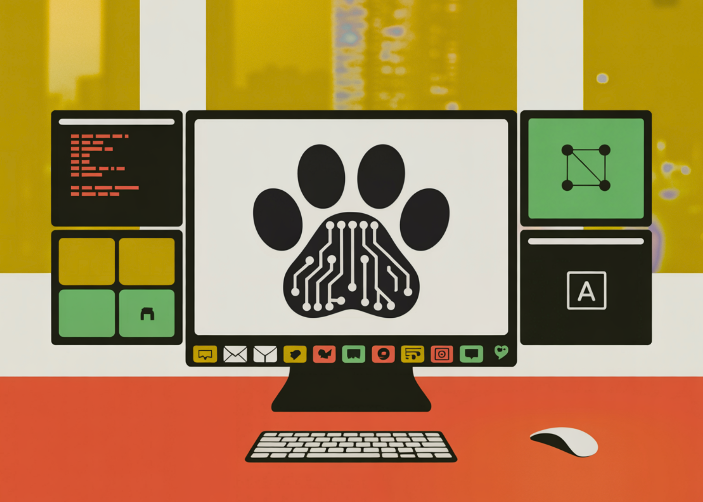

# Alibaba Team Open-Sources CoPaw: A High-Performance Personal Agent Workstation for Developers to Scale Multi-Channel AI Workflows and Memory

> As the industry moves from simple Large Language Model (LLM) inference toward autonomous agentic systems, the challenge for devs have shifted. It is no longer just about the model; it is about the environment in which that model operates. A team of researchers from Alibaba released CoPaw, an open-source framework designed to address this by […]

As the industry moves from simple Large Language Model (LLM) inference toward autonomous agentic systems, the challenge for devs have shifted. It is no longer just about the model; it is about the environment in which that model operates. A team of researchers from Alibaba released **CoPaw**, an open-source framework designed to address this by providing a standardized workstation for deploying and managing personal AI agents.

CoPaw is built on a technical stack comprising **AgentScope**, **AgentScope Runtime**, and **ReMe**. It functions as a bridge between high-level agent logic and the practical requirements of a personal assistant, such as persistent memory, multi-channel connectivity, and task scheduling.

### The Architecture: AgentScope and ReMe Integration

CoPaw is not a standalone bot but a workstation that orchestrates multiple components to create a cohesive ‘Agentic App.’

**The system relies on three primary layers:**

- **AgentScope:** The underlying framework that handles agent communication and logic.

- **AgentScope Runtime:** The execution environment that ensures stable operation and resource management.

- **ReMe (Memory Management):** A specialized module that handles both local and cloud-based memory. This allows agents to maintain ‘Long-Term Experience,’ solving the statelessness issue inherent in standard LLM APIs.

By leveraging **ReMe**, CoPaw allows users to control their data privacy while ensuring the agent retains context across different sessions and platforms. This persistent memory is what enables the workstation to adapt to a user’s specific workflows over time.

### Extensibility via the Skills System

A core feature of the CoPaw workstation is its **Skill Extension** capability. In this framework, a ‘Skill’ is a discrete unit of functionality—essentially a tool that the agent can invoke to interact with the external world.

Adding capabilities to CoPaw does not require modifying the core engine. Instead, CoPaw supports a **custom skill directory** where engineers can drop Python-based functions. These skills follow a standardized specification (influenced by `anthropics/skills`), allowing the agent to:

- Perform web scraping (e.g., summarizing Reddit threads or YouTube videos).

- Interact with local files and desktop environments.

- Query personal knowledge bases stored within the workstation.

- Manage calendars and email via natural language.

This design allows for the creation of **Agentic Apps**—complex workflows where the agent uses a combination of built-in skills and scheduled tasks to achieve a goal autonomously.

### Multi-Channel Connectivity (All-Domain Access)

One of the primary technical hurdles in personal AI is deployment across fragmented communication platforms. CoPaw addresses this through its **All-Domain Access** layer, which standardizes how agents interact with different messaging protocols.

**Currently, CoPaw supports integration with:**

- **Enterprise Platforms:** DingTalk and Lark (Feishu).

- **Social/Developer Platforms:** Discord, QQ, and iMessage.

This multi-channel support means that a developer can initialize a single CoPaw instance and interact with it from any of these endpoints. The workstation handles the translation of messages between the agent’s logic and the specific channel’s API, maintaining a consistent state and memory regardless of where the interaction occurs.

### Key Takeaways

- **Shift from Model to Workstation:** CoPaw moves the focus away from just the Large Language Model (LLM) and toward a structured **Workstation architecture**. It acts as a middleware layer that orchestrates the **AgentScope** framework, **AgentScope Runtime**, and external communication channels to turn raw LLM capabilities into a functional, persistent assistant.

- **Long-Term Memory via ReMe:** Unlike standard stateless LLM interactions, CoPaw integrates the **ReMe (Memory Management)** module. This allows agents to maintain ‘Long-Term Experience’ by storing user preferences and past task data either locally or in the cloud, enabling a personalized evolution of the agent’s behavior over time.

- **Extensible Python-Based ‘Skills’:** The framework uses a decoupled **Skill Extension system** based on the `anthropics/skills` specification. Developers can extend an agent’s utility by simply adding Python functions to a custom skill directory, allowing the agent to perform specific tasks like web scraping, file manipulation, or API integrations without modifying the core codebase.

- **All-Domain Multi-Channel Access:** CoPaw provides a unified interface for **cross-platform deployment**. A single workstation instance can be connected to enterprise tools (Lark, DingTalk) and social/developer platforms (Discord, QQ, iMessage), allowing the same agent and its memory to be accessed across different environments.

- **Automated Agentic Workflows:** By combining **Scheduled Tasks** with the skills system, CoPaw transitions from reactive chat to proactive automation. Devs can program ‘Agentic Apps’ that perform background operations—such as daily research synthesis or automated repository monitoring—and push results to the user’s preferred communication channel.

---

Check out the **[Repo here](https://github.com/agentscope-ai/CoPaw) and [Website](https://copaw.agentscope.io/). **Also, feel free to follow us on **[Twitter](https://x.com/intent/follow?screen_name=marktechpost)** and don’t forget to join our **[120k+ ML SubReddit](https://www.reddit.com/r/machinelearningnews/)** and Subscribe to **[our Newsletter](https://www.aidevsignals.com/)**. Wait! are you on telegram? **[now you can join us on telegram as well.](https://t.me/machinelearningresearchnews)**
