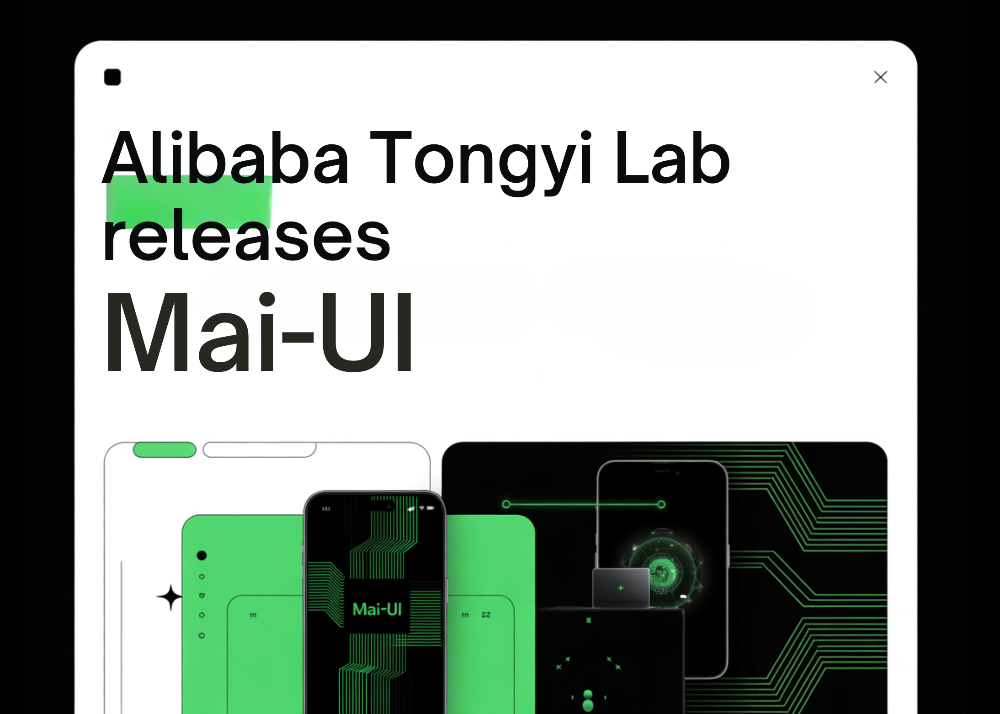

# Alibaba Tongyi Lab Releases MAI-UI: A Foundation GUI Agent Family that Surpasses Gemini 2.5 Pro, Seed1.8 and UI-Tars-2 on AndroidWorld

> Alibaba Tongyi Lab have released MAI-UI—a family of foundation GUI agents. It natively integrates MCP tool use, agent user interaction, device–cloud collaboration, and online RL, establishing state-of-the-art results in general GUI grounding and mobile GUI navigation, surpassing Gemini-2.5-Pro, Seed1.8, and UI-Tars-2 on AndroidWorld. The system targets three specific gaps that early GUI agents often ignore, […]

Alibaba Tongyi Lab have released MAI-UI—a family of foundation GUI agents. It natively integrates MCP tool use, agent user interaction, device–cloud collaboration, and online RL, establishing state-of-the-art results in general GUI grounding and mobile GUI navigation, surpassing Gemini-2.5-Pro, Seed1.8, and UI-Tars-2 on AndroidWorld. The system targets three specific gaps that early GUI agents often ignore, native agent user interaction, MCP tool integration, and a device cloud collaboration architecture that keeps privacy sensitive work on device while still using large cloud models when needed.

*https://arxiv.org/pdf/2512.22047*

### What is MAI-UI?

MAI-UI is a family of multimodal GUI agents built on Qwen3 VL, with model sizes 2B, 8B, 32B and 235B A22B. These models take natural language instructions and rendered UI screenshots as input, then output structured actions for a live Android environment.

The action space covers standard operations such as clicking elements, swiping, entering text and pressing system buttons. On top of that, MAI-UI introduces explicit actions for answering user questions, asking the user for clarification when the goal is ambiguous, and invoking external tools through MCP tool calls. This makes the agent capable of mixing GUI steps, direct language responses and API level operations in a single trajectory.

From a modeling perspective, MAI UI unifies three components, a self evolving navigation data pipeline that includes user interaction and MCP cases, an online RL framework that scales to hundreds of parallel Android instances and long contexts, and a native device cloud collaboration system that routes execution based on task state and privacy constraints.

*https://arxiv.org/pdf/2512.22047*

### GUI grounding with instruction reasoning

A core requirement for any GUI agent is grounding, mapping free form language like ‘open monthly billing settings’ to the correct on screen control. MAI-UI adopts a UI grounding strategy inspired by the earlier UI-Ins work on multi perspective instruction descriptions.

For each UI element, the training pipeline does not rely on a single caption. Instead, it generates several views of the same element, for example appearance, function, spatial location and user intent. These multiple instructions are treated as reasoning evidence for the model, which must select a point inside the correct bounding box. This reduces the impact of flawed or underspecified instructions, an issue that UI Ins quantified in existing datasets.

Ground truth boxes are collected from a mix of curated GUI datasets and large scale exploration of virtualized operating systems in containerized environments. Accessibility trees or OCR based parsers are used to align textual metadata with pixel locations. The training objective combines supervised fine tuning with a simple reinforcement signal that rewards correct point in box predictions and valid output format.

On public GUI grounding benchmarks, the resulting MAI-UI models reach 73.5 percent accuracy on ScreenSpot Pro with adaptive zoom in, 91.3 percent on MMBench GUI L2, 70.9 percent on OSWorld G and 49.2 percent on UI Vision. These numbers surpass Gemini 3 Pro and Seed1.8 on ScreenSpot Pro, and significantly outperform earlier open models on UI Vision.

*https://arxiv.org/pdf/2512.22047*

### Self evolving navigation data and MobileWorld

Navigation is harder than grounding because the agent must maintain context across many steps, possibly across applications, while interacting with the user and tools. To build robust navigation behavior, Tongyi Lab uses a self evolving data pipeline.

Seed tasks come from app manuals, hand designed scenarios and filtered public data. Parameters such as dates, limits and filter values are perturbed to expand coverage, and object level substitutions are applied while staying within the same use case. Multiple agents, together with human annotators, execute these tasks in Android environments to produce trajectories. A judge model then evaluates these trajectories, keeps the longest correct prefixes and filters out low quality segments. The next supervised training round uses the union of fresh human traces and high quality model rollouts, so the data distribution gradually follows the current policy.

MAI UI is evaluated on MobileWorld, a benchmark from the same team that includes 201 tasks across 20 applications. MobileWorld explicitly mixes three categories, pure GUI tasks, agent user interaction tasks that require natural language back and forth with the user, and MCP augmented tasks that require tool calls.

On MobileWorld, MAI UI reaches 41.7 percent overall success, a gain of about 20.8 points over the strongest end to end GUI baselines, and competitive with agentic frameworks that use larger proprietary planners such as Gemini 3 Pro.

### Online RL in containerized Android environments

Static data is not enough for robustness in dynamic mobile apps. MAI-UI therefore uses an online RL framework where the agent interacts directly with containerized Android Virtual Devices. The environment stack packs rooted AVD images and backend services into Docker containers, exposes standard reset and step operations over a service layer and supports more than 35 self hosted apps from e commerce, social, productivity and enterprise categories.

The RL setup uses an asynchronous on policy method, GRPO, implemented on top of verl. It combines tensor, pipeline and context parallelism, similar to Megatron style training, so that the model can learn from trajectories with up to 50 steps and very long token sequences. Rewards come from rule based verifiers or model judges that detect task completion, along with penalties for obvious looping behaviors. Only recent successful trajectories are kept in task specific buffers to stabilize learning.

Scaling this RL environment matters in practice. The research team shows that increasing the number of parallel GUI environments from 32 to 512 yields about 5.2 percentage points improvement on navigation success, and increasing the allowed environment steps from 15 to 50 adds about 4.3 points.

On the AndroidWorld benchmark, which evaluates online navigation in a standard Android app suite, the largest MAI UI variant reaches 76.7 percent success, surpassing UI-Tars-2, Gemini 2.5 Pro and Seed1.8.

### Key Takeaways

- **Unified GUI agent family for mobile**: MAI-UI is a Qwen3 VL based family of GUI agents from 2B to 235B A22B, designed specifically for real world mobile deployment with native agent user interaction, MCP tool calls and device cloud routing, rather than only static benchmarks.

- **State of the art GUI grounding and navigation**: The models reach 73.5 percent on ScreenSpot Pro, 91.3 percent on MMBench GUI L2, 70.9 percent on OSWorld G and 49.2 percent on UI Vision, and set a new 76.7 percent SOTA on AndroidWorld mobile navigation, surpassing UI Tars 2, Gemini 2.5 Pro and Seed1.8.

- **Realistic MobileWorld performance with interaction and tools**: On the MobileWorld benchmark with 201 tasks across 20 apps, MAI UI 235B A22B reaches 41.7 percent overall success, with 39.7 percent on pure GUI tasks, 51.1 percent on agent user interaction tasks and 37.5 percent on MCP augmented tasks, beating the best end to end GUI baseline Doubao 1.5 UI TARS at 20.9 percent.

- **Scalable online RL in containerized Android**: MAI-UI uses an online GRPO based RL framework over containerized Android environments, where scaling from 32 to 512 parallel environments gives about plus 5.2 points in navigation success and increasing the environment step budget from 15 to 50 gives another plus 4.3 points.

---

Check out the **[Paper](https://arxiv.org/pdf/2512.22047)** and **[GitHub Repo](https://github.com/Tongyi-MAI/MAI-UI)**. Also, feel free to follow us on **[Twitter](https://x.com/intent/follow?screen_name=marktechpost)** and don’t forget to join our **[100k+ ML SubReddit](https://www.reddit.com/r/machinelearningnews/)** and Subscribe to **[our Newsletter](https://www.aidevsignals.com/)**. Wait! are you on telegram? **[now you can join us on telegram as well.](https://t.me/machinelearningresearchnews)**
