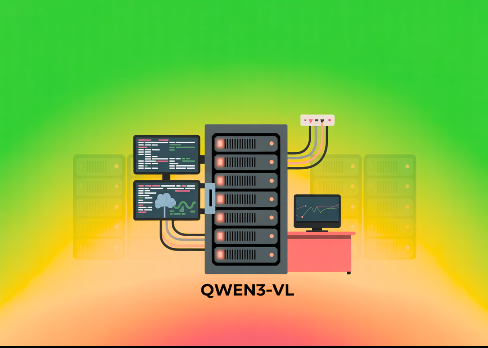

# Alibaba’s Qwen AI Releases Compact Dense Qwen3-VL 4B/8B (Instruct & Thinking) With FP8 Checkpoints

> Do you actually need a giant VLM when dense Qwen3-VL 4B/8B (Instruct/Thinking) with FP8 runs in low VRAM yet retains 256K→1M context and the full capability surface? Alibaba’s Qwen team has expanded its multimodal lineup with dense Qwen3-VL models at 4B and 8B scales, each shipping in two task profiles—Instruct and Thinking—plus FP8-quantized checkpoints for […]

Do you actually need a giant VLM when dense Qwen3-VL 4B/8B (Instruct/Thinking) with FP8 runs in low VRAM yet retains 256K→1M context and the full capability surface? **Alibaba’s Qwen team** has expanded its multimodal lineup with [**dense** Qwen3-VL models at **4B** and **8B** ](https://huggingface.co/collections/Qwen/qwen3-vl-68d2a7c1b8a8afce4ebd2dbe)scales, each shipping in two task profiles—**Instruct** and **Thinking**—plus **FP8-quantized** checkpoints for low-VRAM deployment. The drop arrives as a smaller, edge-friendly complement to the previously released 30B (MoE) and 235B (MoE) tiers and keeps the same capability surface: image/video understanding, OCR, spatial grounding, and GUI/agent control.

*https://github.com/QwenLM/Qwen3-VL/tree/main*

### What’s in the release?

**SKUs and variants**: The new additions comprise four dense models—**Qwen3-VL-4B** and **Qwen3-VL-8B**, each in **Instruct** and **Thinking** editions—alongside **FP8** versions of the 4B/8B Instruct and Thinking checkpoints. The official announcement explicitly frames these as “compact, dense” models with lower VRAM usage and full Qwen3-VL capabilities retained.

**Context length and capability surface**: The model cards list **native 256K** context with **expandability to 1M**, and document the full feature set: long-document and video comprehension, **32-language OCR**, 2D/3D spatial grounding, visual coding, and agentic GUI control on desktop and mobile. These attributes carry over to the new 4B/8B SKUs.

**Architecture notes**: Qwen3-VL highlights three core updates: **Interleaved-MRoPE** for robust positional encoding over time/width/height (long-horizon video), **DeepStack** for fusing multi-level ViT features and sharpening image–text alignment, and **Text–Timestamp Alignment** beyond T-RoPE for event localization in video. These design details appear in the new cards as well, signaling architectural continuity across sizes.

**Project timeline**: The Qwen3-VL GitHub “News” section records the publication of **Qwen3-VL-4B (Instruct/Thinking)** and **Qwen3-VL-8B (Instruct/Thinking)** on **Oct 15, 2025**, following earlier releases of the 30B MoE tier and organization-wide FP8 availability.

### FP8: deployment-relevant details

**Numerics and parity claim**: The **FP8** repositories state **fine-grained FP8 quantization with block size 128**, with **performance metrics nearly identical to the original BF16** checkpoints. For teams evaluating precision trade-offs on multimodal stacks (vision encoders, cross-modal fusion, long-context attention), having vendor-produced FP8 weights reduces re-quantization and re-validation burden.

**Tooling status**: The **4B-Instruct-FP8** card notes that **Transformers does not yet load these FP8 weights directly**, and recommends **vLLM** or **SGLang** for serving; the card includes working launch snippets. Separately, the **vLLM recipes** guide recommends FP8 checkpoints for H100 memory efficiency. Together, these point to immediate, supported paths for low-VRAM inference.

### Key Takeaways

- Qwen released **dense** Qwen3-VL **4B** and **8B** models, each in **Instruct** and **Thinking** variants, with **FP8** checkpoints.

- **FP8** uses fine-grained FP8 (block size **128**) with **near-BF16** metrics; **Transformers** loading is not yet supported—use **vLLM/SGLang**.

- Capability surface is preserved: **256K→1M** context, **32-language OCR**, spatial grounding, video reasoning, and GUI/agent control.

- Model Card-reported sizes: **Qwen3-VL-4B** ≈ **4.83B** params; **Qwen3-VL-8B-Instruct** ≈ **8.77B** params.

### Editorial Comments

Qwen’s decision to ship dense Qwen3-VL 4B/8B in both Instruct and Thinking forms with FP8 checkpoints is the practical part of the story: lower-VRAM, deployment-ready weights (fine-grained FP8, block size 128) and explicit serving guidance (vLLM/SGLang) makes it easily deployable. The capability surface—256K context expandable to 1M, 32-language OCR, spatial grounding, video understanding, and agent control—remains intact at these smaller scales, which matters more than leaderboard rhetoric for teams targeting single-GPU or edge budgets.

---

Check out the **[Model on Hugging Face](https://huggingface.co/collections/Qwen/qwen3-vl-68d2a7c1b8a8afce4ebd2dbe)** and **[GitHub Repo](https://github.com/QwenLM/Qwen3-VL/tree/main)**. Feel free to check out our **[GitHub Page for Tutorials, Codes and Notebooks](https://github.com/Marktechpost/AI-Tutorial-Codes-Included)**. Also, feel free to follow us on **[Twitter](https://x.com/intent/follow?screen_name=marktechpost)** and don’t forget to join our **[100k+ ML SubReddit](https://www.reddit.com/r/machinelearningnews/)** and Subscribe to **[our Newsletter](https://www.aidevsignals.com/)**. Wait! are you on telegram? **[now you can join us on telegram as well.](https://t.me/machinelearningresearchnews)**
