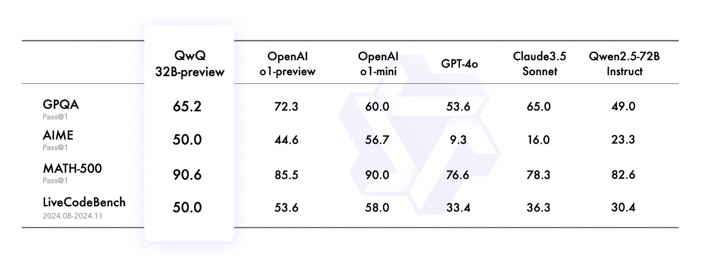

# Alibaba’s Qwen Team Releases QwQ-32B-Preview: An Open Model Comprising 32 Billion Parameters Specifically Designed to Tackle Advanced Reasoning Tasks

> Despite significant progress in artificial intelligence, current models continue to face notable challenges in advanced reasoning. Contemporary models, including sophisticated large language models such as GPT-4, often struggle to effectively manage complex mathematical problems, intricate coding tasks, and nuanced logical reasoning. These models exhibit limitations in generalizing beyond their training data and frequently require extensive […]

Despite significant progress in artificial intelligence, current models continue to face notable challenges in advanced reasoning. Contemporary models, including sophisticated large language models such as GPT-4, often struggle to effectively manage complex mathematical problems, intricate coding tasks, and nuanced logical reasoning. These models exhibit limitations in generalizing beyond their training data and frequently require extensive task-specific information to handle abstract problems. Such deficiencies hinder the development of AI systems capable of achieving human-level reasoning in specialized contexts, thus limiting their broader applicability and capacity to genuinely augment human capabilities in critical domains. To address these persistent issues, Alibaba’s Qwen team has introduced QwQ-32B-Preview—a model aimed at advancing AI reasoning capabilities.

Alibaba’s Qwen team has released QwQ-32B-Preview, an open-source AI model comprising 32 billion parameters specifically designed to tackle advanced reasoning tasks. As part of Qwen’s ongoing initiatives to enhance AI capabilities, QwQ-32B aims to address the inherent limitations of existing AI models in logical and abstract reasoning, which are essential for domains such as mathematics, engineering, and scientific research. Unlike its predecessors, QwQ-32B focuses on overcoming these foundational issues.

QwQ-32B-Preview is intended as a reasoning-centric AI capable of engaging with challenges that extend beyond straightforward textual interpretation. The “Preview” designation highlights its current developmental stage—a prototype open for feedback, improvement, and collaboration with the broader research community. The model has demonstrated promising preliminary results in areas that require a high degree of logical processing and problem-solving proficiency, including mathematical and coding challenges.

### Technical Specifications

QwQ-32B-Preview utilizes an architecture of 32 billion parameters, providing the computational depth needed for advanced reasoning that necessitates both significant memory and intricate understanding. This architecture integrates structured training data and multimodal inputs to optimize the model’s proficiency in navigating complex logical and numerical problems. A critical feature of QwQ-32B is its emphasis on domain-specific training, particularly focused on mathematical reasoning and programming languages, thereby equipping the model to undertake rigorous logical deduction and abstraction. Such capabilities make QwQ-32B particularly suitable for applications in technical research, coding support, and education.

The decision to make QwQ-32B-Preview open-source is another significant aspect of this release. By offering QwQ-32B through platforms like Hugging Face, Alibaba’s Qwen team fosters a spirit of collaboration and open inquiry within the AI research community. This approach allows researchers to experiment, identify limitations, and contribute to the ongoing development of the model, driving innovations in AI reasoning across diverse fields. The model’s flexibility and accessibility are expected to play a pivotal role in community-driven advancements and the creation of effective and adaptable AI solutions.

The release of QwQ-32B-Preview represents a substantial step forward in advancing AI reasoning capabilities. It offers a framework for the research community to collectively refine a model dedicated to enhancing logical depth and precision, areas in which many contemporary models are deficient. Early evaluations of QwQ-32B indicate its potential for tackling complex tasks, including mathematical problem-solving and programming challenges, thereby demonstrating its applicability in specialized fields such as engineering and data science. Moreover, the model’s open nature invites critical feedback, encouraging iterative refinement that could ultimately bridge the gap between sophisticated computational abilities and human-like reasoning.

### Conclusion

QwQ-32B-Preview marks a significant advancement in the evolution of AI, emphasizing not only language generation but also advanced reasoning. By releasing QwQ-32B, Alibaba’s Qwen team has provided the research community with an opportunity to collaborate on addressing some of AI’s most persistent challenges, particularly in logical, mathematical, and coding domains. The model’s 32 billion parameter architecture offers a robust foundation for addressing these complex tasks, and its initial success underscores its broader potential. Engaging the global research community in refining QwQ-32B fosters a collaborative effort to enhance AI’s reasoning capabilities, moving us closer to developing systems capable of understanding, analyzing, and solving problems in a manner that is both effective and sophisticated.

---

Check out **[the Model on Hugging Face](https://huggingface.co/Qwen/QwQ-32B-Preview), [Demo](https://huggingface.co/spaces/Qwen/QwQ-32B-preview), and [Details](https://qwenlm.github.io/blog/qwq-32b-preview/).** All credit for this research goes to the researchers of this project. Also, don’t forget to follow us on **[Twitter](https://twitter.com/Marktechpost)** and join our **[Telegram Channel](https://github.com/XGenerationLab/XiYan-SQL)** and [**LinkedIn Gr**](https://www.linkedin.com/groups/13668564/)[**oup**](https://www.linkedin.com/groups/13668564/). **If you like our work, you will love our**[** newsletter..**](https://marktechpost-newsletter.beehiiv.com/subscribe) Don’t Forget to join our **[55k+ ML SubReddit](https://www.reddit.com/r/machinelearningnews/)**.

**🎙️ 🚨 ‘[Evaluation of Large Language Model Vulnerabilities: A Comparative Analysis of Red Teaming Techniques’ Read the Full Report _(Promoted)_](https://hubs.li/Q02Y39sh0)**
