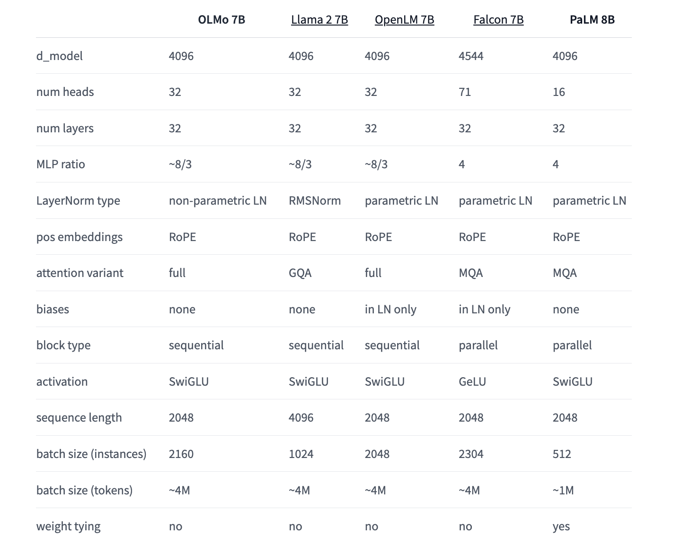

# Allen Institute for AI (AI2) Released a New Bundle of OLMo 1B and 7B Assets

> The Allen Institute for Artificial Intelligence AI2 has taken a significant step in advancing open-source language models with the launch of OLMo (Open Language Model). This framework provides researchers and academics with comprehensive access to data, training code, models, and evaluation tools, fostering collaborative research in the field of AI. The initial release includes multiple […]

The Allen Institute for Artificial Intelligence _AI2_ has taken a significant step in advancing open-source language models with the launch of**_ OLMo (Open Language Model)_**. This framework provides researchers and academics with comprehensive access to data, training code, models, and evaluation tools, fostering collaborative research in the field of AI. The initial release includes multiple variants of 7B-parameter models and a 1B-parameter model, all trained on at least 2 trillion tokens.

The OLMo framework is designed to empower the AI community to explore a wider range of research questions. It allows for investigating the impact of specific pretraining data subsets on downstream performance and exploring new pretraining methods. This open approach enables a deeper understanding of language models and their potential instabilities, contributing to the collective advancement of AI science.

Each OLMo model comes with a suite of resources, including full training data, model weights, training code, logs, and metrics. The framework also provides 500+ checkpoints per base model, adapted versions of the 7B model (OLMo-7B-Instruct and OLMo-7B-SFT), evaluation code, and fine-tuning capabilities. All components are released under the Apache 2.0 License, ensuring broad accessibility for the research community.

In developing OLMo, AI2 benchmarked against other open and partially open models, including EleutherAI’s Pythia Suite, MosaicML’s MPT models, TII’s Falcon models, and Meta’s Llama series. The evaluation results show that OLMo 7B is competitive with popular models like Llama 2, demonstrating comparable performance on many generative and reading comprehension tasks, while slightly lagging in some question-answering tasks.

AI2 has implemented a structured release process for OLMo and associated tools. Regular updates and new asset roll-outs are communicated through templated release notes shared on social media, the AI2 website, and via newsletter. This approach ensures that users stay informed about the latest developments in the OLMo ecosystem, including Dolma and other related tools.

The July 2024 release of OLMo brought significant improvements to both the 1B and 7B models. OLMo 1B July 2024 showed a 4.4-point increase in HellaSwag, among other evaluation improvements, thanks to an enhanced version of the Dolma dataset and staged training. Similarly, OLMo 7B July 2024 utilized the newest Dolma dataset and employed a two-staged curriculum, consistently adding 2-3 points of performance improvements.

Earlier releases, such as OLMo 7B April 2024 (formerly OLMo 7B 1.7), featured extended context length from 2048 to 4096 tokens and training on the Dolma 1.7 dataset. This version outperformed Llama 2-7B on MMLU and approached Llama 2-13B’s performance, even surpassing it on GSM8K. These incremental improvements demonstrate AI2’s commitment to continually enhancing the OLMo framework and models.

The OLMo release marks just the beginning of AI2’s ambitious plans for open language models. Work is already underway on various model sizes, modalities, datasets, safety measures, and evaluations for the OLMo family. AI2 aims to collaboratively build the world’s best open language model, inviting the AI community to participate in this innovative initiative.

In a nutshell, AI2 has launched OLMo, an open-source language model framework, providing researchers with comprehensive access to data, code, and evaluation tools. The initial release includes 7B and 1B parameter models trained on 2+ trillion tokens. OLMo aims to foster collaborative AI research, offering resources like full training data, model weights, and 500+ checkpoints per base model. Benchmarked against other open models, OLMo 7B shows competitive performance. AI2 has implemented a structured release process, with recent updates bringing significant improvements. This initiative marks the beginning of AI2’s ambitious plans to collaboratively build the world’s best open language model.

---

**Check out the [Details](https://allenai.org/olmo/release-notes), [OLMo 1B July 2024](https://huggingface.co/allenai/OLMo-1B-0724-hf), [OLMo 7B July 2024](https://huggingface.co/allenai/OLMo-7B-0724-hf)**, [**OLMo 7B July 2024 SFT**](https://huggingface.co/allenai/OLMo-7B-0724-SFT-hf),** [OLMo 7B July 2024 Instruct](https://huggingface.co/allenai/OLMo-7B-0724-Instruct-hf)**. All credit for this research goes to the researchers of this project. Also, don’t forget to follow us on **[Twitter](https://twitter.com/Marktechpost)** and join our **[Telegram Channel](https://pxl.to/at72b5j)** and [**LinkedIn Gr**](https://www.linkedin.com/groups/13668564/)[**oup**](https://www.linkedin.com/groups/13668564/). **If you like our work, you will love our**[** newsletter..**](https://marktechpost-newsletter.beehiiv.com/subscribe)

Don’t Forget to join our **[47k+ ML SubReddit](https://www.reddit.com/r/machinelearningnews/)**

**Find Upcoming [AI Webinars here](https://www.marktechpost.com/ai-webinars-list-llms-rag-generative-ai-ml-vector-database/)**

---

> [Arcee AI Released DistillKit: An Open Source, Easy-to-Use Tool Transforming Model Distillation for Creating Efficient, High-Performance Small Language Models](https://www.marktechpost.com/2024/08/01/arcee-ai-released-distillkit-an-open-source-easy-to-use-tool-transforming-model-distillation-for-creating-efficient-high-performance-small-language-models/)
