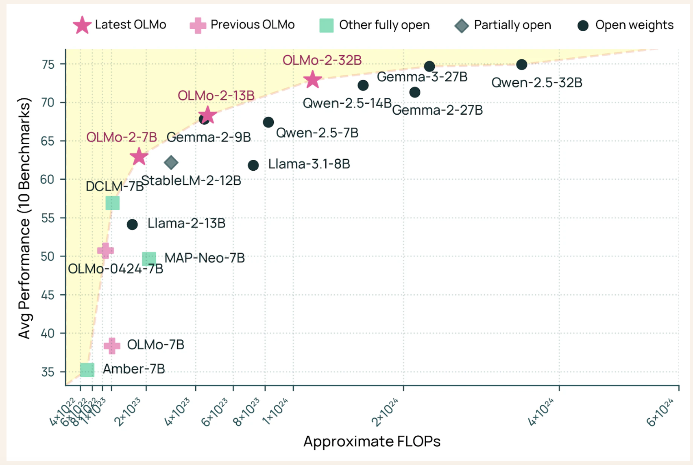

# Allen Institute for AI (AI2) Releases OLMo 32B: A Fully Open Model to Beat GPT 3.5 and GPT-4o mini on a Suite of Multi-Skill Benchmarks

> The rapid evolution of artificial intelligence (AI) has ushered in a new era of large language models (LLMs) capable of understanding and generating human-like text. However, the proprietary nature of many of these models poses challenges for accessibility, collaboration, and transparency within the research community. Additionally, the substantial computational resources required to train such models […]

The rapid evolution of artificial intelligence (AI) has ushered in a new era of large language models (LLMs) capable of understanding and generating human-like text. However, the proprietary nature of many of these models poses challenges for accessibility, collaboration, and transparency within the research community. Additionally, the substantial computational resources required to train such models often limit participation to well-funded organizations, thereby hindering broader innovation.​

Addressing these concerns, the Allen Institute for AI (AI2) has introduced OLMo 2 32B, the latest and most advanced model in the OLMo 2 series. This model distinguishes itself as the first fully open model to surpass GPT-3.5 Turbo and GPT-4o mini across a suite of widely recognized, multi-skill academic benchmarks. By making all data, code, weights, and training details freely available, AI2 promotes a culture of openness and collaboration, enabling researchers worldwide to build upon this work.

OLMo 2 32B’s architecture comprises 32 billion parameters, reflecting a significant scaling from its predecessors. The training process was meticulously structured in two primary phases: pretraining and mid-training. During pretraining, the model was exposed to approximately 3.9 trillion tokens from diverse sources, including DCLM, Dolma, Starcoder, and Proof Pile II, ensuring a comprehensive understanding of language patterns. The mid-training phase utilized the Dolmino dataset, which consists of 843 billion tokens curated for quality, encompassing educational, mathematical, and academic content. This phased approach ensured that OLMo 2 32B developed a robust and nuanced grasp of language.

A notable aspect of OLMo 2 32B is its training efficiency. The model achieved performance levels comparable to leading open-weight models while utilizing only a fraction of the computational resources. Specifically, it required approximately one-third of the training compute compared to models like Qwen 2.5 32B, highlighting AI2’s commitment to resource-efficient AI development. ​

In benchmark evaluations, OLMo 2 32B demonstrated impressive results. It matched or exceeded the performance of models such as GPT-3.5 Turbo, GPT-4o mini, Qwen 2.5 32B, and Mistral 24B. Furthermore, it approached the performance levels of larger models like Qwen 2.5 72B and Llama 3.1 and 3.3 70B. These assessments spanned various tasks, including Massive Multitask Language Understanding (MMLU), mathematics problem-solving (MATH), and instruction-following evaluations (IFEval), underscoring the model’s versatility and competence across diverse linguistic challenges. ​

The release of OLMo 2 32B signifies a pivotal advancement in the pursuit of open and accessible AI. By providing a fully open model that not only competes with but also surpasses certain proprietary models, AI2 exemplifies how thoughtful scaling and efficient training methodologies can lead to significant breakthroughs. This openness fosters a more inclusive and collaborative environment, empowering researchers and developers globally to engage with and contribute to the evolving landscape of artificial intelligence.

---

Check out **_the [Technical Details](https://allenai.org/blog/olmo2-32B), [HF Project](https://huggingface.co/allenai/OLMo-2-0325-32B-Instruct) and [GitHub Page](https://github.com/allenai/OLMo-core)._** All credit for this research goes to the researchers of this project. Also, feel free to follow us on **[Twitter](https://x.com/intent/follow?screen_name=marktechpost)** and don’t forget to join our **[80k+ ML SubReddit](https://www.reddit.com/r/machinelearningnews/)**.
