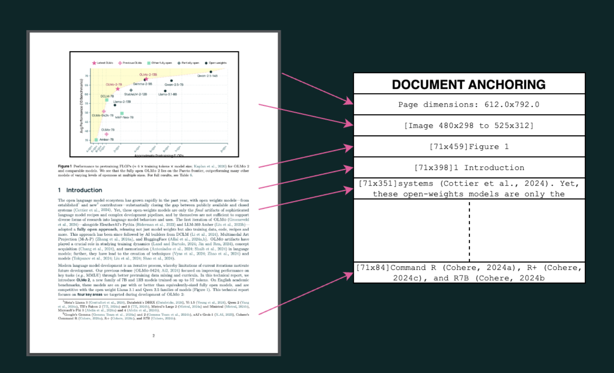

# Allen Institute for AI Released olmOCR: A High-Performance Open Source Toolkit Designed to Convert PDFs and Document Images into Clean and Structured Plain Text

> Access to high-quality textual data is crucial for advancing language models in the digital age. Modern AI systems rely on vast datasets of token trillions to improve their accuracy and efficiency. While much of this data is from the internet, a significant portion exists in formats such as PDFs, which pose unique challenges for content […]

Access to high-quality textual data is crucial for advancing language models in the digital age. Modern AI systems rely on vast datasets of token trillions to improve their accuracy and efficiency. While much of this data is from the internet, a significant portion exists in formats such as PDFs, which pose unique challenges for content extraction. Unlike web pages, which are structured for easy parsing, PDFs prioritize visual layout over logical text flow, making it difficult to extract coherent textual representations. Traditional optical character recognition (OCR) tools have attempted to address these challenges, but their limitations have hindered large-scale adoption in language model training.

A main issue with PDF processing is that these documents store information optimally for visual presentation rather than logical reading order. Many PDFs encode text at the character level, recording each letter’s position and font attributes without preserving sentence structure. This makes it difficult to reconstruct a coherent narrative in multi-column layouts or documents with embedded tables, images, and equations. Also, scanned PDFs introduce additional challenges, as they contain text in image format rather than machine-readable characters. Extracting structured and meaningful content from such documents requires specialized tools to understand textual and visual elements.

Several approaches have previously been developed to tackle the problem of extracting text from PDFs. Early OCR technologies like Tesseract provided basic character recognition but struggled with complex layouts. More recent methods include pipeline-based systems, which combine extraction into multiple machine-learning tasks, such as section segmentation and table recognition. These include tools like Grobid and VILA, which are designed for scientific papers. On the other hand, end-to-end models like Nougat and GOT Theory 2.0 attempt to convert entire PDF pages into readable text using [deep learning](https://www.marktechpost.com/2025/01/15/what-is-deep-learning-2/). However, many systems are expensive, unreliable, or inefficient for large-scale applications.

Researchers at the Allen Institute for AI introduced [**olmOCR**](http://github.com/allenai/olmocr), an open-source Python toolkit designed to efficiently convert PDFs into structured plain text while preserving logical reading order. This toolkit integrates text-based and visual information, allowing for superior extraction accuracy compared to conventional OCR methods. The system is built upon a 7-billion-parameter vision language model (VLM), which has been fine-tuned on a dataset of 260,000 PDF pages collected from over 100,000 unique documents. Unlike traditional OCR approaches, which treat PDFs as mere images, olmOCR leverages the embedded text and its spatial positioning to generate high-fidelity structured content. The system is optimized for large-scale batch processing, enabling cost-efficient conversion of vast document repositories. One of its most notable advantages is its ability to process one million PDF pages for just $190 USD, 32 times cheaper than GPT-4o, where the same task would cost $6,200 USD.

*[**Image Source**](https://olmocr.allenai.org/papers/olmocr.pdf)*

The core innovation behind olmOCR is document anchoring, a technique that combines textual metadata with image-based analysis. Unlike end-to-end OCR models that rely solely on rasterized images, this method extracts textual elements directly from the PDF’s embedded data. It aligns them with their corresponding visual representations. This enhances the model’s ability to recognize complex document structures, reducing errors and improving overall readability. The extracted content is formatted using Markdown, preserving structured elements like headings, lists, tables, and equations. Also, the system employs fine-tuning techniques to improve extraction accuracy, utilizing a dataset curated specifically for diverse document layouts. The model training process involved 10,000 optimization steps, using a four-batch size and an adaptive learning rate of 1e-6. olmOCR has been designed to operate seamlessly with inference frameworks such as vLLM and SGLang.

*[**Image Source**](https://olmocr.allenai.org/papers/olmocr.pdf)*

The system achieves an alignment score of 0.875 with its teacher model, surpassing smaller-scale models like GPT-4o Mini. In direct comparison with other OCR tools, olmOCR consistently outperforms competitors in accuracy and efficiency. When subjected to human evaluation, the system received the highest ELO rating among leading PDF extraction methods. Also, when olmOCR-extracted text was used for mid-training on the OLMo-2-1124-7B language model, it resulted in an average accuracy improvement of 1.3 percentage points across multiple AI benchmark tasks. Specific performance gains were observed in datasets such as ARC Challenge and DROP, where olmOCR-based training data contributed to notable improvements in language model comprehension.

**Several Key Takeaways from the Research on olmOCR include:**

- olmOCR is built on a 7-billion-parameter vision-language model and fine-tuned on 260,000 pages from 100,000 PDFs, ensuring robust extraction across diverse document types.

- Utilizes document anchoring to combine textual metadata with image-based information, significantly improving the extraction accuracy for structured content.

- Processes one million PDF pages for just $190, compared to $6,200 using GPT-4o, making it 32 times more cost-efficient for large-scale applications.

- Achieves an alignment score of 0.875, surpassing smaller models and demonstrating superior accuracy in reconstructing logical reading order.

- It outperforms traditional OCR tools in structured data recognition and large-scale processing and has the highest ELO score in human evaluations.

- Improves language model training by increasing accuracy by 1.3 percentage points on AI benchmark datasets like ARC Challenge and DROP.

- Compatible with inference engines like vLLM and SGLang, allowing flexible deployment on various hardware setups.

---

Check out **_the [Training and toolkit code](https://github.com/allenai/olmocr) and [Hugging Face collection](https://huggingface.co/collections/allenai/olmocr-67af8630b0062a25bf1b54a1)._** All credit for this research goes to the researchers of this project. Also, feel free to follow us on **[Twitter](https://x.com/intent/follow?screen_name=marktechpost)** and don’t forget to join our **[80k+ ML SubReddit](https://www.reddit.com/r/machinelearningnews/)**.

**🚨 [Recommended Read- LG AI Research Releases NEXUS: An Advanced System Integrating Agent AI System and Data Compliance Standards to Address Legal Concerns in AI Datasets](https://www.marktechpost.com/2025/02/16/lg-ai-research-releases-nexus-an-advanced-system-integrating-agent-ai-system-and-data-compliance-standards-to-address-legal-concerns-in-ai-datasets/)**
