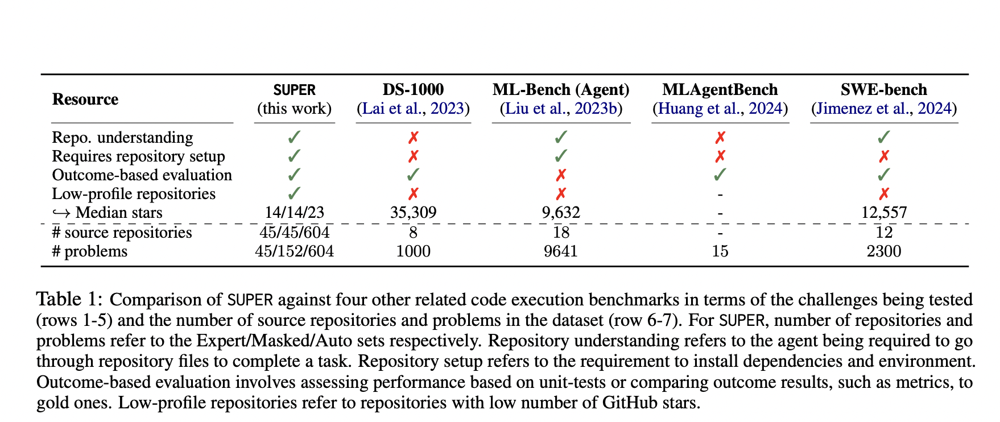

# Allen Institute for AI Researchers Propose SUPER: A Benchmark for Evaluating the Ability of LLMs to Set Up and Execute Research Experiments

> Artificial Intelligence (AI) and Machine Learning (ML) have been transformative in numerous fields, but a significant challenge remains in the reproducibility of experiments. Researchers frequently rely on previously published work to validate or extend their findings. This process often involves running complex code from research repositories. However, setting up these repositories, configuring the environment, and […]

Artificial Intelligence (AI) and Machine Learning (ML) have been transformative in numerous fields, but a significant challenge remains in the reproducibility of experiments. Researchers frequently rely on previously published work to validate or extend their findings. This process often involves running complex code from research repositories. However, setting up these repositories, configuring the environment, and resolving various technical issues, such as outdated dependencies and bugs, are time-consuming and require expertise. As AI continues to evolve, researchers are looking for ways to automate these tasks to expedite scientific discovery.

One of the critical problems in reproducing experiments from research repositories is that these repositories are often not well-maintained. Poor documentation and outdated code make it difficult for other researchers to run the experiments as intended. This issue is further complicated by the various platforms and tools required to run different experiments. Researchers spend a considerable amount of time installing dependencies, troubleshooting compatibility issues, and configuring the environment to meet the specific needs of each experiment. Addressing this problem could significantly improve the pace at which discoveries are validated and expanded upon in the scientific community.

Historically, methods for handling the setup and execution of research repositories have been largely manual. Researchers must possess a deep understanding of the codebase and the specific domain of study to resolve issues arising during experiment replication. While some tools help manage dependencies or troubleshoot errors, these are limited in scope and effectiveness. Recent advancements in large language models (LLMs) have shown potential in automating this process, such as generating code or commands to resolve issues. However, there is currently no robust method for evaluating LLMs’ ability to handle real-world research repositories’ complex and often incomplete nature.

Researchers from the Allen Institute for AI and the University of Washington introduced SUPER—a benchmark designed to evaluate the ability of LLMs to set up and execute tasks from research repositories. Unlike other tools focusing on popular and well-maintained repositories, SUPER emphasizes real-world challenges researchers face using lower-profile repositories that are not always well-documented. The benchmark includes a variety of scenarios that mimic the types of obstacles researchers regularly encounter. By testing LLMs on these tasks, SUPER provides a comprehensive framework for assessing how well these models can support research tasks that involve code execution and troubleshooting.

The SUPER benchmark is divided into three distinct sets:

- The **Expert** set includes 45 manually curated problems based on real research tasks.

- The **Masked** set breaks down these problems into 152 smaller challenges focusing on specific technical issues like configuring a trainer or resolving runtime exceptions.

- The **Auto** set consists of 604 automatically generated tasks designed for large-scale development and fine-tuning of models.

Each problem set introduces different challenges, from installing dependencies and configuring hyperparameters to troubleshooting errors and reporting metrics. The benchmark assesses task success, partial progress, and the accuracy of the generated solutions, offering a detailed evaluation of the model’s capabilities.

The performance evaluation of LLMs on the SUPER benchmark reveals significant limitations in current models. The most advanced model tested, GPT-4o, successfully solved only 16.3% of the end-to-end tasks in the Expert set and 46.1% of the sub-problems in the Masked set. These results highlight the difficulties in automating the setup and execution of research experiments, as even the best-performing models struggle with many tasks. Furthermore, open-source models lag significantly behind, completing a smaller percentage of tasks. The Auto set showed similar performance patterns, suggesting that the challenges observed in the curated sets are consistent across various problems. The evaluation also highlighted that agents perform better on specific tasks, such as resolving dependency conflicts or addressing runtime errors, than on more complex tasks, like configuring new datasets or modifying training scripts.

In conclusion, the SUPER benchmark sheds light on the current limitations of LLMs in automating research tasks. Despite recent advancements, there is still a considerable gap between the capabilities of these models and the complex needs of researchers working with real-world repositories. The results from the SUPER benchmark indicate that while LLMs can be useful in resolving well-defined technical issues, they are not yet capable of handling the full range of tasks required for the complete automation of research experiments. This benchmark provides a valuable resource for the AI community to measure and improve upon, offering a path forward for the development of more sophisticated tools that could one day fully support scientific research.

- 

---

Check out the **[Paper](https://arxiv.org/abs/2409.07440v1)**, **[GitHub](https://github.com/allenai/super-benchmark?tab=readme-ov-file)**, and **[HF Page](https://huggingface.co/datasets/allenai/super)**. All credit for this research goes to the researchers of this project. Also, don’t forget to follow us on **[Twitter](https://twitter.com/Marktechpost)** and join our **[Telegram Channel](https://pxl.to/at72b5j)** and [**LinkedIn Gr**](https://www.linkedin.com/groups/13668564/)[**oup**](https://www.linkedin.com/groups/13668564/). **If you like our work, you will love our**[** newsletter..**](https://marktechpost-newsletter.beehiiv.com/subscribe)

Don’t Forget to join our **[50k+ ML SubReddit](https://www.reddit.com/r/machinelearningnews/)**

**[⏩ ⏩ FREE AI WEBINAR: ‘SAM 2 for Video: How to Fine-tune On Your Data’ (Wed, Sep 25, 4:00 AM – 4:45 AM EST)](https://encord.com/webinar/sam2-for-video/?utm_medium=affiliate&utm_source=newsletter&utm_campaign=marktechpost&utm_content=sam2video)**
