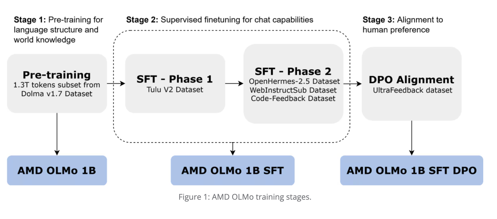

# AMD Open Sources AMD OLMo: A Fully Open-Source 1B Language Model Series that is Trained from Scratch by AMD on AMD Instinct™ MI250 GPUs

> In the rapidly evolving world of artificial intelligence and machine learning, the demand for powerful, flexible, and open-access solutions has grown immensely. Developers, researchers, and tech enthusiasts frequently face challenges when it comes to leveraging cutting-edge technology without being constrained by closed ecosystems. Many of the existing language models, even the most popular ones, often […]

In the rapidly evolving world of artificial intelligence and machine learning, the demand for powerful, flexible, and open-access solutions has grown immensely. Developers, researchers, and tech enthusiasts frequently face challenges when it comes to leveraging cutting-edge technology without being constrained by closed ecosystems. Many of the existing language models, even the most popular ones, often come with proprietary limitations and licensing restrictions or are hosted in environments that inhibit the kind of granular control developers seek. These issues often present roadblocks for those who are passionate about experimenting, extending, or deploying models in specific ways that benefit their individual use cases. This is where open-source solutions become a pivotal enabler, offering autonomy and democratizing access to powerful AI tools.

AMD recently released AMD OLMo: a fully open-source 1B model series trained from scratch by AMD on AMD Instinct™ MI250 GPUs. The AMD OLMo’s release marks AMD’s first substantial entry into the open-source AI ecosystem, offering an entirely transparent model that caters to developers, data scientists, and businesses alike. AMD OLMo-1B-SFT (Supervised Fine-Tuned) has been specifically fine-tuned to enhance its capabilities in understanding instructions, improving both user interactions and language understanding. This model is designed to support a wide variety of use cases, from basic conversational AI tasks to more complex NLP problems. The model is compatible with standard machine learning frameworks like PyTorch and TensorFlow, ensuring easy accessibility for users across different platforms. This step represents AMD’s commitment to fostering a thriving AI development community, leveraging the power of collaboration, and taking a definitive stance in the open-source AI domain.

The technical details of the AMD OLMo model are particularly interesting. Built with a transformer architecture, the model boasts a robust 1 billion parameters, providing significant language understanding and generation capabilities. It has been trained on a diverse dataset to optimize its performance for a wide array of natural language processing (NLP) tasks, such as text classification, summarization, and dialogue generation. The fine-tuning of instruction-following data further enhances its suitability for interactive applications, making it more adept at understanding nuanced commands. Additionally, AMD’s use of high-performance Radeon Instinct GPUs during the training process demonstrates their hardware’s capability to handle large-scale deep learning models. The model has been optimized for both accuracy and computational efficiency, allowing it to run on consumer-level hardware without the hefty resource requirements often associated with proprietary large-scale language models. This makes it an attractive option for both enthusiasts and smaller enterprises that cannot afford expensive computational resources.

The significance of this release cannot be overstated. One of the main reasons this model is important is its potential to lower the entry barriers for AI research and innovation. By making a fully open 1B-parameter model available to everyone, AMD is providing a critical resource that can empower developers across the globe. The AMD OLMo-1B-SFT, with its instruction-following fine-tuning, allows for enhanced usability in various real-world scenarios, including chatbots, customer support systems, and educational tools. Initial benchmarks indicate that the AMD OLMo performs competitively with other well-known models of similar scale, demonstrating strong performance across multiple NLP benchmarks, including GLUE and SuperGLUE. The availability of these results in an open-source setting is crucial as it enables independent validation, testing, and improvement by the community, ensuring transparency and promoting a collaborative approach to pushing the boundaries of what such models can achieve.

In conclusion, AMD’s introduction of a fully open-source 1B language model is a significant milestone for the AI community. This release not only democratizes access to advanced language modeling capabilities but also provides a practical demonstration of how powerful AI can be made more inclusive. AMD’s commitment to open-source principles has the potential to inspire other tech giants to contribute similarly, fostering a richer ecosystem of tools and solutions that benefit everyone. By offering a powerful, cost-effective, and flexible tool for language understanding and generation, AMD has successfully positioned itself as a key player in the future of AI innovation.

---

Check out the** [Model on Hugging Face](https://huggingface.co/amd/AMD-OLMo-1B-SFT) and [Details here](https://www.amd.com/en/developer/resources/technical-articles/introducing-the-first-amd-1b-language-model.html)**. All credit for this research goes to the researchers of this project. Also, don’t forget to follow us on **[Twitter](https://twitter.com/Marktechpost)** and join our **[Telegram Channel](https://pxl.to/at72b5j)** and [**LinkedIn Gr**](https://www.linkedin.com/groups/13668564/)[**oup**](https://www.linkedin.com/groups/13668564/). **If you like our work, you will love our**[** newsletter..**](https://marktechpost-newsletter.beehiiv.com/subscribe) Don’t Forget to join our **[55k+ ML SubReddit](https://www.reddit.com/r/machinelearningnews/)**.

**[[Trending](https://www.marktechpost.com/2024/10/28/llmware-introduces-model-depot-an-extensive-collection-of-small-language-models-slms-for-intel-pcs/)] ****[LLMWare Introduces Model Depot: An Extensive Collection of Small Language Models (SLMs) for Intel PCs](https://www.marktechpost.com/2024/10/28/llmware-introduces-model-depot-an-extensive-collection-of-small-language-models-slms-for-intel-pcs/)**
