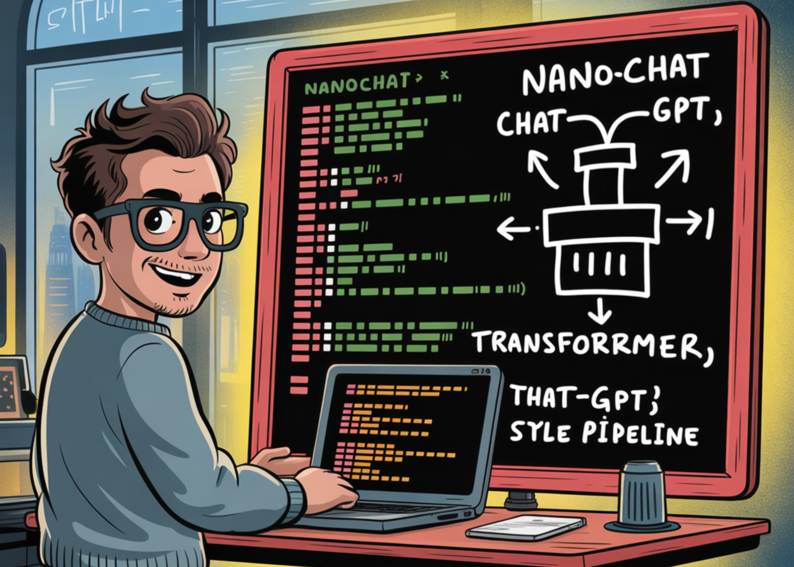

# Andrej Karpathy Releases ‘nanochat’: A Minimal, End-to-End ChatGPT-Style Pipeline You Can Train in ~4 Hours for ~$100

> Andrej Karpathy has open-sourced nanochat, a compact, dependency-light codebase that implements a full ChatGPT-style stack—from tokenizer training to web UI inference—aimed at reproducible, hackable LLM training on a single multi-GPU node. The repo provides a single-script “speedrun” that executes the full loop: tokenization, base pretraining, mid-training on chat/multiple-choice/tool-use data, Supervised Finetuning (SFT), optional RL on […]

[Andrej Karpathy has open-sourced **nanochat**](https://x.com/karpathy/status/1977755427569111362?s=43&t=wGmgWgsrh94uK2vjEBUYDA), a compact, dependency-light codebase that implements a [full ChatGPT-style stack—from tokenizer training to web UI inference](https://github.com/karpathy/nanochat/discussions/1)—aimed at reproducible, hackable LLM training on a single multi-GPU node.

The [repo provides a single-script “speedrun”](https://github.com/karpathy/nanochat) that executes the full loop: tokenization, base pretraining, mid-training on chat/multiple-choice/tool-use data, Supervised Finetuning (SFT), optional RL on GSM8K, evaluation, and serving (CLI + ChatGPT-like web UI). The recommended setup is an **8×H100** node; at ~$24/hour, the 4-hour speedrun lands near **$100**. A post-run `report.md` summarizes metrics (CORE, ARC-E/C, MMLU, GSM8K, HumanEval, ChatCORE).

### Tokenizer and data path

- **Tokenizer**: custom Rust BPE (built via Maturin), with a 65,536-token vocab; training uses **FineWeb-EDU** shards (re-packaged/shuffled for simple access). The walkthrough reports ~4.8 characters/token compression and compares against GPT-2/4 tokenizers.

- **Eval bundle**: a curated set for **CORE** (22 autocompletion datasets like HellaSwag, ARC, BoolQ, etc.), downloaded into `~/.cache/nanochat/eval_bundle`.

### Model, scaling, and “speedrun” target

The speedrun config trains a **depth-20 Transformer** (≈560M params with 1280 hidden channels, 10 attention heads of dim 128) for ~11.2B tokens consistent with Chinchilla-style scaling (params × ~20 tokens). The author estimates this run as a **~4e19 FLOPs capability model**. Training uses **Muon** for matmul parameters and **AdamW** for embeddings/unembeddings; loss is reported in **bits-per-byte (bpb)** to be tokenizer-invariant.

### Mid-training, SFT, and tool use

After pretraining, **mid-training** adapts the base model to **conversations** (SmolTalk) and explicitly teaches multiple-choice behavior (100K MMLU auxiliary-train questions) and **tool use** by inserting `<|python_start|>…<|python_end|>` blocks; a small GSM8K slice is included to seed calculator-style usage. The default mixture: **SmolTalk (460K)**, **MMLU aux-train (100K)**, **GSM8K main (8K)**, totaling **568K** rows.

**SFT** then fine-tunes on higher-quality conversations while matching test-time formatting (padded, non-concatenated rows) to reduce train/inference mismatch. The repo’s example post-SFT metrics (speedrun tier) report **ARC-Easy 0.3876**, **ARC-Challenge 0.2807**, **MMLU 0.3151**, **GSM8K 0.0455**, **HumanEval 0.0854**, **ChatCORE 0.0884**.

Tool use is wired end-to-end: the custom **Engine** implements **KV cache**, **prefill/decode** inference, and a simple **Python interpreter** sandbox for tool-augmented runs—used in both training and evaluation flows.

### Optional RL on GSM8K via a simplified GRPO loop

The final (optional) stage applies **reinforcement learning** on **GSM8K** with a **simplified GRPO** routine. The walkthrough clarifies what’s omitted relative to canonical PPO-style RLHF: no trust region via a reference model, no KL penalties, on-policy updates (discard PPO ratios/clip), token-level GAPO-style normalization, and mean-shift advantage. Practically, it behaves close to **REINFORCE** while keeping the **group-relative** advantage calculation. Scripts `scripts.chat_rl` and `scripts.chat_eval -i rl -a GSM8K` demonstrate the loop.

### Cost/quality scaling and bigger models

**The README sketches two larger targets beyond the ~$100 speedrun:**

- **~$300 tier**: **d=26** (~12 hours), **slightly surpasses GPT-2 CORE**; requires more pretraining shards and batch-size adjustments.

- **~$1,000 tier**: **~41.6 hours**, with materially improved coherence and basic reasoning/coding ability.

The repo also note prior experimental runs where a **d=30** model trained for ~24 hours reached **40s on MMLU**, **70s on ARC-Easy**, **20s on GSM8K**.

### Evaluation snapshot (speedrun tier)

An example `report.md` table for the ~$100/≈4-hour run shows: **CORE 0.2219 (base)**; after mid-training/SFT, **ARC-E 0.3561→0.3876**, **ARC-C ~0.2875→0.2807**, **MMLU 0.3111→0.3151**, **GSM8K 0.0250→0.0455**, **HumanEval 0.0671→0.0854**, **ChatCORE 0.0730→0.0884**; **wall-clock 3h51m**.

*https://github.com/karpathy/nanochat/discussions/1*

### Key Takeaways

- nanochat is a minimal, end-to-end ChatGPT-style stack (~8K LOC) that runs via a single `speedrun.sh` on one 8×H100 node (~4h ≈ $100).

- The pipeline covers tokenizer (Rust BPE), base pretraining, mid-training, SFT, optional RL on GSM8K (simplified GRPO), evaluation, and serving (CLI + Web UI).

- Speedrun metrics (example `report.md`): CORE 0.2219 base; after SFT—ARC-Easy 0.3876, ARC-Challenge 0.2807, MMLU 0.3151, GSM8K 0.0455, HumanEval 0.0854.

- Scaling tiers are outlined: ~$300 (d=26, ~12h) “slightly outperforms GPT-2 CORE”; ~$1,000 (~41.6h) for materially better coherence/reasoning.

### Editorial Comments

Karpathy’s **nanochat** lands in a useful middle ground: a single, clean, dependency-light repository that stitches tokenizer training (Rust BPE), pretraining on FineWeb-EDU, mid-training (SmolTalk/MMLU aux/GSM8K with tool use tags), SFT, optional simplified GRPO on GSM8K, and a thin Engine (KV cache, prefill/decode, Python interpreter) into a reproducible **speedrun** on an 8×H100 node, producing a traceable `report.md` with CORE/ARC/MMLU/GSM8K/HumanEval and a minimal Web UI.

---

Check out the **[Technical details](https://github.com/karpathy/nanochat/discussions/1) **and** [Codes](https://github.com/karpathy/nanochat)**. Feel free to check out our **[GitHub Page for Tutorials, Codes and Notebooks](https://github.com/Marktechpost/AI-Tutorial-Codes-Included)**. Also, feel free to follow us on **[Twitter](https://x.com/intent/follow?screen_name=marktechpost)** and don’t forget to join our **[100k+ ML SubReddit](https://www.reddit.com/r/machinelearningnews/)** and Subscribe to **[our Newsletter](https://www.aidevsignals.com/)**. Wait! are you on telegram? **[now you can join us on telegram as well.](https://t.me/machinelearningresearchnews)**

> Excited to release new repo: nanochat!(it's among the most unhinged I've written).Unlike my earlier similar repo nanoGPT which only covered pretraining, nanochat is a minimal, from scratch, full-stack training/inference pipeline of a simple ChatGPT clone in a single,… [pic.twitter.com/LLhbLCoZFt](https://t.co/LLhbLCoZFt)— Andrej Karpathy (@karpathy) [October 13, 2025](https://twitter.com/karpathy/status/1977755427569111362?ref_src=twsrc%5Etfw)
