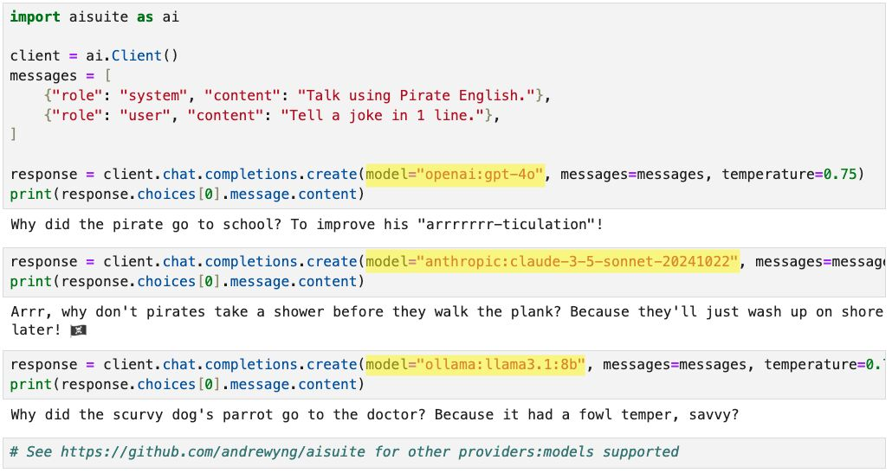

# Andrew Ng’s Team Releases ‘aisuite’: A New Open Source Python Library for Generative AI

> Generative AI (Gen AI) is transforming the landscape of artificial intelligence, opening up new opportunities for creativity, problem-solving, and automation. Despite its potential, several challenges arise for developers and businesses when implementing Gen AI solutions. One of the most prominent issues is the lack of interoperability between different large language models (LLMs) from multiple providers. […]

Generative AI (Gen AI) is transforming the landscape of artificial intelligence, opening up new opportunities for creativity, problem-solving, and automation. Despite its potential, several challenges arise for developers and businesses when implementing Gen AI solutions. One of the most prominent issues is the lack of interoperability between different large language models (LLMs) from multiple providers. Each model has unique APIs, configurations, and specific requirements, making it difficult for developers to switch between providers or use different models in the same application. This fragmented landscape often leads to increased complexity, extended development time, and challenges for engineers aiming to create effective Gen AI applications.

Andrew Ng’s team has released a new open source Python library for Gen AI called **[aisuite](https://github.com/andrewyng/aisuite)**. This library aims to address the issue of interoperability and simplify the process of building applications that utilize large language models from different providers. With aisuite, developers can switch between models from OpenAI, Anthropic, Ollama, and others by changing a single string in their code. The library introduces a standard interface that allows users to choose a “provider:model” combination, such as “openai:gpt-4o,” “anthropic:claude-3-5-sonnet-20241022,” or “ollama:llama3.1:8b,” enabling an easy switch between different language models without needing to rewrite significant parts of the code.

### Technical Details

From a technical perspective, aisuite offers a straightforward interface for managing various LLMs, making it a useful tool for developers. By abstracting the complexities associated with multiple APIs, it provides a unified framework that handles different types of requests and responses. Developers can leverage aisuite to integrate multiple models into their applications with just a few lines of code. This results in lower barriers to entry for Gen AI projects, quicker prototyping, and faster deployment. Another key feature is its extensibility—aisuite allows developers to add new models and providers as they emerge in the market, ensuring that applications can stay up to date with the latest AI capabilities.

The significance of aisuite lies in its ability to streamline the development process, saving time and reducing costs. For teams that need flexibility, aisuite’s capability to switch between models based on specific tasks and requirements provides a valuable tool for optimizing performance. For instance, developers might use OpenAI’s GPT-4 for creative content generation but switch to a specialized model from Anthropic for more constrained, factual outputs. Early benchmarks and community feedback indicate that using aisuite can reduce integration time for multi-model applications, highlighting its impact on improving developer efficiency and productivity.

### Conclusion

Aisuite represents a meaningful advancement for the Gen AI community, simplifying the complexities involved in using large language models from different providers. By providing a unified interface, Andrew Ng’s team has lowered the barriers for integrating advanced AI capabilities into applications, making it easier for developers to experiment and build. As the Gen AI ecosystem continues to expand, tools like aisuite will play an important role in driving accessibility and adoption, enabling more individuals and organizations to leverage the power of AI without being constrained by the technical hurdles that have traditionally accompanied model integration.

---

Check out **the [GitHub Page](https://github.com/andrewyng/aisuite).** All credit for this research goes to the researchers of this project. Also, don’t forget to follow us on **[Twitter](https://twitter.com/Marktechpost)** and join our **[Telegram Channel](https://github.com/XGenerationLab/XiYan-SQL)** and [**LinkedIn Gr**](https://www.linkedin.com/groups/13668564/)[**oup**](https://www.linkedin.com/groups/13668564/). **If you like our work, you will love our**[** newsletter..**](https://marktechpost-newsletter.beehiiv.com/subscribe) Don’t Forget to join our **[55k+ ML SubReddit](https://www.reddit.com/r/machinelearningnews/)**.

**🎙️ 🚨 ‘[Evaluation of Large Language Model Vulnerabilities: A Comparative Analysis of Red Teaming Techniques’ Read the Full Report _(Promoted)_](https://hubs.li/Q02Y39sh0)**
