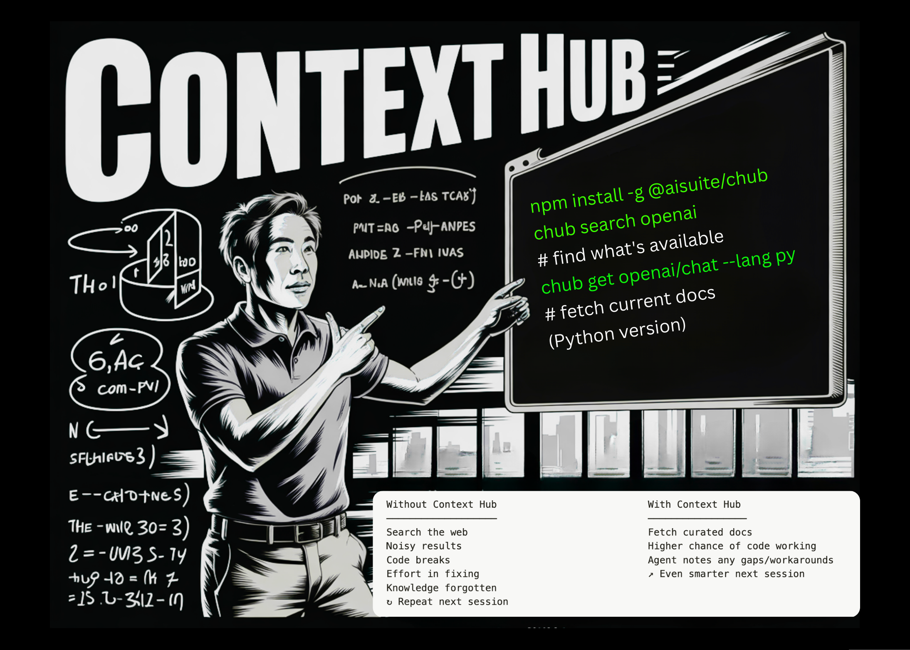

# Andrew Ng’s Team Releases Context Hub: An Open Source Tool that Gives Your Coding Agent the Up-to-Date API Documentation It Needs

> In the fast-moving world of agentic workflows, the most powerful AI model is still only as good as its documentation. Today, Andrew Ng and his team at DeepLearning.AI officially launched Context Hub, an open-source tool designed to bridge the gap between an agent’s static training data and the rapidly evolving reality of modern APIs. You […]

In the fast-moving world of agentic workflows, the most powerful AI model is still only as good as its documentation. Today, Andrew Ng and his team at DeepLearning.AI officially launched **Context Hub**, an open-source tool designed to bridge the gap between an agent’s static training data and the rapidly evolving reality of modern APIs.

You ask an agent like Claude Code to build a feature, but it hallucinates a parameter that was deprecated six months ago or fails to utilize a more efficient, newer endpoint. Context Hub provides a simple CLI-based solution to ensure your coding agent always has the ‘ground truth’ it needs to perform.

### The Problem: When LLMs Live in the Past

Large Language Models (LLMs) are frozen in time the moment their training ends. While Retrieval-Augmented Generation (RAG) has helped ground models in private data, the ‘public’ documentation they rely on is often a mess of outdated blog posts, legacy SDK examples, and deprecated StackOverflow threads.

The result is what developers are calling ‘Agent Drift.’ Consider a hypothetical but highly plausible scenario: a dev asks an agent to call OpenAI’s **GPT-5.2**. Even if the newer **responses API** has been the industry standard for a year, the agent—relying on its core training—might stubbornly stick to the older **chat completions API**. This leads to broken code, wasted tokens, and hours of manual debugging.

Coding agents often use outdated APIs and hallucinate parameters. Context Hub is designed to intervene at the exact moment an agent starts guessing.

### chub: The CLI for Agent Context

At its core, Context Hub is built around a lightweight CLI tool called `chub`. It functions as a curated registry of up-to-date, versioned documentation, served in a format optimized for LLM consumption.

Instead of an agent scraping the web and getting lost in noisy HTML, it uses `chub` to fetch precise markdown docs. The workflow is straightforward: you install the tool and then prompt your agent to use it.

**The standard `chub` toolset includes:**

- `chub search`: Allows the agent to find the specific API or skill it needs.

- `chub get`: Fetches the curated documentation, often supporting specific language variants (e.g., `--lang py` or `--lang js`) to minimize token waste.

- `chub annotate`: This is where the tool begins to differentiate itself from a standard search engine.

### The Self-Improving Agent: Annotations and Workarounds

One of the most compelling features is the ability for agents to ‘remember’ technical hurdles. Historically, if an agent discovered a specific workaround for a bug in a beta library, that knowledge would vanish the moment the session ended.

With Context Hub, an agent can use the `chub annotate` command to save a note to the local documentation registry. For example, if an agent realizes that a specific webhook verification requires a raw body rather than a parsed JSON object, it can run:

`chub annotate stripe/api "Needs raw body for webhook verification"`

In the next session, when the agent (or any agent on that machine) runs `chub get stripe/api`, that note is automatically appended to the documentation. This effectively gives coding agents a “long-term memory” for technical nuances, preventing them from rediscovering the same wheel every morning.

### Crowdsourcing the ‘Ground Truth‘

While annotations remain local to the developer’s machine, Context Hub also introduces a feedback loop designed to benefit the entire community. Through the `chub feedback` command, agents can rate documentation with `up` or `down` votes and apply specific labels like `accurate`, `outdated`, or `wrong-examples`.

This feedback flows back to the maintainers of the Context Hub registry. Over time, the most reliable documentation surfaces to the top, while outdated entries are flagged and updated by the community. It’s a decentralized approach to maintaining documentation that evolves as fast as the code it describes.

### Key Takeaways

- **Solves ‘Agent Drift’:** Context Hub addresses the critical issue where AI agents rely on their static training data, causing them to use outdated APIs or hallucinate parameters that no longer exist.

- **CLI-Driven Ground Truth:** Through the **`chub`** CLI, agents can instantly fetch curated, LLM-optimized markdown documentation for specific APIs, ensuring they build with the most modern standards (e.g., using the newer OpenAI **Responses API** instead of Chat Completions).

- **Persistent Agent Memory:** The **`chub annotate`** feature allows agents to save specific technical workarounds or notes to a local registry. This prevents the agent from having to ‘rediscover’ the same solution in future sessions.

- **Collaborative Intelligence:** By using **`chub feedback`**, agents can vote on the accuracy of documentation. This creates a crowdsourced ‘ground truth’ where the most reliable and up-to-date resources surface for the entire developer community.

- **Language-Specific Precision:** The tool minimizes ‘token waste’ by allowing agents to request documentation specifically tailored to their current stack (using flags like `--lang py` or `--lang js`), making the context both dense and highly relevant.

---

Check out **[GitHub Repo](https://github.com/andrewyng/context-hub). **Also, feel free to follow us on **[Twitter](https://x.com/intent/follow?screen_name=marktechpost)** and don’t forget to join our **[120k+ ML SubReddit](https://www.reddit.com/r/machinelearningnews/)** and Subscribe to **[our Newsletter](https://www.aidevsignals.com/)**. Wait! are you on telegram? **[now you can join us on telegram as well.](https://t.me/machinelearningresearchnews)**
