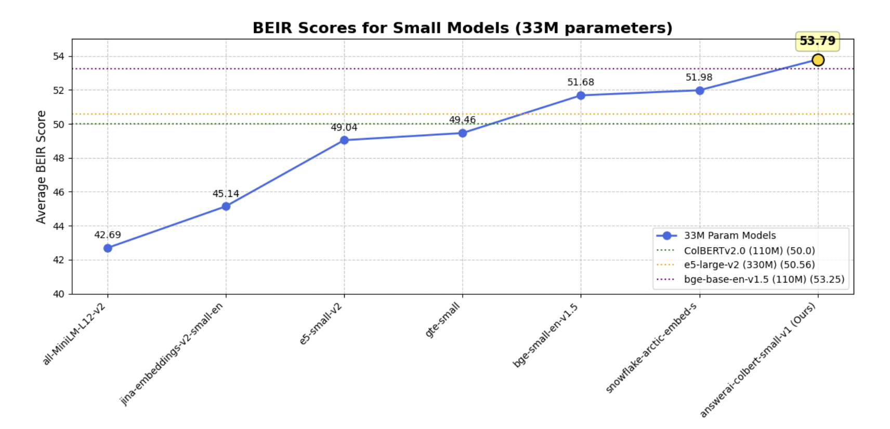

# Answer.AI Releases answerai-colbert-small: A Proof of Concept for Smaller, Faster, Modern ColBERT Models

> AnswerAI has unveiled a robust model called answerai-colbert-small-v1, showcasing the potential of multi-vector models when combined with advanced training techniques. This proof-of-concept model, developed using the innovative JaColBERTv2.5 training recipe and additional optimizations, demonstrates remarkable performance despite its compact size of just 33 million parameters. The model’s efficiency is particularly noteworthy, as it achieves these […]

AnswerAI has unveiled a robust model called answerai-colbert-small-v1, showcasing the potential of multi-vector models when combined with advanced training techniques. This proof-of-concept model, developed using the innovative JaColBERTv2.5 training recipe and additional optimizations, demonstrates remarkable performance despite its compact size of just 33 million parameters. The model’s efficiency is particularly noteworthy, as it achieves these results while maintaining a footprint comparable to MiniLM.

In a surprising turn of events, answerai-colbert-small-v1 has surpassed the performance of all previous models of similar size on common benchmarks. Even more impressively, it has outperformed much larger and widely used models, including e5-large-v2 and bge-base-en-v1.5. This achievement underscores the potential of AnswerAI’s approach in pushing the boundaries of what’s possible with smaller, more efficient AI models.

Multi-vector retrievers, introduced through the ColBERT model architecture, offer a unique approach to document representation. Unlike traditional methods that create a single vector per document, ColBERT generates multiple smaller vectors, each representing a single token. This technique addresses the information loss often associated with single-vector representations, particularly in out-of-domain generalization tasks. The architecture also incorporates query augmentation, using masked language modeling to enhance retrieval performance.

ColBERT’s innovative MaxSim scoring mechanism calculates the similarity between query and document tokens, summing the highest similarities for each query token. While this approach consistently improves out-of-domain generalization, it initially faced challenges with in-domain tasks and required significant memory and storage resources. ColBERTv2 addressed these issues by introducing a more modern training recipe, including in-batch negatives and knowledge distillation, along with a unique indexing approach that reduced storage requirements.

In the Japanese language context, JaColBERTv1 and v2 have demonstrated even greater success than their English counterparts. JaColBERTv1, following the original ColBERT training recipe, became the strongest monolingual Japanese retriever of its time. JaColBERTv2, built on the ColBERTv2 recipe, further improved performance and currently stands as the strongest out-of-domain retriever across all existing Japanese benchmarks, though it still faces some challenges in large-scale retrieval tasks like MIRACL.

The answerai-colbert-small-v1 model has been specifically designed with future compatibility in mind, particularly for the upcoming RAGatouille overhaul. This forward-thinking approach ensures that the model will remain relevant and useful as new technologies emerge. Despite its future-oriented design, the model maintains broad compatibility with recent ColBERT implementations, offering users flexibility in their choice of tools and frameworks.

For those interested in utilizing this innovative model, there are two primary options available. Users can opt for the Stanford ColBERT library, which is a well-established and widely-used implementation. Alternatively, they can choose RAGatouille, which may offer additional features or optimizations. The installation process for either or both of these libraries is straightforward, requiring a simple command execution to get started.

*_Image source: https://huggingface.co/answerdotai/answerai-colbert-small-v1_*

The results of the answerai-colbert-small-v1 model demonstrate its exceptional performance when compared to single-vector models.

*_Image source: https://huggingface.co/answerdotai/answerai-colbert-small-v1_*

AnswerAI’s answerai-colbert-small-v1 model represents a significant advancement in multi-vector retrieval systems. Despite its compact 33 million parameters, it outperforms larger models like e5-large-v2 and bge-base-en-v1.5. Built on the ColBERT architecture and enhanced by the JaColBERTv2.5 training recipe, it excels in out-of-domain generalization. The model’s success stems from its multi-vector approach, query augmentation, and MaxSim scoring mechanism. Designed for future compatibility, particularly with the upcoming RAGatouille overhaul, it remains compatible with recent ColBERT implementations. Users can easily implement it using either the Stanford ColBERT library or RAGatouille, showcasing AnswerAI’s potential to reshape AI efficiency and performance.

---

Check out the **[Model Card](https://huggingface.co/answerdotai/answerai-colbert-small-v1) and [Details](https://www.answer.ai/posts/2024-08-13-small-but-mighty-colbert.html).** All credit for this research goes to the researchers of this project. Also, don’t forget to follow us on **[Twitter](https://twitter.com/Marktechpost)** and join our **[Telegram Channel](https://pxl.to/at72b5j)** and [**LinkedIn Gr**](https://www.linkedin.com/groups/13668564/)[**oup**](https://www.linkedin.com/groups/13668564/). **If you like our work, you will love our**[** newsletter..**](https://marktechpost-newsletter.beehiiv.com/subscribe)

Don’t Forget to join our **[48k+ ML SubReddit](https://www.reddit.com/r/machinelearningnews/)**

**Find Upcoming [AI Webinars here](https://www.marktechpost.com/ai-webinars-list-llms-rag-generative-ai-ml-vector-database/)**

---

> [Arcee AI Introduces Arcee Swarm: A Groundbreaking Mixture of Agents MoA Architecture Inspired by the Cooperative Intelligence Found in Nature Itself](https://www.marktechpost.com/2024/08/15/arcee-ai-introduces-arcee-swarm-a-groundbreaking-mixture-of-agents-moa-architecture-inspired-by-the-cooperative-intelligence-found-in-nature-itself/)
