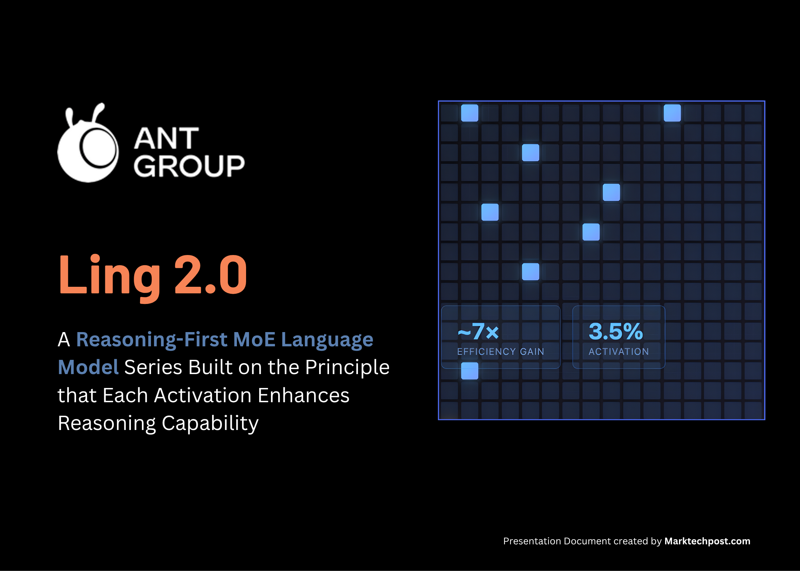

# Ant Group Releases Ling 2.0: A Reasoning-First MoE Language Model Series Built on the Principle that Each Activation Enhances Reasoning Capability

> How do you build a language model that grows in capacity but keeps the computation for each token almost unchanged? The Inclusion AI team from the Ant Group is pushing sparse large models in a methodical way by releasing Ling 2.0. Ling 2.0 is a reasoning based language model family built on the idea that each […]

**How do you build a language model that grows in capacity but keeps the computation for each token almost unchanged?** [The Inclusion AI team from the Ant Group](https://pxllnk.co/khvhb2h) is pushing sparse large models in a methodical way by releasing [Ling 2.0](https://pxllnk.co/7zl4f8o). [Ling 2.0](https://pxllnk.co/viv0tgm) is a [reasoning based language model family](https://pxllnk.co/khvhb2h) built on the idea that each activation should translate directly into stronger reasoning behavior. It is one of the latest approaches that shows how to keep activation small while moving from [16B to 1T without rewriting the recipe](https://pxllnk.co/7zl4f8o). The series has three versions, [Ling mini 2.0](https://pxllnk.co/viv0tgm) at 16B total with 1.4B activated, [Ling flash 2.0 ](https://pxllnk.co/7zl4f8o)in the 100B class with 6.1B activated, and [Ling 1T ](https://pxllnk.co/7zl4f8o)with 1T total and about 50B active per token.

### Sparse MoE as the central design

Every [Ling 2.0 model](https://pxllnk.co/viv0tgm) uses the same sparse [Mixture of Experts layer.](https://pxllnk.co/khvhb2h) Each layer has 256 routed experts and one shared expert. The router picks 8 routed experts for every token, the shared expert is always on, so about 9 experts out of 257 are used for every token, this is about 3.5 percent activation, which matches the 1/32 activation ratio. The research team reports about 7 times efficiency compared to an equivalent dense model because you train and serve only a small part of the network per token while keeping a very large parameter pool. 

*https://arxiv.org/abs/2510.22115*

**Ling 2.0 brings coordinated advances across four layers of the stack, model architecture, pre training, post training, and the underlying FP8 infrastructure:**

**Model architecture: **The [architecture is chosen using Ling Scaling Laws, not by trial and error](https://pxllnk.co/khvhb2h). To support the Ling Scaling Laws, the team runs what they call the Ling Wind Tunnel, a fixed set of small MoE runs trained under the same data and routing rules, then fitted to power laws to predict loss, activation and expert balance at much larger sizes. This gives them a low cost way to choose [1/32 activation, 256 routed experts and 1 shared expert before committing GPUs to 1T scale.](https://pxllnk.co/khvhb2h) Routing is aux-loss-free with sigmoid scoring, and the stack uses QK Norm, MTP loss and partial RoPE to keep depth stable. Because the same law picked the shape, Ling mini 2.0, Ling flash 2.0 and Ling 1T can all share the consistency across sizes.

**Pre training: **The series is trained on more than 20T tokens, starting with 4K context and a mix in which reasoning heavy sources such as math and code gradually increase to almost half of the corpus. A later mid training stage extends context to about 32K on a selected 150B token slice, then injects another 600B tokens of high quality chain of thought, before finally stretching to 128K with YaRN while preserving short context quality. This pipeline ensures that long context and reasoning are introduced early, not just added at the SFT step. 

**Post training: **Alignment is separated into a capability pass and a preference pass. First, Decoupled Fine Tuning teaches the model to switch between quick responses and deep reasoning through different system prompts, then an evolutionary CoT stage expands and diversifies chains, and finally a sentence level policy optimization with a Group Arena Reward aligns outputs to human judgments at fine granularity. This [staged alignment](https://pxllnk.co/khvhb2h) is what lets a non thinking base reach strong math, code and instruction performance without inflating every answer.

**Infrastructure: **[Ling 2.0](https://pxllnk.co/7zl4f8o) trains natively in FP8 with safeguards, keeping the loss curve within a small gap of BF16 while gaining about 15% utilization on the reported hardware. The larger speedups, around 40 percent, come from heterogeneous pipeline parallelism, interleaved one forward one backward execution and partitioning that is aware of the MTP block, not from precision alone. Together with Warmup Stable Merge, which replaces LR decay by merging checkpoints, this systems stack makes 1T scale runs practical on existing clusters. 

### Understanding the Results

Evaluations are consistent in pattern, [small activation MoE models](https://pxllnk.co/khvhb2h) deliver competitive quality while keeping per token compute low. [Ling mini 2.0 ](https://pxllnk.co/viv0tgm)has 16B total parameters, activates 1.4B per token, and is reported to perform in the 7 to 8B dense band. Ling flash 2.0 keeps the same 1/32 activation recipe, has 100B and activates 6.1B per token. [Ling 1T ](https://pxllnk.co/7zl4f8o)is the flagship non thinking model, it has 1T total parameters and about 50B active per token, preserving the 1/32 sparsity and extending the same Ling Scaling Laws to trillion scale.

*https://arxiv.org/abs/2510.22115*

*https://arxiv.org/abs/2510.22115*

*https://arxiv.org/abs/2510.22115*

### Key Takeaways

- [Ling 2.0](https://pxllnk.co/viv0tgm) is built around a 1/32 activation MoE architecture, selected using Ling Scaling Laws so that 256 routed experts plus 1 shared expert stay optimal from 16B up to 1T.

- [Ling mini 2.0](https://pxllnk.co/7zl4f8o) has 16B total parameters with 1.4B activated per token and is reported to match 7B to 8B dense models while generating at more than 300 tokens per second in simple QA on H20.

- [Ling flash 2.0](https://pxllnk.co/7zl4f8o) keeps the same recipe, has 6.1B active parameters and sits in the 100B range, giving a higher capacity option without increasing per token compute.

- [Ling 1T](https://pxllnk.co/7zl4f8o) exposes the full design, 1T total parameters with about 50B active per token, 128K context, and an Evo CoT plus LPO style post training stack to push efficient reasoning.

- Across all sizes, efficiency gains above[ 7 times over dense baselines come](https://pxllnk.co/khvhb2h) from the combination of sparse activation, FP8 training, and a shared training schedule, so quality scales predictably without re tuning compute.

### Editorial Comments

This [release](https://pxllnk.co/7zl4f8o) demonstrates a complete sparse [MoE stack](https://pxllnk.co/khvhb2h). Ling Scaling Laws identify a 1/32 activation as optimal, the architecture locks in 256 routed experts plus 1 shared expert, and the same shape is used from 16B to 1T. Training, context extension and preference optimization are all aligned to that choice, so small activation does not block math, code or long context, and FP8 plus heterogeneous pipelines keep cost in a practical range. It is a clear signal that trillion scale reasoning can be organized around fixed sparsity instead of growing dense compute.

---

Check out the **[Weights on HF](https://pxllnk.co/viv0tgm), [Repo](https://pxllnk.co/7zl4f8o) and [Paper](https://pxllnk.co/khvhb2h)**. Feel free to check out our **[GitHub Page for Tutorials, Codes and Notebooks](https://github.com/Marktechpost/AI-Tutorial-Codes-Included)**. Also, feel free to follow us on **[Twitter](https://x.com/intent/follow?screen_name=marktechpost)** and don’t forget to join our **[100k+ ML SubReddit](https://www.reddit.com/r/machinelearningnews/)** and Subscribe to **[our Newsletter](https://www.aidevsignals.com/)**. Wait! are you on telegram? **[now you can join us on telegram as well.](https://t.me/machinelearningresearchnews)**
