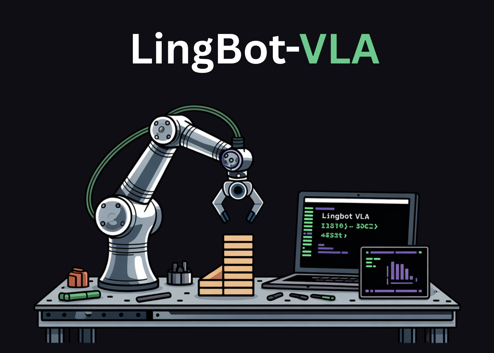

# Ant Group Releases LingBot-VLA, A Vision Language Action Foundation Model For Real World Robot Manipulation

> How do you build a single vision language action model that can control many different dual arm robots in the real world? LingBot-VLA is Ant Group Robbyant’s new Vision Language Action foundation model that targets practical robot manipulation in the real world. It is trained on about 20,000 hours of teleoperated bimanual data collected from 9 […]

How do you build a single vision language action model that can control many different dual arm robots in the real world? LingBot-VLA is Ant Group Robbyant’s new Vision Language Action foundation model that targets practical robot manipulation in the real world. It is trained on about 20,000 hours of teleoperated bimanual data collected from 9 dual arm robot embodiments and is evaluated on the large scale GM-100 benchmark across 3 platforms. The model is designed for cross morphology generalization, data efficient post training, and high training throughput on commodity GPU clusters.

*https://arxiv.org/pdf/2601.18692*

### Large scale dual arm dataset across 9 robot embodiments

The pre-training dataset is built from real world teleoperation on 9 popular dual arm configurations. These include AgiBot G1, AgileX, Galaxea R1Lite, Galaxea R1Pro, Realman Rs 02, Leju KUAVO 4 Pro, Qinglong humanoid, ARX Lift2, and a Bimanual Franka setup. All systems have dual 6 or 7 degree of freedom arms with parallel grippers and multiple RGB-D cameras that provide multi view observations

Teleoperation uses VR control for AgiBot G1 and isomorphic arm control for AgileX. For each scene the recorded videos from all views are segmented by human annotators into clips that correspond to atomic actions. Static frames at the start and end of each clip are removed to reduce redundancy. Task level and sub task level language instructions are then generated with Qwen3-VL-235B-A22B. This pipeline yields synchronized sequences of images, instructions, and action trajectories for pre-training. 

To characterize action diversity the research team visualizes the most frequent atomic actions in training and tests through word clouds. About 50 percent of atomic actions in the test set do not appear within the top 100 most frequent actions in the training set. This gap ensures that evaluation stresses cross task generalization rather than frequency based memorization.

*https://arxiv.org/pdf/2601.18692*

### Architecture, Mixture of Transformers, and Flow Matching actions

LingBot-VLA combines a strong multimodal backbone with an action expert through a Mixture of Transformers architecture. The vision language backbone is Qwen2.5-VL. It encodes multi-view operational images and the natural language instruction into a sequence of multimodal tokens. In parallel, the action expert receives robot proprioceptive state and chunks of past actions. Both branches share a self attention module that performs layer wise joint sequence modeling over observation and action tokens.

At each time step the model forms an observation sequence that concatenates tokens from 3 camera views, the task instruction, and the robot state. The action sequence is a future action chunk with a temporal horizon set to 50 during pre-training. The training objective is conditional Flow Matching. The model learns a vector field that transports Gaussian noise to the ground truth action trajectory along a linear probability path. This gives a continuous action representation and produces smooth, temporally coherent control suitable for precise dual arm manipulation. 

LingBot-VLA uses blockwise causal attention over the joint sequence. Observation tokens can attend to each other bidirectionally. Action tokens can attend to all observation tokens and only to past action tokens. This mask prevents information leakage from future actions into current observations while still allowing the action expert to exploit the full multimodal context at each decision step.

### Spatial perception via LingBot Depth distillation

Many VLA models struggle with depth reasoning when depth sensors fail or return sparse measurements. LingBot-VLA addresses this by integrating LingBot-Depth, a separate spatial perception model based on Masked Depth Modeling. LingBot-Depth is trained in a self supervised way on a large RGB-D corpus and learns to reconstruct dense metric depth when parts of the depth map are masked, often in regions where physical sensors tend to fail.

In LingBot-VLA the visual queries from each camera view are aligned with LingBot-Depth tokens through a projection layer and a distillation loss. Cross attention maps VLM queries into the depth latent space and the training minimizes their difference from LingBot-Depth features. This injects geometry aware information into the policy and improves performance on tasks that require accurate 3D spatial reasoning, such as insertion, stacking, and folding under clutter and occlusion. 

### GM-100 real world benchmark across 3 platforms

The main evaluation uses GM-100, a real world benchmark with 100 manipulation tasks and 130 filtered teleoperated trajectories per task on each of 3 hardware platforms. Experiments compare LingBot-VLA with π0.5, GR00T N1.6, and WALL-OSS under a shared post training protocol. All methods fine tune from public checkpoints with the same dataset, batch size 256, and 20 epochs. Success Rate measures completion of all subtasks within 3 minutes and Progress Score tracks partial completion.

On GM-100, LingBot-VLA with depth achieves state of the art averages across the 3 platforms. The average Success Rate is 17.30 percent and the average Progress Score is 35.41 percent. π0.5 reaches 13.02 percent SR (success rate) and 27.65 percent PS (progress score). GR00T N1.6 and WALL-OSS are lower at 7.59 percent SR, 15.99 percent PS and 4.05 percent SR, 10.35 percent PS respectively. LingBot-VLA without depth already outperforms GR00T N1.6 and WALL-OSS and the depth variant adds further gains.

In RoboTwin 2.0 simulation with 50 tasks, models are trained on 50 demonstrations per task in clean scenes and 500 per task in randomized scenes. LingBot-VLA with depth reaches 88.56 percent average Success Rate in clean scenes and 86.68 percent in randomized scenes. π0.5 reaches 82.74 percent and 76.76 percent in the same settings. This shows consistent gains from the same architecture and depth integration when domain randomization is strong.

*https://arxiv.org/pdf/2601.18692*

### Scaling behavior and data efficient post training

The research team analyzes scaling laws by varying pre-training data from 3,000 to 20,000 hours on a subset of 25 tasks. Both Success Rate and Progress Score increase monotonically with data volume, with no saturation at the largest scale studied. This is the first empirical evidence that VLA models maintain favorable scaling on real robot data at this size.

They also study data efficiency of post training on AgiBot G1 using 8 representative GM-100 tasks. With only 80 demonstrations per task LingBot-VLA already surpasses π0.5 that uses the full 130 demonstration set, in both Success Rate and Progress Score. As more trajectories are added the performance gap widens. This confirms that the pre-trained policy transfers with only dozens to around 100 task specific trajectories, which directly reduces adaptation cost for new robots or tasks. 

### Training throughput and open source toolkit

LingBot-VLA comes with a training stack optimized for multi-node efficiency. The codebase uses a FSDP style strategy for parameters and optimizer states, hybrid sharding for the action expert, mixed precision with float32 reductions and bfloat16 storage, and operator level acceleration with fused attention kernels and torch compile. 

On an 8 GPU setup the research team reported throughput of 261 samples per second per GPU for Qwen2.5-VL-3B and PaliGemma-3B-pt-224 model configurations. This corresponds to a 1.5 times to 2.8 times speedup compared with existing VLA oriented codebases such as StarVLA, Dexbotic, and OpenPI evaluated on the same Libero based benchmark. Throughput scales close to linearly when moving from 8 to 256 GPUs. The full post training toolkit is released as open source. 

### Key Takeaways

- LingBot-VLA is a Qwen2.5-VL based vision language action foundation model trained on about 20,000 hours of real world dual arm teleoperation across 9 robot embodiments, which enables strong cross morphology and cross task generalization.

- The model integrates LingBot Depth through feature distillation so vision tokens are aligned with a depth completion expert, which significantly improves 3D spatial understanding for insertion, stacking, folding, and other geometry sensitive tasks.

- On the GM-100 real world benchmark, LingBot-VLA with depth achieves about 17.30 percent average Success Rate and 35.41 percent average Progress Score, which is higher than π0.5, GR00T N1.6, and WALL OSS under the same post training protocol.

- LingBot-VLA shows high data efficiency in post training, since on AgiBot G1 it can surpass π0.5 that uses 130 demonstrations per task while using only about 80 demonstrations per task, and performance continues to improve as more trajectories are added.

---

Check out the **[Paper](https://arxiv.org/pdf/2601.18692), [Model Weight](https://huggingface.co/collections/robbyant/lingbot-vla), [Repo](https://github.com/robbyant/lingbot-vla) and [Project Page](https://technology.robbyant.com/lingbot-vla)**. Also, feel free to follow us on **[Twitter](https://x.com/intent/follow?screen_name=marktechpost)** and don’t forget to join our **[100k+ ML SubReddit](https://www.reddit.com/r/machinelearningnews/)** and Subscribe to **[our Newsletter](https://www.aidevsignals.com/)**. Wait! are you on telegram? **[now you can join us on telegram as well.](https://t.me/machinelearningresearchnews)**
