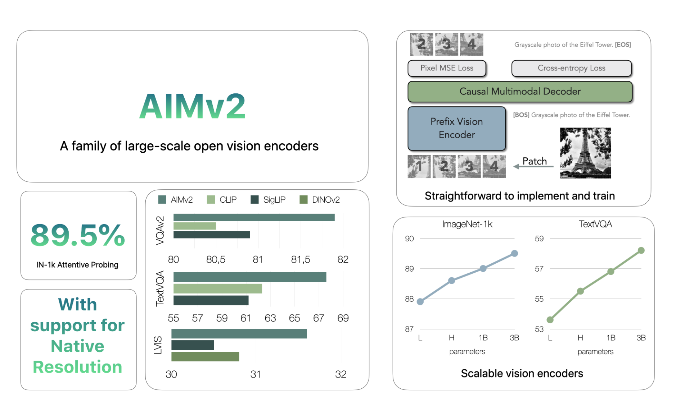

# Apple Releases AIMv2: A Family of State-of-the-Art Open-Set Vision Encoders

> Vision models have evolved significantly over the years, with each innovation addressing the limitations of previous approaches. In the field of computer vision, researchers have often faced challenges in balancing complexity, generalizability, and scalability. Many current models struggle to effectively handle diverse visual tasks or adapt efficiently to new datasets. Traditionally, large-scale pre-trained vision encoders […]

Vision models have evolved significantly over the years, with each innovation addressing the limitations of previous approaches. In the field of computer vision, researchers have often faced challenges in balancing complexity, generalizability, and scalability. Many current models struggle to effectively handle diverse visual tasks or adapt efficiently to new datasets. Traditionally, large-scale pre-trained vision encoders have used contrastive learning, which, despite its success, presents challenges in scaling and parameter efficiency. There remains a need for a robust, versatile model that can handle multiple modalities—such as images and text—without sacrificing performance or requiring extensive data filtering.

### AIMv2: A New Approach

Apple has taken on this challenge with the release of AIMv2, a family of open-set vision encoders designed to improve upon existing models in multimodal understanding and object recognition tasks. Inspired by models like CLIP, AIMv2 adds an autoregressive decoder, allowing it to generate image patches and text tokens. The AIMv2 family includes 19 models with varying parameter sizes—300M, 600M, 1.2B, and 2.7B—and supports resolutions of 224, 336, and 448 pixels. This range in model size and resolution makes AIMv2 suitable for different use cases, from smaller-scale applications to tasks requiring larger models.

### Technical Overview

AIMv2 incorporates a multimodal autoregressive pre-training framework, which builds on the conventional contrastive learning approach used in similar models. The key feature of AIMv2 is its combination of a Vision Transformer (ViT) encoder with a causal multimodal decoder. During pre-training, the encoder processes image patches, which are subsequently paired with corresponding text embeddings. The causal decoder then autoregressively generates both image patches and text tokens, reconstructing the original multimodal inputs. This setup simplifies training and facilitates model scaling without requiring specialized inter-batch communication or extremely large batch sizes. Additionally, the multimodal objective allows AIMv2 to achieve denser supervision compared to other methods, enhancing its ability to learn from both image and text inputs.

### Performance and Scalability

AIMv2 outperforms major existing models like OAI CLIP and SigLIP on most multimodal understanding benchmarks. Specifically, AIMv2-3B achieved 89.5% top-1 accuracy on the ImageNet dataset with a frozen trunk, demonstrating notable robustness in frozen encoder models. Compared to DINOv2, AIMv2 also performed well in open-vocabulary object detection and referring expression comprehension. Moreover, AIMv2’s scalability was evident, as its performance consistently improved with increasing data and model size. The model’s flexibility and integration with modern tools, such as the Hugging Face Transformers library, make it practical and straightforward to implement across various applications.

### Conclusion

AIMv2 represents a meaningful advancement in the development of vision encoders, emphasizing simplicity in training, effective scaling, and versatility in multimodal tasks. Apple’s release of AIMv2 offers improvements over previous models, with strong performance on numerous benchmarks, including open-vocabulary recognition and multimodal tasks. The integration of autoregressive techniques enables dense supervision, resulting in robust and flexible model capabilities. AIMv2’s availability on platforms like Hugging Face allows developers and researchers to experiment with advanced vision models more easily. AIMv2 sets a new standard for open-set visual encoders, capable of addressing the increasing complexity of real-world multimodal understanding.

---

Check out **the [Paper](https://arxiv.org/abs/2411.14402) and **[**AIMv2** **family of the models on Hugging Face**](https://huggingface.co/collections/apple/aimv2-6720fe1558d94c7805f7688c). All credit for this research goes to the researchers of this project. Also, don’t forget to follow us on **[Twitter](https://twitter.com/Marktechpost)** and join our **[Telegram Channel](https://github.com/XGenerationLab/XiYan-SQL)** and [**LinkedIn Gr**](https://www.linkedin.com/groups/13668564/)[**oup**](https://www.linkedin.com/groups/13668564/). **If you like our work, you will love our**[** newsletter..**](https://marktechpost-newsletter.beehiiv.com/subscribe) Don’t Forget to join our **[55k+ ML SubReddit](https://www.reddit.com/r/machinelearningnews/)**.

**[[FREE AI VIRTUAL CONFERENCE](https://predibase.com/smallcon?utm_medium=3rdparty&utm_source=marktechpost)] ****[SmallCon: Free Virtual GenAI Conference ft. Meta, Mistral, Salesforce, Harvey AI & more](https://predibase.com/smallcon?utm_medium=3rdparty&utm_source=marktechpost)**. _[Join us on Dec 11th for this free virtual event to learn what it takes to build big with small models from AI trailblazers like Meta, Mistral AI, Salesforce, Harvey AI, Upstage, Nubank, Nvidia, Hugging Face, and more.](https://predibase.com/smallcon?utm_medium=3rdparty&utm_source=marktechpost)_
