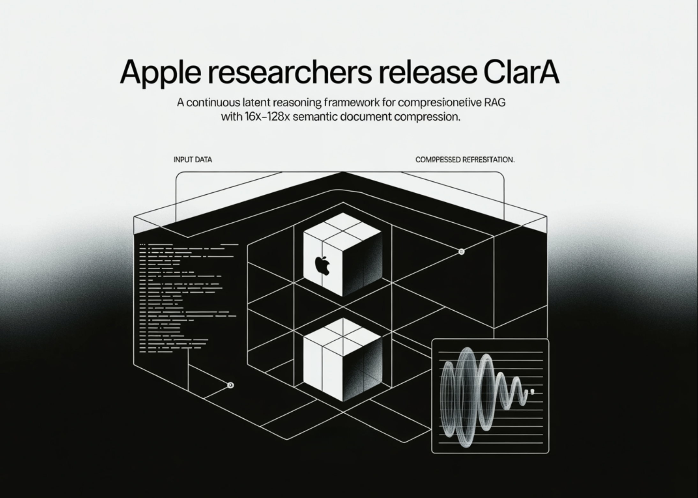

# Apple Researchers Release CLaRa: A Continuous Latent Reasoning Framework for Compression‑Native RAG with 16x–128x Semantic Document Compression

> How do you keep RAG systems accurate and efficient when every query tries to stuff thousands of tokens into the context window and the retriever and generator are still optimized as 2 separate, disconnected systems? A team of researchers from Apple and University of Edinburgh released CLaRa, Continuous Latent Reasoning, (CLaRa-7B-Base, CLaRa-7B-Instruct and CLaRa-7B-E2E) a […]

How do you keep RAG systems accurate and efficient when every query tries to stuff thousands of tokens into the context window and the retriever and generator are still optimized as 2 separate, disconnected systems? A team of researchers from **Apple and University of Edinburgh released CLaRa, Continuous Latent Reasoning,** (CLaRa-7B-Base, CLaRa-7B-Instruct and CLaRa-7B-E2E) a retrieval augmented generation framework that compresses documents into continuous memory tokens and then performs both retrieval and generation in that shared latent space. The goal is simple. Shorten context, avoid double encoding, and let the generator teach the retriever what actually matters for downstream answers.

*https://arxiv.org/pdf/2511.18659*

### From raw documents to continuous memory tokens

CLaRa starts with a semantic compressor that attaches a small number of learned memory tokens to each document. During **Salient Compressor Pretraining, SCP,** the base model is a Mistral 7B style transformer with LoRA adapters that switch between a compressor role and a generator role. The final layer hidden states of the memory tokens become the compressed representation for that document.

SCP is trained on about 2M passages from Wikipedia 2021. A local Qwen-32B model generates 3 supervision signals for each passage. Simple QA pairs cover atomic facts. Complex QA pairs connect several facts in one question to enforce multi hop reasoning. Paraphrases reorder and compress the text while preserving semantics. A verification loop checks factual consistency and coverage and can regenerate missing questions or paraphrases for up to 10 rounds before accepting a sample.

Training uses 2 losses. A cross entropy term trains the generator to answer questions or produce paraphrases conditioned only on the memory tokens and an instruction prefix. A mean squared error term aligns the average hidden state of document tokens with the average hidden state of the memory tokens. The MSE loss gives modest but consistent gains of about 0.3 to 0.6 F1 points at compression ratios 32 and 128 and keeps compressed and original representations in the same semantic region.

*https://arxiv.org/pdf/2511.18659*

### Joint retrieval and generation in a shared space

After offline compression, each document is represented only by its memory tokens. CLaRa then trains a query reasoner and an answer generator on top of the same backbone. The query reasoner is another LoRA adapter that maps an input question into the same number of memory tokens used for documents. Retrieval becomes pure embedding search. The system computes cosine similarity between the query embedding and each candidate document embedding.

The best compressed document embeddings for a query are concatenated with the query tokens and fed into the generator adapter. Training uses only a standard next token prediction loss on the final answer. There are no explicit relevance labels. The key trick is a differentiable top k selector implemented with a Straight Through estimator. During the forward pass the model uses hard top k selection. During the backward pass a softmax distribution over document scores allows gradients from the generator to flow into the query reasoner parameters.

The research team shows 2 effects in the gradient analysis. First, the retriever is encouraged to assign higher probability to documents that increase answer likelihood. Second, because retrieval and generation share the same compressed representations, generator gradients reshape the latent document space to make it easier to reason over. Logit lens analysis of the query embeddings recovers topic tokens such as “NFL” and “Oklahoma” for a question about the nephew of Ivory Lee Brown, even though those tokens are not in the raw query but are present in the supporting articles.

*https://arxiv.org/pdf/2511.18659*

### Compression quality and QA accuracy

The compressor is evaluated on 4 QA datasets: Natural Questions, HotpotQA, MuSiQue and 2WikiMultihopQA. Under the Normal setting, where the system retrieves the top 5 Wikipedia 2021 documents per query, SCP-Mistral-7B at 4 times compression reaches an average F1 of 39.86. This is 5.37 points better than the hard compression baseline LLMLingua 2 and 1.13 points better than the best soft compression baseline PISCO.

Under the Oracle setting, where the gold document is guaranteed to be in the candidate set, SCP-Mistral-7B at 4 times compression reaches an average F1 of 66.76. That is 17.31 points above LLMLingua-2 and 5.35 points above PISCO. Even more interesting, the compressed representations outperform a BGE based text retriever plus full document Mistral-7B generator by about 2.36 average F1 points for Mistral and about 6.36 points for Phi 4 mini. Well trained soft compression can exceed full text RAG while cutting context length by factors from 4 to 128.

*https://arxiv.org/pdf/2511.18659*

The performance at very high compression ratios, above 32 in Oracle, does drop, but the decline remains moderate in Normal retrieval conditions. The key explanation as per the research team is, weak document relevance bottlenecks the system before compression quality does.

### End to end QA and retrieval behavior

For end to end QA, CLaRa uses 20 candidate documents per query with compression ratios 4, 16 and 32. On the Normal setting, CLaRa-Mistral-7B with instruction initialized weights and 16 times compression reaches F1 equal to 50.89 on Natural Questions and 44.66 on 2WikiMultihopQA. This is comparable to DRO-Mistral-7B, which reads full uncompressed text, while using 16 times shorter document representations. On some datasets, CLaRa at 16 times compression slightly improves F1 over DRO, for example from 43.65 to 47.18 on 2Wiki.

In the Oracle setting, CLaRa-Mistral-7B exceeds 75, F1 on both Natural Questions and HotpotQA at 4 times compression. This shows that the generator can fully exploit accurate retrieval even when all evidence is stored only in compressed memory tokens. Instruction initialized CLaRa generally wins over pre-training initialized CLaRa in the Normal setting, while the gap narrows in Oracle, where retrieval noise is limited.

On the retrieval side, CLaRa used as a reranker under Oracle conditions delivers strong Recall at 5. With pretraining initialization at compression 4 on HotpotQA, CLaRa-Mistral-7B reaches Recall at 5 equal to 96.21. This beats the supervised BGE Reranker baseline at 85.93 by 10.28 points and even outperforms a fully supervised Sup Instruct retriever trained with contrastive relevance labels.

*https://arxiv.org/pdf/2511.18659*

### What Apple has released?

Apple’s research team released 3 models on Hugging Face: CLaRa-7B-Base, CLaRa-7B-Instruct and CLaRa-7B-E2E. CLaRa-7B-Instruct is described as an instruction tuned unified RAG model with built in document compression at 16 and 128 times. It answers instruction style questions directly from compressed representations and uses Mistral-7B-Instruct v0.2 as the base model.

### Key Takeaways

- CLaRa replaces raw documents with a small set of continuous memory tokens learned via QA guided and paraphrase guided semantic compression, which preserves key reasoning signals even at 16 times and 128 times compression.

- Retrieval and generation are trained in a single shared latent space, the query encoder and generator share the same compressed representations and are optimized together with one language modeling loss.

- A differentiable top-k estimator lets gradients flow from answer tokens back into the retriever, which aligns document relevance with answer quality and removes the usual disjoint tuning loop for RAG systems.

- On multi hop QA benchmarks like Natural Questions, HotpotQA, MuSiQue and 2WikiMultihopQA, CLaRa’s SCP compressor at 4 times compression outperforms strong text based baselines such as LLMLingua 2 and PISCO and can even beat full text BGE/ Mistral pipelines on average F1.

- Apple has released 3 practical models, CLaRa-7B-Base, CLaRa-7B-Instruct and CLaRa-7B-E2E, along with the full training pipeline on GitHub.

### Editorial Notes

CLaRa is an important step for retrieval augmented generation because it treats semantic document compression and joint optimization in a shared continuous space as first class citizens, not afterthoughts bolted onto a text only pipeline. It shows that embedding based compression with SCP, combined with end to end training via a differentiable top-k estimator and a single language modeling loss, can match or surpass text based RAG baselines while using far shorter contexts and simpler retrieval stacks. Overall, CLaRa demonstrates that unified continuous latent reasoning is a credible alternative to classic chunk and retrieve RAG for real world QA workloads.

---

Check out the **[Paper](https://arxiv.org/pdf/2511.18659)**, **[Model Weights on HF](https://huggingface.co/apple/CLaRa-7B-Instruct)** and **[Repo](https://github.com/apple/ml-clara)**. Feel free to check out our **[GitHub Page for Tutorials, Codes and Notebooks](https://github.com/Marktechpost/AI-Tutorial-Codes-Included)**. Also, feel free to follow us on **[Twitter](https://x.com/intent/follow?screen_name=marktechpost)** and don’t forget to join our **[100k+ ML SubReddit](https://www.reddit.com/r/machinelearningnews/)** and Subscribe to **[our Newsletter](https://www.aidevsignals.com/)**. Wait! are you on telegram? **[now you can join us on telegram as well.](https://t.me/machinelearningresearchnews)**
