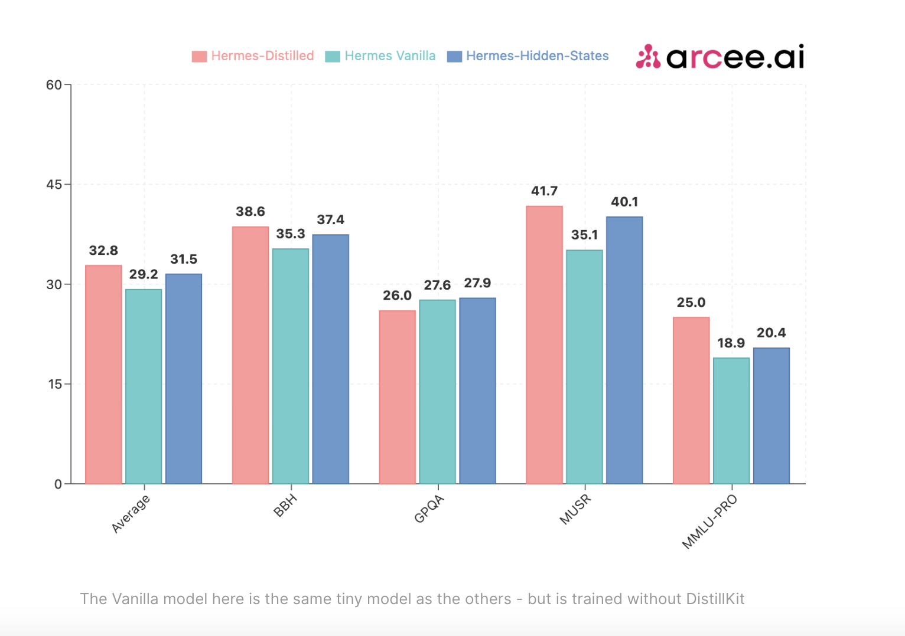

# Arcee AI Released DistillKit: An Open Source, Easy-to-Use Tool Transforming Model Distillation for Creating Efficient, High-Performance Small Language Models

> Arcee AI has announced the release of DistillKit, an innovative open-source tool designed to revolutionize the creation and distribution of Small Language Models (SLMs). This release aligns with Arcee AI‘s ongoing mission to make AI more accessible and efficient for researchers, users, and businesses seeking to access open-source and easy-to-use distillation methods tools. Introduction to […]

[Arcee AI](https://hubs.li/Q02JL65s0) has announced the release of [**DistillKit**,](https://hubs.li/Q02JLbnv0) an innovative open-source tool designed to revolutionize the creation and distribution of Small Language Models (SLMs). This release aligns with [Arcee AI](https://hubs.li/Q02JL65s0)‘s ongoing mission to make AI more accessible and efficient for researchers, users, and businesses seeking to access open-source and easy-to-use distillation methods tools.

**Introduction to DistillKit**

[DistillKit](https://hubs.li/Q02JLbnv0) is an open-source, cutting-edge project centered around model distillation, a process that enables knowledge transfer from large, resource-intensive models to smaller, more efficient ones. This tool aims to make advanced AI capabilities available to a broader audience by significantly reducing the computational resources required to run these models.

The primary goal of [DistillKit](https://hubs.li/Q02JLbnv0) is to create smaller models that retain the power and sophistication of their larger counterparts while being optimized for use on less powerful hardware, such as laptops and smartphones. This approach democratizes access to advanced AI and promotes energy efficiency and cost savings in AI deployment.

**Distillation Methods in DistillKit**

**[DistillKit](https://blog.arcee.ai/distillkit-v0-1-by-arcee-ai/)** employs two main methods for knowledge transfer: logit-based distillation and hidden states-based distillation.

- **Logit-based Distillation: **This method involves the teacher model (the larger model) providing its output probabilities (logits) to the student model (the smaller model). The student model learns not only the correct answers but also the confidence levels of the teacher model in its predictions. This technique enhances the student model’s ability to generalize and perform efficiently by mimicking the teacher model’s output distribution.

- **Hidden States-based Distillation:** The student model is trained to replicate the teacher model’s intermediate representations (hidden states) in this approach. By aligning its internal processing with the teacher model, the student model gains a deeper understanding of the data. This method is useful for cross-architecture distillation as it allows knowledge transfer between models of different tokenizers.

**Key Takeaways of DistillKit**

The experiments and performance evaluations of DistillKit provide several key insights into its effectiveness and potential applications:

- **General-Purpose Performance Gain:** [DistillKit](https://hubs.li/Q02JLbnv0) demonstrated consistent performance improvements across various datasets and training conditions. Models trained on subsets of openhermes, WebInstruct-Sub, and FineTome showed encouraging gains in benchmarks such as MMLU and MMLU-Pro. These results indicate significant enhancements in knowledge absorption for SLMs.

- **Domain-Specific Performance Gain:** The targeted distillation approach yielded notable improvements in domain-specific tasks. For instance, distilling Arcee-Agent into Qwen2-1.5B-Instruct using the same training data as the teacher model resulted in substantial performance enhancements. This suggests that leveraging identical training datasets for teacher and student models can lead to higher performance gains.

- **Flexibility and Versatility:** [DistillKit](https://hubs.li/Q02JLbnv0)‘s ability to support logit-based and hidden states-based distillation methods provides flexibility in model architecture choices. This versatility allows researchers and developers to tailor the distillation process to suit specific requirements.

- **Efficiency and Resource Optimization:** [DistillKit](https://hubs.li/Q02JLbnv0) reduces the computational resources and energy required for AI deployment by enabling the creation of smaller, efficient models. This makes advanced AI capabilities more accessible and promotes sustainable AI research and development practices.

- **Open-Source Collaboration:** [DistillKit](https://hubs.li/Q02JLbnv0)‘s open-source nature invites the community to contribute to its ongoing development. This collaborative approach fosters innovation and improvement, encouraging researchers and developers to explore new distillation methods, optimize training routines, and enhance memory efficiency.

**Performance Results**

The effectiveness of DistillKit has been rigorously tested through a series of experiments to evaluate its impact on model performance and efficiency. These experiments focused on various aspects, including comparing distillation techniques, the performance of distilled models against their teacher models, and domain-specific distillation applications.

- **Comparison of Distillation Techniques**

The first set of experiments compared the performance of different models refined through logit-based and hidden states-based distillation techniques against a standard supervised fine-tuning (SFT) approach. Using Arcee-Spark as the teacher model, knowledge was distilled into Qwen2-1.5B-Base models. The results demonstrated significant performance improvements for distilled models over the SFT-only baseline across major benchmarks such as BBH, MUSR, and MMLU-PRO.

- **Logit-based Distillation: **The logit-based approach outperformed the hidden states-based method across most benchmarks, showcasing its superior ability to enhance student performance by transferring knowledge more effectively.

- **Hidden States-based Distillation:** While slightly behind the logit-based method in overall performance, this technique still provided substantial gains compared to the SFT-only variant, especially in scenarios requiring cross-architecture distillation.

These findings underscore the robustness of the distillation methods implemented in [DistillKit](https://hubs.li/Q02JLbnv0) and highlight their potential to boost the efficiency and accuracy of smaller models significantly.

- **Effectiveness in General Domains**: Further experiments evaluated the effectiveness of logit-based distillation in a general domain setting. A 1.5B distilled model, trained on a subset of WebInstruct-Sub, was compared against its teacher model, Arcee-Spark, and the baseline Qwen2-1.5B-Instruct model. The distilled model consistently improved performance across all metrics, demonstrating results comparable to the teacher model, particularly on MUSR and GPQA benchmarks. This experiment confirmed the capability of DistillKit to produce highly efficient models that retain much of the teacher model’s performance while being significantly smaller and less resource-intensive.

- **Domain-Specific Distillation**: DistillKit’s potential for domain-specific tasks was also explored through the distillation of Arcee-Agent into Qwen2-1.5B-Instruct models. Arcee-Agent, a model specialized in function calling and tool use, served as the teacher. The results revealed substantial performance gains and highlighted the effectiveness of using the same training data for teacher and student models. This approach enhanced the distilled models’ general-purpose capabilities and optimized them for specific tasks.

**Impact and Future Directions**

The release of DistillKit is poised to enable the creation of smaller, efficient models for making advanced AI accessible to various users and applications. This accessibility is crucial for businesses & individuals who may not have the resources to deploy large-scale AI models. Smaller models generated through DistillKit offer several advantages, including reduced energy consumption & lower operational costs. These models can be deployed directly on local devices, enhancing privacy and security by minimizing the need to transmit data to cloud servers. Arcee AI plans to continue enhancing DistillKit with additional features and capabilities. Future updates will include advanced distillation techniques such as Continued Pre-Training (CPT) and Direct Preference Optimization (DPO). 

**Conclusion**

[DistillKit](https://hubs.li/Q02JLbnv0) by [Arcee AI](https://hubs.li/Q02JL65s0) marks a significant milestone in model distillation, offering a robust, flexible, and efficient tool for creating SLMs. The experiments’ performance results and key takeaways highlight DistillKit’s potential to revolutionize AI deployment by making advanced models more accessible and practical. Arcee AI’s commitment to open-source research and community collaboration ensures that DistillKit will continue to evolve, incorporating new techniques and optimizations to meet the ever-changing demands of AI technology. Arcee AI also invites the community to contribute to the project by developing new distillation methods for improving training routines and optimizing memory usage.

---

_Thanks to [Arcee AI ](https://hubs.li/Q02JL65s0)for the thought leadership/ Resources for this article. [Arcee AI ](https://hubs.li/Q02JL65s0)has supported us in this content/article._
