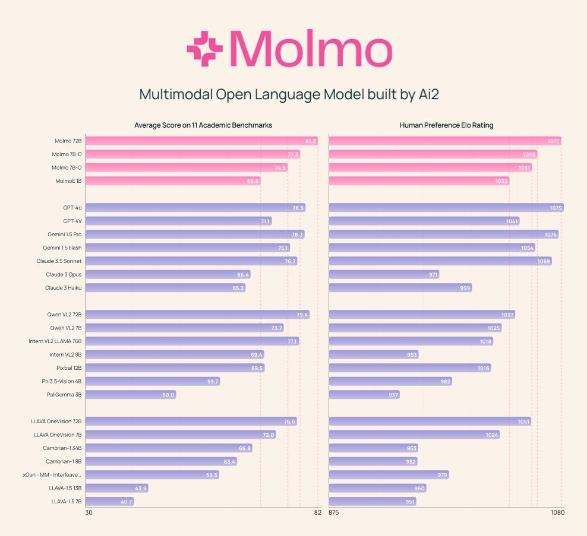

# Are Small Language Models Really the Future of Language Models? Allen Institute for Artificial Intelligence (Ai2) Releases Molmo: A Family of Open-Source Multimodal Language Models

> Multimodal models represent a significant advancement in artificial intelligence by enabling systems to process and understand data from multiple sources, like text and images. These models are essential for applications like image captioning, answering visual questions, and assisting in robotics, where understanding visual and language inputs is crucial. With advances in vision-language models (VLMs), AI […]

Multimodal models represent a significant advancement in artificial intelligence by enabling systems to process and understand data from multiple sources, like text and images. These models are essential for applications like image captioning, answering visual questions, and assisting in robotics, where understanding visual and language inputs is crucial. With advances in vision-language models (VLMs), AI systems can generate descriptive narratives of images, answer questions based on visual information, and perform tasks like object recognition. However, many of the highest-performing multimodal models today are built using proprietary data, which limits their accessibility to the broader research community and stifles innovation in open-access AI research.

One of the critical problems facing the development of open multimodal models is their dependence on data generated by proprietary systems. Closed systems, like GPT-4V and Claude 3.5, have created high-quality synthetic data that help models achieve impressive results, but this data is not available to everyone. As a result, researchers face barriers when attempting to replicate or improve upon these models, and the scientific community needs a foundation for building such models from scratch using fully open datasets. This problem has stalled the progress of open research in the field of AI, as researchers cannot access the fundamental components required to create state-of-the-art multimodal models independently.

The methods commonly used to train multimodal models rely heavily on distillation from proprietary systems. Many vision-language models, for instance, use data like ShareGPT4V, which is generated by GPT-4V, to train their systems. While highly effective, this synthetic data keeps these models dependent on closed systems. Open-weight models have been developed but often perform significantly worse than their proprietary counterparts. Also, these models are constrained by their limited access to high-quality datasets, which makes it challenging to close the performance gap with closed systems. Open models are thus frequently left behind compared to more advanced models from companies with access to proprietary data.

The researchers from the Allen Institute for AI and the University of Washington introduced the [**Molmo** ](https://molmo.allenai.org/)family of vision-language models. This new family of models represents a breakthrough in the field by providing an entirely open-weight and open-data solution. Molmo does not rely on synthetic data from proprietary systems, making it a fully accessible tool for the AI research community. The researchers developed a new dataset, [**PixMo**](https://molmo.allenai.org/blog), which consists of detailed image captions created entirely by human annotators. This dataset allows the Molmo models to be trained on natural, high-quality data, making them competitive with the best models in the field.

The first release includes several key components:

- [**MolmoE-1B:**](https://huggingface.co/allenai/MolmoE-1B-0924)** **Built using the fully open OLMoE-1B-7B mixture-of-experts large language model (LLM).

- [**Molmo-7B-O:**](https://huggingface.co/allenai/Molmo-7B-O-0924) Utilizes the fully open OLMo-7B-1024 LLM, set for the October 2024 pre-release, with a full public release planned later.

- [**Molmo-7B-D:**](https://huggingface.co/allenai/Molmo-7B-D-0924)** **This demo model leverages the open-weight Qwen2 7B LLM.

- [**Molmo-72B:**](https://huggingface.co/allenai/Molmo-72B-0924) The highest-performing model in the family, using the open-weight Qwen2 72B LLM.

The Molmo models are trained using a simple yet powerful pipeline that combines a pre-trained vision encoder with a language model. The vision encoder is based on OpenAI’s ViT-L/14 CLIP model, which provides reliable image tokenization. Molmo’s PixMo dataset, which contains over 712,000 images and approximately 1.3 million captions, is the foundation for training the models to generate dense, detailed image descriptions. Unlike previous methods that asked annotators to write captions, the PixMo dataset relies on spoken descriptions. Annotators were prompted to describe every image detail for 60 to 90 seconds. This innovative approach allowed for the collection of more descriptive data in less time and provided high-quality image annotations, avoiding the reliance on synthetic data from closed VLMs.

The Molmo-72B model, the most advanced in the family, has outperformed many leading proprietary systems, including Gemini 1.5 and Claude 3.5 Sonnet, on 11 academic benchmarks. It also ranked second in a human evaluation with 15,000 image-text pairs, only slightly behind GPT-4o. The model achieved top scores in benchmarks such as AndroidControl, where it reached an accuracy of 88.7% for low-level tasks and 69.0% for high-level tasks. The MolmoE-1B model, another in the family, was able to closely match the performance of GPT-4V, making it a highly efficient and competitive open-weight model. The broad success of the Molmo models in both academic and user evaluations demonstrates the potential of open VLMs to compete with and even surpass proprietary systems.

In conclusion, the development of the Molmo family provides the research community with a powerful, open-access alternative to closed systems, offering fully open weights, datasets, and source code. By introducing innovative data collection techniques and optimizing the model architecture, the researchers at the Allen Institute for AI have successfully created a family of models that perform on par with, and in some cases surpass, the proprietary giants of the field. The release of these models, along with the associated PixMo datasets, paves the way for future innovation and collaboration in developing vision-language models, ensuring that the broader scientific community has the tools needed to continue pushing the boundaries of AI.

---

Check out the **[Models on the HF Page](https://huggingface.co/collections/allenai/molmo-66f379e6fe3b8ef090a8ca19)**, **[Demo](https://molmo.allenai.org/)**, and **[Details](https://molmo.allenai.org/blog)**. All credit for this research goes to the researchers of this project. Also, don’t forget to follow us on **[Twitter](https://twitter.com/Marktechpost)** and join our **[Telegram Channel](https://pxl.to/at72b5j)** and [**LinkedIn Gr**](https://www.linkedin.com/groups/13668564/)[**oup**](https://www.linkedin.com/groups/13668564/). **If you like our work, you will love our**[** newsletter..**](https://marktechpost-newsletter.beehiiv.com/subscribe)

Don’t Forget to join our **[52k+ ML SubReddit](https://www.reddit.com/r/machinelearningnews/)**
