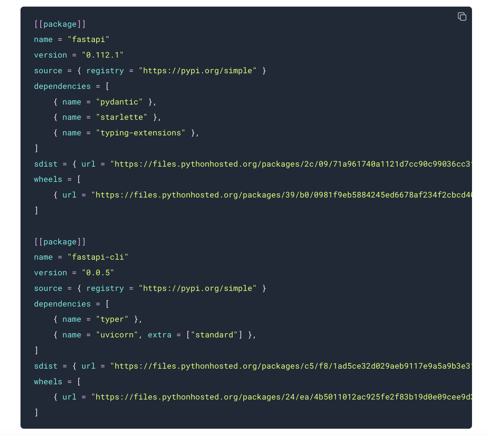

# Astral Released uv with Advanced Features: A Comprehensive and High-Performance Tool for Unified Python Packaging and Project Management

> Astral, a company renowned for its high-performance developer tools in the Python ecosystem, has recently released uv: Unified Python packaging, a comprehensive tool designed to streamline Python package management. This new tool, built in Rust, represents a significant advancement in Python packaging by offering an all-in-one solution that caters to various Python development needs. Let’s […]

Astral, a company renowned for its high-performance developer tools in the Python ecosystem, has recently released **uv: Unified Python packaging**, a comprehensive tool designed to streamline Python package management. This new tool, built in Rust, represents a significant advancement in Python packaging by offering an all-in-one solution that caters to various Python development needs. Let’s delve into the features, capabilities, and potential impact of uv on the Python development community.

**Introduction to uv: The New Python Packaging Tool**

Astral is best known for creating Ruff, a fast Python linter and formatter that has gained significant popularity in the developer community. Building on this success, Astral introduced uv in February 2024 as a fast Python package installer and resolver, initially designed to serve as a drop-in replacement for the widely used pip tool. However, the recent updates to uv have transformed it from a simple pip alternative into a fully-fledged project management solution for Python developers.

**Key Features of uv**

The core appeal of uv lies in its strength of providing a unified interface for managing Python projects, tools, scripts, and even the Python interpreter itself. Below is an exploration of the key features introduced in this new release:

- **End-to-End Project Management**

One of the most significant additions to uv is its project management capabilities. Developers can now use uv to generate and install cross-platform lockfiles based on standards-compliant metadata. This feature positions uv as a high-performance alternative to popular Python project management tools such as Poetry, PDM, and Rye. By integrating uv into their workflows, developers can achieve consistent and reliable project environments across different machines and platforms.

For example, developers can initialize a new Python project and add dependencies with just a few commands. The uv tool will then create a lockfile that captures the project’s fully resolved dependencies, ensuring the environment is consistent across all platforms. This approach simplifies dependency management and significantly reduces the complexity of maintaining large Python projects.

- **Tool Management**

In addition to managing Python projects, uv now supports the installation and execution of command-line tools in isolated virtual environments. This capability makes uv a powerful alternative to tools like pipx. With uv, developers can install tools and run commands without requiring explicit installations, streamlining the development process. For instance, executing a command like `uvx ruff check` allows developers to run a Python linter without additional setup, making uv a convenient and efficient option for managing Python-based command-line tools.

- **Python Installation**

uv also extends its functionality to include Python installation and management. By supporting Python bootstrapping, uv allows developers to install and manage different Python versions directly from the command line. This feature makes uv a viable alternative to pyenv, enhancing its utility in Python development. The simplicity of this process—developers can install Python with a single command—underscores uv’s focus on providing a seamless and user-friendly experience.

- **Script Execution**

Another innovative feature of uv is its support for hermetic, single-file Python scripts with inline dependency metadata. Leveraging PEP 723, uv enables developers to embed dependency declarations directly within Python scripts. This feature eliminates the need for separate dependency management files, such as ‘requirements.txt,’ thereby simplifying the execution of standalone Python scripts. With uv, running a Python script with all necessary dependencies is as simple as executing a single command, making it an ideal tool for quick, one-off scripting tasks.

**Performance and Efficiency**

One of the standout qualities of uv is its speed. Built with Rust, uv is designed to handle dependency resolution and project management tasks efficiently. In benchmark tests, uv has performed significantly faster than other tools like Poetry and PDM. For example, resolving dependencies for the Jupyter project without caching takes uv approximately 0.57 seconds, whereas Poetry requires 7.59 seconds. This performance boost is a testament to the underlying architecture of uv, which is optimized for speed and reliability.

*[**Image Source**](https://astral.sh/blog/uv-unified-python-packaging)*

uv’s caching mechanism further enhances its efficiency. With caching enabled, uv can resolve dependencies in milliseconds, providing a swift and responsive user experience. This capability is particularly beneficial for developers working on large projects with complex dependency trees, where the time savings can be substantial.

*[**Image Source**](https://astral.sh/blog/uv-unified-python-packaging)*

**Workspaces and Collaboration**

Astral has also introduced the concept of workspaces to uv, drawing inspiration from a similar feature in Rust’s Cargo tool. Workspaces allow developers to manage multiple Python packages within a single repository, each with its own ‘pyproject.toml’ file, but sharing a unified lockfile. This setup ensures that all packages within the workspace operate with consistent dependencies, simplifying the management of large, multi-package projects.

Workspaces are particularly useful for teams working on complex Python applications that involve multiple interdependent packages. Centralizing the management of these packages, uv helps developers maintain consistency across their projects, reducing the likelihood of dependency conflicts and other common issues.

**Conclusion**

The release of uv by Astral marks a significant milestone in Python packaging. uv addresses many Python developers’ pains when managing projects, tools, and environments by offering a unified, fast, and reliable toolchain. Its extensive feature set, emphasis on performance, and ease of use position uv as a powerful alternative to tools like pip, poetry, and pyenv.

As Python becomes popular, the need for efficient and scalable tools becomes increasingly important. With uv, Astral has delivered a solution that not only meets the current demands of Python developers but also anticipates future challenges. Whether you are a seasoned Python developer or a newcomer to the language, uv offers a compelling option for managing your Python projects quickly and simply.

---

Check out the **[Details](https://astral.sh/blog/uv-unified-python-packaging) and [GitHub](https://github.com/astral-sh/uv).** All credit for this research goes to the researchers of this project. Also, don’t forget to follow us on **[Twitter](https://twitter.com/Marktechpost)** and join our **[Telegram Channel](https://arxiv.org/abs/2408.08231)** and [**LinkedIn Gr**](https://www.linkedin.com/groups/13668564/)[**oup**](https://www.linkedin.com/groups/13668564/). **If you like our work, you will love our**[** newsletter..**](https://marktechpost-newsletter.beehiiv.com/subscribe)

Don’t Forget to join our **[49k+ ML SubReddit](https://www.reddit.com/r/machinelearningnews/)**

**Find Upcoming [AI Webinars here](https://www.marktechpost.com/ai-webinars-list-llms-rag-generative-ai-ml-vector-database/)**
