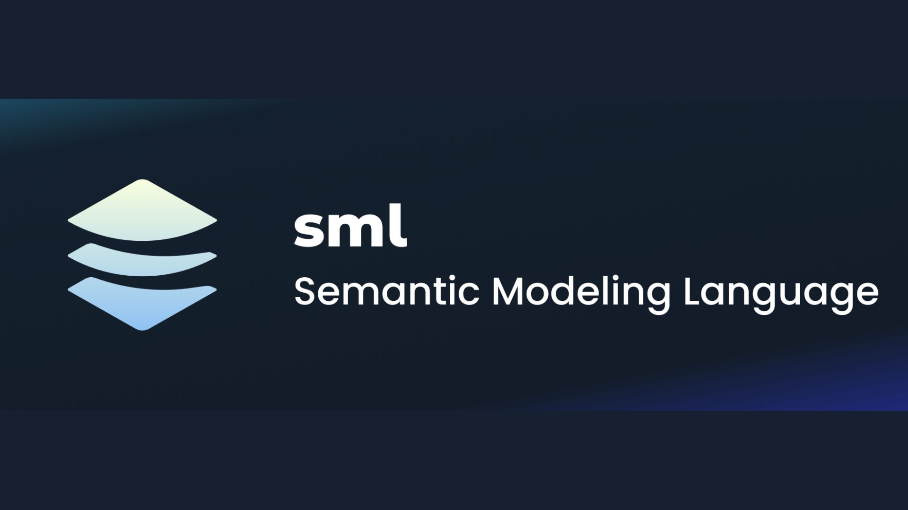

# AtScale Open-Sourced Semantic Modeling Language (SML): Transforming Analytics with Industry-Standard Framework for Interoperability, Reusability, and Multidimensional Data Modeling Across Platforms

> AtScale has made a significant move by announcing the open-source release of its Semantic Modeling Language (SML). This initiative aims to provide an industry-standard semantic modeling language that can be adopted across various platforms, fostering greater collaboration and interoperability in the analytics community. The introduction of SML marks a major step in the company’s decade-long […]

AtScale has made a significant move by announcing the open-source release of its [**Semantic Modeling Language (SML)**](https://www.atscale.com/blog/introduction-to-sml-a-standard-semantic-modeling-language/). This initiative aims to provide an industry-standard semantic modeling language that can be adopted across various platforms, fostering greater collaboration and interoperability in the analytics community. The introduction of SML marks a major step in the company’s decade-long journey of democratizing data analytics and advancing semantic layer technology. 

AtScale’s journey began with a vision to create a business-friendly interface for users to interact with data. This led to creation of an independent semantic layer that sits on top of technical data platforms, enabling business users to query data in terms they understand. Since its inception, AtScale has been committed to advancing the concept of a universal semantic layer that can operate across different analytics tools and data platforms, making it easier for business users to derive insights without deep technical knowledge.

**The Need for an Open Standard**

Semantic layers are vital to modern analytics platforms, bridging the gap between raw data & business insights. When AtScale was founded in 2013, no other vendors offered semantic layer platforms. However, the industry has seen a proliferation of semantic layer platforms from various vendors over the past decade. With the growing diversity of tools, a need for a unified, standard language for semantic modeling emerged. 

AtScale has now open-sourced SML. The company aims to promote model portability, enabling users to build semantic models that can be shared across platforms. A key motivation behind this move is to foster a community where model builders can create and share a library of reusable semantic models that can be plugged into any platform. This will lead to time savings for users, allowing them to consume business data with minimal technical configuration.

**What SML Offers**

SML results from more than a decade of hands-on development. It is designed to handle complex, multidimensional data across various industries like finance, healthcare, retail, manufacturing, and more. The language supports metrics, dimensions, hierarchies, and semi-additive measures, crucial for building sophisticated analytics models.

**SML offers several benefits to developers and organizations:**

- **Object-Oriented Structure: **SML is designed to be object-oriented, so its semantic objects can be reused across different models, promoting consistency and efficiency in model building.

- **Comprehensive Scope:** It is a superset of existing semantic modeling languages, incorporating more than a decade’s experience and use cases across different verticals. This makes SML versatile enough to cater to a wide range of applications.

- **Familiar Syntax: **SML is built on YAML, a widely adopted, human-readable syntax, making it easier for developers to adopt the language without steep learning curves.

- **CI/CD Friendly:** Being code-based, SML integrates well with modern software development practices, including Git for version control, and supports continuous integration and continuous deployment (CI/CD) workflows.

- **Extensibility and Open Access:** SML is Apache open-sourced, which means it is free to use and can be extended by the community. This open nature allows for innovation and collaboration, ensuring the language evolves to meet new demands.

**What Is Being Open-Sourced**

AtScale is making several components available as part of its open-source initiative:

- **SML Language Specification:** This includes tabular and multidimensional constructs, providing a comprehensive framework for model building.

- **Pre-built Semantic Models:** These models, available on GitHub, cover standard data schemas such as TPC-DS and other common training models. AtScale plans to release models for popular SaaS applications like Salesforce and Jira.

- **Helper Classes and Translators (coming soon):** These will include programmatic tools to facilitate the reading and writing of SML syntax and translators for migrating models from other semantic languages, such as those used by dbt Labs and Power BI.

AtScale’s decision to open-source SML represents a significant step towards fostering greater collaboration in the analytics industry. By creating a standard semantic modeling language, the company hopes to accelerate the adoption of semantic layers and promote the development of reusable, interoperable models. With the introduction of SML, AtScale is positioning itself at the forefront of the movement to standardize business logic expression and facilitate seamless data and analytics interoperability across platforms.

In conclusion, the open sourcing of SML underscores AtScale’s commitment to democratizing analytics and building a vibrant community around semantic modeling. As more organizations adopt the standard, the hope is that it will spur innovation and make analytics more accessible and efficient for all industry stakeholders.

---

Check out the **[Details](https://www.atscale.com/blog/introduction-to-sml-a-standard-semantic-modeling-language/) and [GitHub](https://github.com/semanticdatalayer/SML).** All credit for this research goes to the researchers of this project. Also, don’t forget to follow us on **[Twitter](https://twitter.com/Marktechpost)** and [**LinkedIn**](https://www.linkedin.com/company/marktechpost/?viewAsMember=true). Join our **[Telegram Channel](https://www.zyphra.com/post/zamba2-mini)**.

**If you like our work, you will love our**[** newsletter..**](https://marktechpost-newsletter.beehiiv.com/subscribe)

Don’t Forget to join our **[50k+ ML SubReddit](https://www.reddit.com/r/machinelearningnews/)**

> [LG AI Research Open-Sources EXAONEPath: Transforming Histopathology Image Analysis with a 285M Patch-level Pre-Trained Model for Variety of Medical Prediction, Reducing Genetic Testing Time and Costs](https://www.marktechpost.com/2024/09/09/lg-ai-research-open-sources-exaonepath-transforming-histopathology-image-analysis-with-a-285m-patch-level-pre-trained-model-for-variety-of-medical-prediction-reducing-genetic-testing-time-and-costs/)
