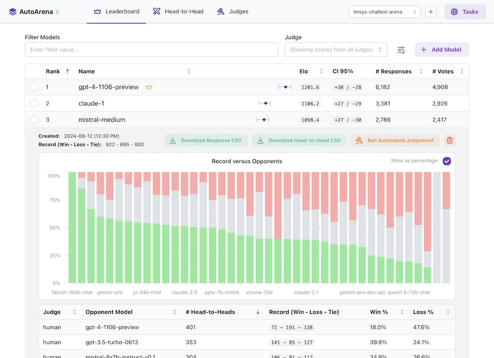

# AutoArena: An Open-Source AI Tool that Automates Head-to-Head Evaluations Using LLM Judges to Rank GenAI Systems

> Evaluating generative AI systems can be a complex and resource-intensive process. As the landscape of generative models evolves rapidly, organizations, researchers, and developers face significant challenges in systematically evaluating different models, including LLMs (Large Language Models), retrieval-augmented generation (RAG) setups, or even variations in prompt engineering. Traditional methods for evaluating these systems can be cumbersome, […]

Evaluating generative AI systems can be a complex and resource-intensive process. As the landscape of generative models evolves rapidly, organizations, researchers, and developers face significant challenges in systematically evaluating different models, including LLMs (Large Language Models), retrieval-augmented generation (RAG) setups, or even variations in prompt engineering. Traditional methods for evaluating these systems can be cumbersome, time-consuming, and highly subjective, especially when comparing the nuances of outputs across models. These challenges result in slower iteration cycles and increased cost, often hampering innovation. To address these issues, Kolena AI has introduced a new tool called **[AutoArena](https://www.autoarena.app/)**—a solution designed to automate the evaluation of generative AI systems effectively and consistently.

### Overview of AutoArena

AutoArena is specifically developed to provide an efficient solution for evaluating the comparative strengths and weaknesses of generative AI models. It allows users to perform head-to-head evaluations of different models using LLM judges, thus making the evaluation process more objective and scalable. By automating the process of model comparison and ranking, AutoArena accelerates decision-making and helps identify the best model for any specific task. The open-source nature of the tool also opens it up for contributions and refinements from a broad community of developers, enhancing its capability over time.

### Features and Technical Details

AutoArena has a streamlined and user-friendly interface designed for both technical and non-technical users. The tool automates head-to-head comparisons between generative AI models—be it LLMs, different RAG configurations, or prompt tweaks—using LLM judges. These judges are capable of evaluating various outputs based on pre-set criteria, removing the need for manual evaluations, which are both labor-intensive and prone to bias. AutoArena allows users to set up their desired evaluation tasks easily and then leverages LLMs to provide consistent and replicable evaluations. This automation significantly reduces the cost and human effort typically required for such tasks while ensuring that each model is objectively assessed under the same conditions. AutoArena also provides visualization features to help users interpret the evaluation results, thus offering clear and actionable insights.

One of the major reasons why AutoArena is important lies in its potential to streamline the evaluation process and bring consistency to it. Evaluating generative AI models often involves a level of subjectivity that can lead to variability in results—AutoArena addresses this issue by using standardized LLM judges to assess model quality consistently. By doing so, it provides a structured evaluation framework that minimizes bias and subjective variations that typically affect evaluations. This consistency is crucial for organizations that need to benchmark multiple models before deploying AI solutions. Furthermore, the open-source nature of AutoArena fosters transparency and community-driven innovation, allowing researchers and developers to contribute and adapt the tool to evolving requirements in the AI space. As AI becomes increasingly integral to various industries, the need for reliable benchmarking tools like AutoArena becomes essential for building trustworthy AI systems.

#### Conclusion

In conclusion, AutoArena by Kolena AI represents a significant advancement in the automation of generative AI evaluations. The tool addresses the challenges of labor-intensive and subjective evaluations by introducing an automated, scalable approach that utilizes LLM judges. Its capabilities are not only beneficial for researchers and organizations seeking objective assessments but also for the broader community contributing to its open-source development. By facilitating a streamlined evaluation process, AutoArena helps accelerate innovation in generative AI, ultimately enabling more informed decision-making and improving the quality of AI systems being developed.

---

Check out the **[GitHub Page](https://github.com/kolenaIO/autoarena)**. All credit for this research goes to the researchers of this project. Also, don’t forget to follow us on **[Twitter](https://twitter.com/Marktechpost)** and join our **[Telegram Channel](https://pxl.to/at72b5j)** and [**LinkedIn Gr**](https://www.linkedin.com/groups/13668564/)[**oup**](https://www.linkedin.com/groups/13668564/). **If you like our work, you will love our**[** newsletter..**](https://marktechpost-newsletter.beehiiv.com/subscribe) Don’t Forget to join our **[50k+ ML SubReddit](https://www.reddit.com/r/machinelearningnews/)**

**[[Upcoming Event- Oct 17 202] RetrieveX – The GenAI Data Retrieval Conference (Promoted)](https://www.eventbrite.com/e/retrievex-the-genai-data-retrieval-conference-tickets-983939869637?utm_source=print&utm_medium=markettechpost&utm_campaign=retrievex&utm_term=tagline&utm_content=SIZE)**
