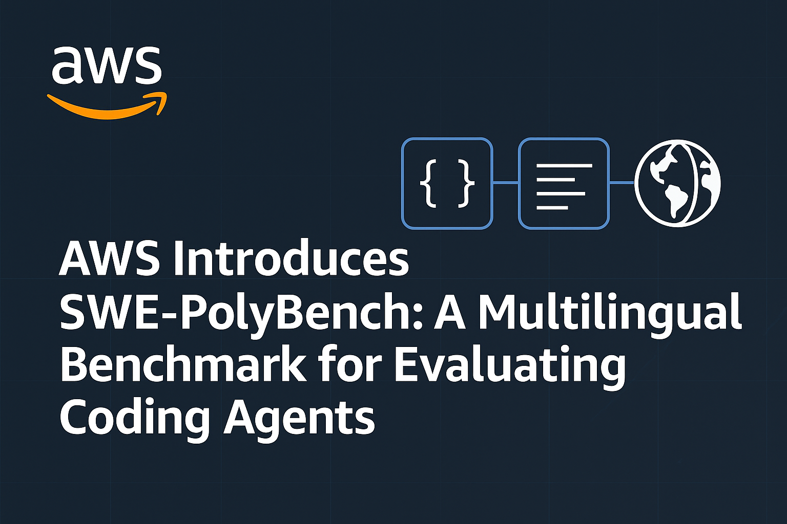

# AWS Introduces SWE-PolyBench: A New Open-Source Multilingual Benchmark for Evaluating AI Coding Agents

> Recent advancements in large language models (LLMs) have enabled the development of AI-based coding agents that can generate, modify, and understand software code. However, the evaluation of these systems remains limited, often constrained to synthetic or narrowly scoped benchmarks, primarily in Python. These benchmarks seldom reflect the structural and semantic diversity of real-world codebases, and […]

Recent advancements in large language models (LLMs) have enabled the development of AI-based coding agents that can generate, modify, and understand software code. However, the evaluation of these systems remains limited, often constrained to synthetic or narrowly scoped benchmarks, primarily in Python. These benchmarks seldom reflect the structural and semantic diversity of real-world codebases, and as a result, many agents overfit to benchmark-specific patterns rather than demonstrating robust, transferable capabilities.

### AWS Introduces SWE-PolyBench: A More Comprehensive Evaluation Framework

To address these challenges, AWS AI Labs has introduced **SWE-PolyBench**, a multilingual, repository-level benchmark designed for execution-based evaluation of AI coding agents. The benchmark spans 21 GitHub repositories across four widely-used programming languages—Java, JavaScript, TypeScript, and Python—comprising 2,110 tasks that include bug fixes, feature implementations, and code refactorings.

Unlike prior benchmarks, SWE-PolyBench incorporates real pull requests (PRs) that close actual issues and include associated test cases, allowing for verifiable evaluation. A smaller, stratified subset—**SWE-PolyBench500**—has also been released to support quicker experimentation while preserving task and language diversity.

### Technical Structure and Evaluation Metrics

SWE-PolyBench adopts an execution-based evaluation pipeline. Each task includes a repository snapshot and a problem statement derived from a GitHub issue. The system applies the associated ground truth patch in a containerized test environment configured for the respective language ecosystem (e.g., Maven for Java, npm for JS/TS, etc.). The benchmark then measures outcomes using two types of unit tests: **fail-to-pass (F2P)** and **pass-to-pass (P2P)**.

To provide a more granular assessment of coding agents, SWE-PolyBench introduces **Concrete Syntax Tree (CST)**-based metrics. These include both file-level and node-level retrieval scores, assessing the agent’s ability to locate and modify relevant sections of the codebase. These metrics offer insights beyond binary pass/fail outcomes, especially for complex, multi-file modifications.

### Empirical Evaluation and Observations

Three open-source coding agents—**Aider**, **SWE-Agent**, and **Agentless**—were adapted for SWE-PolyBench. All used Anthropic’s Claude 3.5 as the underlying model and were modified to handle the multilingual, repository-level requirements of the benchmark.

The evaluation revealed notable differences in performance across languages and task types. For instance, agents performed best on Python tasks (up to 24.1% pass rate) but struggled with TypeScript (as low as 4.7%). Java, despite its higher complexity in terms of average node changes, achieved higher success rates than TypeScript, suggesting that pretraining exposure and syntax familiarity play a critical role in model performance.

Performance also varied with task complexity. Tasks limited to single-function or single-class changes yielded higher success rates (up to 40%), while those requiring mixed or multi-file changes saw a significant drop. Interestingly, high retrieval precision and recall—particularly for file and CST node identification—did not always translate to higher pass rates, indicating that code localization is necessary but insufficient for problem resolution.

### Conclusion: Toward Robust Evaluation of AI Coding Agents

SWE-PolyBench presents a robust and nuanced evaluation framework for coding agents, addressing key limitations in existing benchmarks. By supporting multiple programming languages, covering a wider range of task types, and incorporating syntax-aware metrics, it offers a more representative assessment of an agent’s real-world applicability.

The benchmark reveals that while AI agents exhibit promising capabilities, their performance remains inconsistent across languages and tasks. SWE-PolyBench provides a foundation for future research aimed at improving the generalizability, robustness, and reasoning capabilities of AI coding assistants.

---

**Check out the [AWS DevOps Blog](https://aws.amazon.com/blogs/devops/amazon-introduces-swe-polybench-a-multi-lingual-benchmark-for-ai-coding-agents/), [Hugging Face – SWE-PolyBench](https://huggingface.co/datasets/AmazonScience/SWE-PolyBench) and [GitHub – SWE-PolyBench](https://github.com/amazon-science/SWE-PolyBench)**. Also, don’t forget to follow us on **[Twitter](https://x.com/intent/follow?screen_name=marktechpost)** and join our **[Telegram Channel](https://arxiv.org/abs/2406.09406)** and [**LinkedIn Gr**](https://www.linkedin.com/groups/13668564/)[**oup**](https://www.linkedin.com/groups/13668564/). Don’t Forget to join our **[90k+ ML SubReddit](https://www.reddit.com/r/machinelearningnews/)**.

[**🔥 [Register Now] miniCON Virtual Conference on AGENTIC AI: FREE REGISTRATION + Certificate of Attendance + 4 Hour Short Event (May 21, 9 am- 1 pm PST) + Hands on Workshop**](https://minicon.marktechpost.com/)
