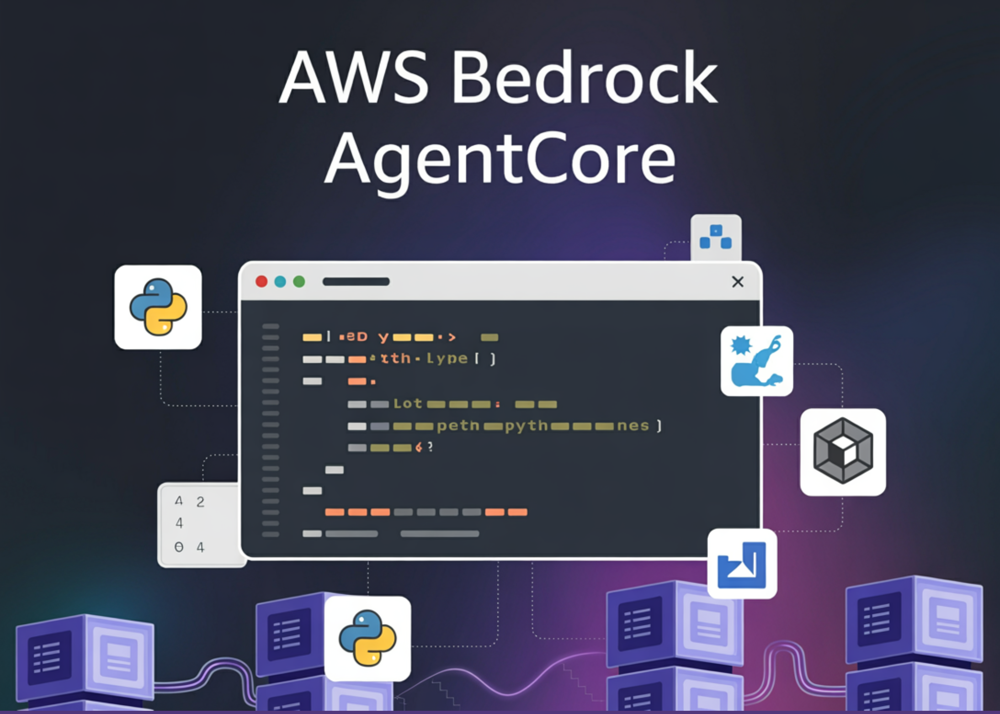

# AWS Open-Sources an MCP Server for Bedrock AgentCore to Streamline AI Agent Development

> AWS released an open-source Model Context Protocol (MCP) server for Amazon Bedrock AgentCore, providing a direct path from natural-language prompts in agentic IDEs to deployable agents on AgentCore Runtime. The package ships with automated transformations, environment provisioning, and Gateway/tooling hooks designed to compress typical multi-step integration work into conversational commands. So, what exactly is it? […]

AWS released an open-source [Model Context Protocol (MCP) server](https://github.com/awslabs/mcp/tree/main/src/amazon-bedrock-agentcore-mcp-server) for Amazon Bedrock AgentCore, providing a direct path from natural-language prompts in agentic IDEs to deployable agents on AgentCore Runtime. The package ships with automated transformations, environment provisioning, and Gateway/tooling hooks designed to compress typical multi-step integration work into conversational commands.

### So, what exactly is it?

The “AgentCore MCP [server](https://www.marktechpost.com/2025/08/08/proxy-servers-explained-types-use-cases-trends-in-2025-technical-deep-dive/)” exposes task-specific tools to a client (e.g., Kiro, Claude Code, Cursor, Amazon Q Developer CLI, or the VS Code Q plugin) and guides the assistant to: (1) minimally refactor an existing agent to the AgentCore Runtime model; (2) provision and configure the AWS environment (credentials, roles/permissions, ECR, config files); (3) wire up AgentCore Gateway for tool calls; and (4) invoke and test the deployed agent—all from the IDE’s chat surface.

Practically, the server teaches your coding assistant to convert entry points to AgentCore handlers, add `bedrock_agentcore` imports, generate `requirements.txt`, and rewrite direct agent calls into payload-based handlers compatible with Runtime. It can then call the AgentCore CLI to deploy and exercise the agent, including end-to-end calls through Gateway tools.

*https://aws.amazon.com/blogs/machine-learning/accelerate-development-with-the-amazon-bedrock-agentcore-mcpserver/*

### How to Install? and what’s the client support?

AWS provides a one-click install flow from the GitHub repository, using a lightweight launcher (`uvx`) and a standard `mcp.json` entry that most MCP-capable clients consume. The [AWS team lists the](https://aws.amazon.com/blogs/machine-learning/accelerate-development-with-the-amazon-bedrock-agentcore-mcpserver/) expected `mcp.json` locations for Kiro (`.kiro/settings/mcp.json`), Cursor (`.cursor/mcp.json`), Amazon Q CLI (`~/.aws/amazonq/mcp.json`), and Claude Code (`~/.claude/mcp.json`).

The repository sits in the [awslabs “mcp” mono-repo (license Apache-2.0)](https://github.com/awslabs/mcp/tree/main/src/amazon-bedrock-agentcore-mcp-server). While the AgentCore server directory hosts the implementation, the root repo also links to broader AWS MCP resources and documentation.

### Architecture guidance and the “layered” context model

AWS recommends a layered approach to give the IDE’s assistant progressively richer context: start with the agentic client, then add the AWS Documentation MCP Server, layer in framework documentation (e.g., Strands Agents, LangGraph), include the AgentCore and agent-framework SDK docs, and finally steer recurrent workflows via per-IDE “steering files.” This arrangement reduces retrieval misses and helps the assistant plan the end-to-end transform/deploy/test loop without manual context switching.

### Development workflow (typical path)

- **Bootstrap**: Use local tools or MCP servers. Either provision a Lambda target for AgentCore Gateway or deploy the server directly to AgentCore Runtime.

- **Author/Refactor**: Start from Strands Agents or LangGraph code. The server instructs the assistant to convert handlers, imports, and dependencies for Runtime compatibility.

- **Deploy**: The assistant looks up relevant docs and invokes the AgentCore CLI to deploy.

- **Test & Iterate**: Invoke the agent via natural language; if tools are needed, integrate Gateway (MCP client inside the agent), redeploy (v2), and retest.

*https://aws.amazon.com/blogs/machine-learning/accelerate-development-with-the-amazon-bedrock-agentcore-mcpserver/*

### How does it make a difference?

Most “agent frameworks” still require developers to learn cloud-specific runtimes, credentials, role policies, registries, and deployment CLIs before any useful iteration. AWS’s MCP server shifts that work into the IDE assistant and narrows the “prompt-to-production” gap. Since it’s just another MCP server, it composes with existing doc servers (AWS service docs, Strands, LangGraph) and can ride improvements in MCP-aware clients, making it a low-friction entry point for teams standardizing on Bedrock AgentCore.

### Comments from MTP (Marktechpost team)

I like that AWS shipped a real MCP endpoint for AgentCore that my IDE can call directly. The `uvx`-based `mcp.json` config makes client hookup trivial (Cursor, Claude Code, Kiro, Amazon Q CLI), and the server’s tooling maps cleanly onto the AgentCore Runtime/Gateway/Memory stack while preserving existing Strands/LangGraph code paths. Practically, this collapses the prompt→refactor→deploy→test loop into a reproducible, scriptable workflow rather than bespoke glue code.

---

Check out the **[GitHub Repo](https://github.com/awslabs/mcp/tree/main/src/amazon-bedrock-agentcore-mcp-server) **and** [Technical details](https://aws.amazon.com/blogs/machine-learning/accelerate-development-with-the-amazon-bedrock-agentcore-mcpserver/)**. Feel free to check out our **[GitHub Page for Tutorials, Codes and Notebooks](https://github.com/Marktechpost/AI-Tutorial-Codes-Included)**. Also, feel free to follow us on **[Twitter](https://x.com/intent/follow?screen_name=marktechpost)** and don’t forget to join our **[100k+ ML SubReddit](https://www.reddit.com/r/machinelearningnews/)** and Subscribe to **[our Newsletter](https://www.aidevsignals.com/)**. Wait! are you on telegram? **[now you can join us on telegram as well.](https://t.me/machinelearningresearchnews)**
