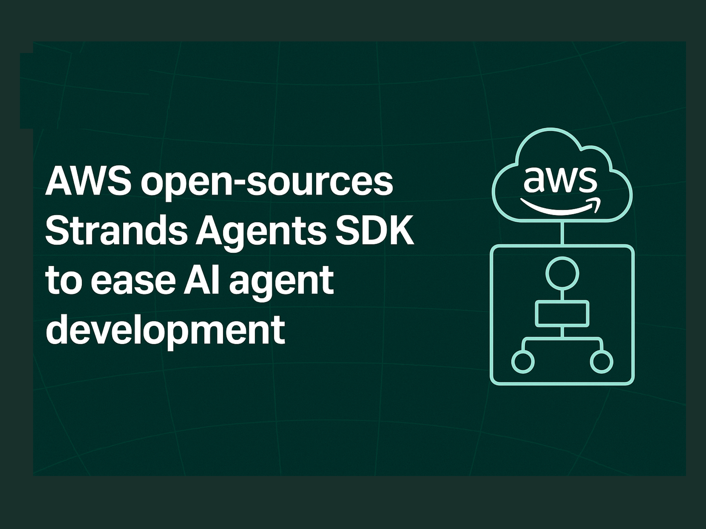

# AWS Open-Sources Strands Agents SDK to Simplify AI Agent Development

> Amazon Web Services (AWS) has open-sourced its Strands Agents SDK, aiming to make the development of AI agents more accessible and adaptable across various domains. By following a model-driven approach, the Strands Agents SDK abstracts much of the complexity behind building, orchestrating, and deploying intelligent agents—making it easier for developers to build tools that plan, […]

Amazon Web Services (AWS) has open-sourced its **[Strands Agents SDK](https://aws.amazon.com/blogs/opensource/introducing-strands-agents-an-open-source-ai-agents-sdk/)**, aiming to make the development of AI agents more accessible and adaptable across various domains. By following a model-driven approach, the Strands Agents SDK abstracts much of the complexity behind building, orchestrating, and deploying intelligent agents—making it easier for developers to build tools that plan, reason, and interact autonomously.

### Defining an Agent in Strands

At its core, an AI agent built with Strands is defined by three essential components: a model, a set of tools, and a prompt. These components together enable the agent to carry out tasks—ranging from answering queries to orchestrating workflows—by iteratively reasoning and selecting tools using large language models (LLMs).

- **Model**: Strands supports a range of models, including those from Amazon Bedrock (such as Claude or Titan), Anthropic, Meta’s Llama, and other providers through APIs like LiteLLM. It also supports local model development using platforms like Ollama, and developers can define custom model providers if needed.

- **Tools**: Tools represent external functionalities that the model can invoke. Strands provides 20+ prebuilt tools—ranging from file operations to API calls and AWS service integrations. Developers can also easily register their own Python functions using the `@tool` decorator. Notably, Strands supports thousands of Model Context Protocol (MCP) servers, allowing for dynamic tool interaction.

- **Prompt**: This defines the task or objective the agent needs to complete. Prompts can be user-defined or set at the system level for general behavior control.

### The Agentic Loop

Strands operates through a loop where the agent interacts with the model and tools until the task defined by the prompt is completed. Each iteration involves invoking the LLM with the current context and tool descriptions. The model can choose to generate a response, plan multiple steps, reflect on past actions, or invoke tools.

When a tool is selected, Strands executes it and feeds the result back to the model, continuing the loop until a final response is ready. This mechanism takes advantage of the growing capability of LLMs to reason, plan, and adapt in context.

### Extensibility Through Tools

One of the strengths of the Strands SDK lies in how tools can be used to extend agent behavior. Some of the more advanced tool types include:

- **Retrieve Tool**: Integrates with Amazon Bedrock Knowledge Bases to implement semantic search, enabling models to dynamically retrieve documents or even select relevant tools from thousands of options using embedding-based similarity.

- **Thinking Tool**: Prompts the model to engage in multi-step analytical reasoning, enabling deeper planning and self-reflection.

- **Multi-Agent Tools**: Including workflow, graph, and swarm tools, these allow the orchestration of sub-agents for more complex tasks. Strands plans to support the Agent2Agent (A2A) protocol to further enhance multi-agent collaboration.

### Real-World Applications and Infrastructure

Strands Agents has already seen internal adoption at AWS. Teams such as Amazon Q Developer, AWS Glue, and VPC Reachability Analyzer have integrated it into production workflows. The SDK supports a range of deployment targets including local environments, AWS Lambda, Fargate, and EC2.

Observability of the agent is built in through OpenTelemetry (OTEL), enabling detailed tracking and diagnostics—critical for production-grade systems.

### Conclusion

Strands Agents SDK offers a structured yet flexible framework for building AI agents by emphasizing a clean separation between models, tools, and prompts. Its model-driven loop and integration with existing LLM ecosystems make it a technically sound choice for developers looking to implement autonomous agents with minimal boilerplate and strong customization capabilities.

---

**Check out the [Project Page](https://github.com/strands-agents)_._** All credit for this research goes to the researchers of this project. Also, feel free to follow us on **[Twitter](https://x.com/intent/follow?screen_name=marktechpost)** and don’t forget to join our **[90k+ ML SubReddit](https://www.reddit.com/r/machinelearningnews/)**.
