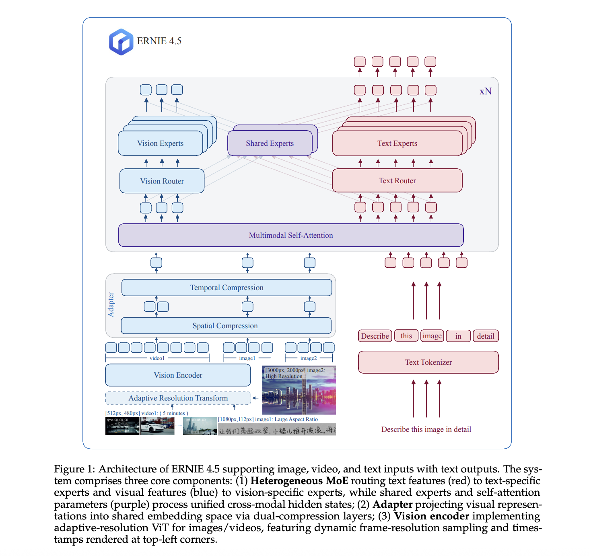

# Baidu Open Sources ERNIE 4.5: LLM Series Scaling from 0.3B to 424B Parameters

> Baidu has officially open-sourced its latest ERNIE 4.5 series, a powerful family of foundation models designed for enhanced language understanding, reasoning, and generation. The release includes ten model variants ranging from compact 0.3B dense models to massive Mixture-of-Experts (MoE) architectures, with the largest variant totaling 424B parameters. These models are now freely available to the […]

Baidu has officially open-sourced its latest ERNIE 4.5 series, a powerful family of foundation models designed for enhanced language understanding, reasoning, and generation. The release includes ten model variants ranging from compact 0.3B dense models to massive Mixture-of-Experts (MoE) architectures, with the largest variant totaling 424B parameters. These models are now freely available to the global research and developer community through Hugging Face, enabling open experimentation and broader access to cutting-edge Chinese and multilingual language technology.

### Technical Overview of ERNIE 4.5 Architecture

The ERNIE 4.5 series builds on Baidu’s previous iterations of ERNIE models by introducing advanced model architectures, including both dense and sparsely activated MoE designs. The MoE variants are particularly notable for scaling parameter counts efficiently: the ERNIE 4.5-MoE-3B and ERNIE 4.5-MoE-47B variants activate only a subset of experts per input token (typically 2 of 64 experts), keeping the number of active parameters manageable while retaining model expressivity and generalization capabilities.

ERNIE 4.5 models are trained using a mixture of supervised fine-tuning (SFT), reinforcement learning with human feedback (RLHF), and contrastive alignment techniques. The training corpus spans 5.6 trillion tokens across diverse domains in both Chinese and English, using Baidu’s proprietary multi-stage pretraining pipeline. The resulting models demonstrate high fidelity in instruction-following, multi-turn conversation, long-form generation, and reasoning benchmarks.

### Model Variants and Open-Source Release

The ERNIE 4.5 release includes the following ten variants:

- **Dense Models:** ERNIE 4.5-0.3B, 0.5B, 1.8B, and 4B

- **MoE Models:** ERNIE 4.5-MoE-3B, 4B, 6B, 15B, 47B, and 424B total parameters (with varying active parameters)

The MoE-47B variant, for instance, activates only 3B parameters during inference while having a total of 47B. Similarly, the 424B model—the largest ever released by Baidu—employs sparse activation strategies to make inference feasible and scalable. These models support both FP16 and INT8 quantization for efficient deployment.

### Performance Benchmarks

ERNIE 4.5 models show significant improvements on several key Chinese and multilingual NLP tasks. According to the official technical report:

- On **CMMLU**, ERNIE 4.5 surpasses previous ERNIE versions and achieves state-of-the-art accuracy in Chinese language understanding.

- On **MMLU**, the multilingual benchmark, ERNIE 4.5-47B demonstrates competitive performance with other leading LLMs like GPT-4 and Claude.

- For **long-form generation**, ERNIE 4.5 achieves higher coherence and factuality scores when evaluated using Baidu’s internal metrics.

In instruction-following tasks, the models benefit from contrastive fine-tuning, showing improved alignment with user intent and reduced hallucination rates compared to earlier ERNIE versions.

### Applications and Deployment

ERNIE 4.5 models are optimized for a broad range of applications:

- **Chatbots and Assistants**: Multilingual support and instruction-following alignment make it suitable for AI assistants.

- **Search and Question Answering**: High retrieval and generation fidelity allow for integration with [RAG](https://www.marktechpost.com/2024/11/25/retrieval-augmented-generation-rag-deep-dive-into-25-different-types-of-rag/) pipelines.

- **Content Generation**: Long-form text and knowledge-rich content generation are improved with better factual grounding.

- **Code and Multimodal Extension**: Although the current release focuses on text, Baidu indicates that ERNIE 4.5 is compatible with multimodal extensions.

With support for up to 128K context length in some variants, the ERNIE 4.5 family can be used in tasks requiring memory and reasoning across long documents or sessions.

### Conclusion

The ERNIE 4.5 series represents a significant step in open-source AI development, offering a versatile set of models tailored for scalable, multilingual, and instruction-aligned tasks. Baidu’s decision to release models ranging from lightweight 0.3B variants to a 424B-parameter MoE model underscores its commitment to inclusive and transparent AI research. With comprehensive documentation, open availability on Hugging Face, and support for efficient deployment, ERNIE 4.5 is positioned to accelerate global advancements in natural language understanding and generation.

---

Check out the** _[Paper](https://yiyan.baidu.com/blog/publication/ERNIE_Technical_Report.pdf) and [Models on Hugging Face](https://huggingface.co/collections/baidu/ernie-45-6861cd4c9be84540645f35c9)._** All credit for this research goes to the researchers of this project. Also, feel free to follow us on **[Twitter](https://x.com/intent/follow?screen_name=marktechpost)** and don’t forget to join our **[100k+ ML SubReddit](https://www.reddit.com/r/machinelearningnews/)** and Subscribe to **[our Newsletter](https://www.airesearchinsights.com/subscribe)**.
