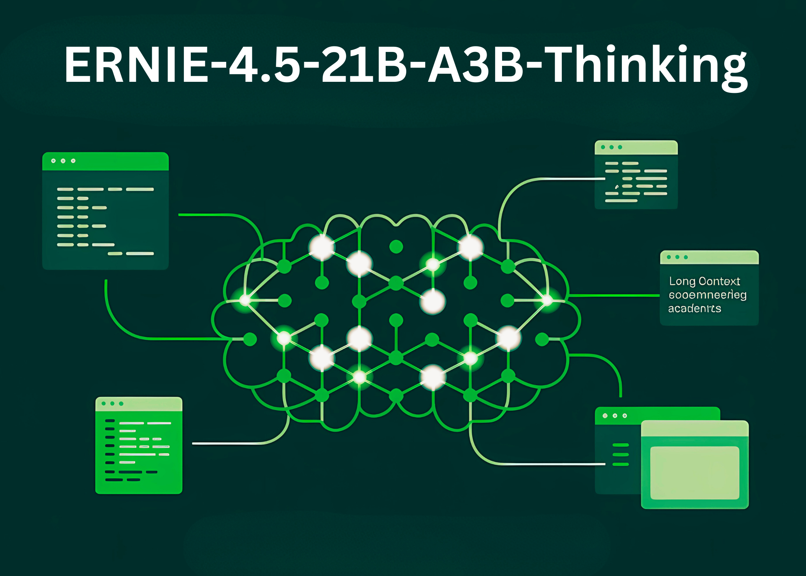

# Baidu Releases ERNIE-4.5-21B-A3B-Thinking: A Compact MoE Model for Deep Reasoning

> Baidu AI Research team has just released ERNIE-4.5-21B-A3B-Thinking, a new reasoning-focused large language model designed around efficiency, long-context reasoning, and tool integration. Being part of the ERNIE-4.5 family, this model is a Mixture-of-Experts (MoE) architecture with 21B total parameters but only 3B active parameters per token, making it computationally efficient while maintaining competitive reasoning capability. […]

Baidu AI Research team has just released **ERNIE-4.5-21B-A3B-Thinking**, a new reasoning-focused large language model designed around efficiency, long-context reasoning, and tool integration. Being part of the ERNIE-4.5 family, this model is a **Mixture-of-Experts (MoE) architecture with 21B total parameters but only 3B active parameters per token**, making it computationally efficient while maintaining competitive reasoning capability. Released under the **Apache-2.0 license**, it is accessible for both research and commercial deployment via **[Hugging Face](https://huggingface.co/baidu/ERNIE-4.5-21B-A3B-Thinking)**.

### What is the architectural design of ERNIE-4.5-21B-A3B-Thinking?

ERNIE-4.5-21B-A3B-Thinking is built on a **Mixture-of-Experts backbone**. Instead of activating all 21B parameters, the router selects a subset of experts, resulting in **3B active parameters per token**. This structure reduces computation without compromising the specialization of different experts. The research team applies **router orthogonalization loss** and **token-balanced loss** to encourage diverse expert activation and stable training.

This design provides a middle ground between small dense models and ultra-large systems. The research team’s assumptions include a theory that ~3B active parameters per token may represent a practical **sweet spot for reasoning performance versus deployment efficiency**.

### How does the model handle long-context reasoning?

A defining capability of ERNIE-4.5-21B-A3B-Thinking is its **128K context length**. This allows the model to process very long documents, perform extended multi-step reasoning, and integrate structured data sources such as academic papers or multi-file codebases.

The research team achieves this through **progressive scaling of Rotary Position Embeddings (RoPE)**—gradually increasing the frequency base from 10K up to 500K during training. Additional optimizations, including **FlashMask attention** and memory-efficient scheduling, make these long-context operations computationally feasible.

### What training strategy supports its reasoning?

The model follows the multi-stage recipe defined across the ERNIE-4.5 family:

- **Stage I – Text-only pretraining** builds the core language backbone, starting with 8K context and expanding to 128K.

- **Stage II – Vision training** is skipped for this text-only variant.

- **Stage III – Joint multimodal training** is not used here, as A3B-Thinking is purely textual.

Post-training focuses on **reasoning tasks**. The research team employs **Supervised Fine-Tuning (SFT)** across mathematics, logic, coding, and science, followed by **Progressive Reinforcement Learning (PRL)**. Reinforcement stages begin with logic, then extend to mathematics and programming, and finally to broader reasoning tasks. This is enhanced by **Unified Preference Optimization (UPO)**, which integrates preference learning with PPO to stabilize alignment and reduce reward hacking.

### What role does tool usage play in this model?

ERNIE-4.5-21B-A3B-Thinking supports **structured tool and function calling**, making it useful for scenarios where external computation or retrieval is required. Developers can integrate it with **vLLM**, **Transformers 4.54+**, and **FastDeploy**. This tool-use capability is particularly suited for **program synthesis, symbolic reasoning, and multi-agent workflows**.

Built-in function calling allows the model to reason over long contexts while dynamically invoking external APIs, a key requirement for applied reasoning in enterprise systems.

### How does ERNIE-4.5-21B-A3B-Thinking perform on reasoning benchmarks?

It show strong performance improvements across **logical reasoning, mathematics, scientific QA, and programming tasks**. In evaluations, the model demonstrates:

- Enhanced accuracy in **multi-step reasoning datasets**, where long chains of thought are required.

- Competitiveness with larger dense models on **STEM reasoning tasks**.

- Stable **text generation and academic synthesis performance**, benefiting from extended context training.

These results suggest that the **MoE structure amplifies reasoning specialization**, making it efficient without requiring trillion-scale dense parameters.

*https://huggingface.co/baidu/ERNIE-4.5-21B-A3B-Thinking*

### How does it compare to other reasoning-focused LLMs?

This release gets into the landscape that includes **OpenAI’s o3, Anthropic’s Claude 4, DeepSeek-R1, and Qwen-3**. Many of these competitors rely on dense architectures or larger active parameter counts. Baidu research team’s choice of a **compact MoE with 3B active parameters** offers a different balance:

- **Scalability:** Sparse activation reduces compute overhead while scaling expert capacity.

- **Long-context readiness:** 128K context is directly trained, not retrofitted.

- **Commercial openness:** Apache-2.0 license lowers adoption friction for enterprises.

### Summary

ERNIE-4.5-21B-A3B-Thinking explains how **deep reasoning can be achieved without massive dense parameter counts**. By combining efficient MoE routing, 128K context training, and tool integration, Baidu’s research team offers a model that balances research-grade reasoning with deployment feasibility.

---

Check out the **[Model on Hugging Face](https://huggingface.co/baidu/ERNIE-4.5-21B-A3B-Thinking)** and **[PAPER](https://ernie.baidu.com/blog/publication/ERNIE_Technical_Report.pdf)_._** Feel free to check out our **[GitHub Page for Tutorials, Codes and Notebooks](https://github.com/Marktechpost/AI-Tutorial-Codes-Included)**. Also, feel free to follow us on **[Twitter](https://x.com/intent/follow?screen_name=marktechpost)** and don’t forget to join our **[100k+ ML SubReddit](https://www.reddit.com/r/machinelearningnews/)** and Subscribe to **[our Newsletter](https://www.aidevsignals.com/)**.
