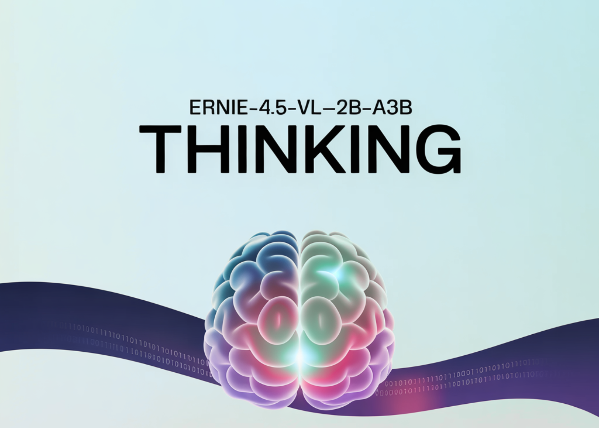

# Baidu Releases ERNIE-4.5-VL-28B-A3B-Thinking: An Open-Source and Compact Multimodal Reasoning Model Under the ERNIE-4.5 Family

> How can we get large model level multimodal reasoning for documents, charts and videos while running only a 3B class model in production? Baidu has added a new model to the ERNIE-4.5 open source family. ERNIE-4.5-VL-28B-A3B-Thinking is a vision language model that focuses on document, chart and video understanding with a small active parameter budget. […]

How can we get large model level multimodal reasoning for documents, charts and videos while running only a 3B class model in production? Baidu has added a new model to the ERNIE-4.5 open source family. ERNIE-4.5-VL-28B-A3B-Thinking is a vision language model that focuses on document, chart and video understanding with a small active parameter budget.

*https://huggingface.co/baidu/ERNIE-4.5-VL-28B-A3B-Thinking*

### Architecture and training setup

ERNIE-4.5-VL-28B-A3B-Thinking is built on the ERNIE-4.5-VL-28B-A3B Mixture of Experts architecture. The family uses a heterogeneous multimodal MoE design with shared parameters across text and vision plus modality specific experts. At the model level, it has 30B total parameters, while the architecture is in the 28B-VL branch, and only 3B parameters are activated per token through an A3B routing scheme. This gives the compute and memory profile of a 3B class model while keeping a larger capacity pool for reasoning.

The model goes through an additional mid training stage on a large visual language reasoning corpus. This stage is designed to improve representation power and semantic alignment between visual and language modalities, which matters for dense text in documents and fine structures in charts. On top of that, ERNIE-4.5-VL-28B-A3B-Thinking uses multimodal reinforcement learning on verifiable tasks, with GSPO and IcePop strategies and dynamic difficulty sampling to stabilize MoE training and push the model toward hard examples.

### Key capabilities

Baidu researchers position this model as a lightweight multimodal reasoning engine that can activate only 3B parameters while approaching the behavior of larger flagship systems on internal benchmarks. Officially listed capabilities include visual reasoning, STEM reasoning, visual grounding, Thinking with Images, tool utilization and video understanding.

Thinking with Images is at the core. The model can zoom into regions, reason on cropped views and then integrate those local observations into a final answer. Tool utilization extends this with calls to tools such as image search when internal knowledge is not enough. Both features are exposed as part of the reasoning parser and tool call parser path in deployment.

### Performance and positioning

The lightweight vision language model ERNIE-4.5-VL-28B-A3B achieves competitive or superior performance compared to Qwen-2.5-VL-7B and Qwen-2.5-VL-32B on many benchmarks, while using fewer activation parameters. ERNIE-4.5-VL models also support both thinking and non thinking modes, with the thinking mode improving reasoning centered tasks while keeping strong perception quality.

For the specific Thinking variant, Baidu researchers describe ERNIE-4.5-VL-28B-A3B-Thinking as closely matching the performance of industry flagship models across internal multimodal benchmarks.

### Key Takeaways

- ERNIE-4.5-VL-28B-A3B-Thinking uses a Mixture of Experts architecture with about 30B total parameters and only 3B active parameters per token to deliver efficient multimodal reasoning.

- The model is optimized for document, chart and video understanding through an additional visual language reasoning mid training stage and multimodal reinforcement learning using GSPO, IcePop and dynamic difficulty sampling.

- Thinking with Images lets the model iteratively zoom into image regions and reason over crops, while tool utilization enables calls to external tools such as image search for long tail recognition.

- It demonstrate strong performance on analytics style charts, STEM circuit problems, visual grounding with JSON bounding boxes and video segment localization with timestamped answers.

- The model is released under Apache License 2.0, supports deployment via transformers, vLLM and FastDeploy, and can be fine tuned with ERNIEKit using SFT, LoRA and DPO for commercial multimodal applications.

### Comparison Table

ModelTraining stageTotal / active parametersModalitiesContext length (tokens)**ERNIE-4.5-VL-28B-A3B-Base**Pretraining28B total, 3B active per tokenText, Vision131,072**ERNIE-4.5-VL-28B-A3B (PT)**Posttraining chat model28B total, 3B active per tokenText, Vision131,072**ERNIE-4.5-VL-28B-A3B-Thinking**Reasoning oriented mid training on ERNIE-4.5-VL-28B-A3B28B architecture, 3B active per token, HF model size 30B paramsText, Vision131,072 (FastDeploy example uses 131,072 max model length)**Qwen2.5-VL-7B-Instruct**Posttraining vision language model≈8B total (7B class)Text, Image, Video32,768 text positions in config (max_position_embeddings)**Qwen2.5-VL-32B-Instruct**Posttraining plus reinforcement tuned large VL model33B totalText, Image, Video32,768 text positions (same Qwen2.5-VLTextConfig family)

### Editorial Comments

ERNIE-4.5-VL-28B-A3B-Thinking is a practical release for teams that want multimodal reasoning on documents, charts and videos with only 3B activated parameters, while still using a Mixture-of-Experts architecture with about 30B total parameters and Apache License 2.0. It connects Thinking with Images, tool utilization and multimodal reinforcement learning into a deployable stack that directly targets real world analytics and understanding workloads.

---

Check out the **[Repo](https://github.com/PaddlePaddle/ERNIE), [Model Weights](https://huggingface.co/baidu/ERNIE-4.5-VL-28B-A3B-Thinking) **and** [Technical details](https://yiyan.baidu.com/blog/posts/ernie-4.5-vl-28b-a3b-thinking/)**. Feel free to check out our **[GitHub Page for Tutorials, Codes and Notebooks](https://github.com/Marktechpost/AI-Tutorial-Codes-Included)**. Also, feel free to follow us on **[Twitter](https://x.com/intent/follow?screen_name=marktechpost)** and don’t forget to join our **[100k+ ML SubReddit](https://www.reddit.com/r/machinelearningnews/)** and Subscribe to **[our Newsletter](https://www.aidevsignals.com/)**. Wait! are you on telegram? **[now you can join us on telegram as well.](https://t.me/machinelearningresearchnews)**
