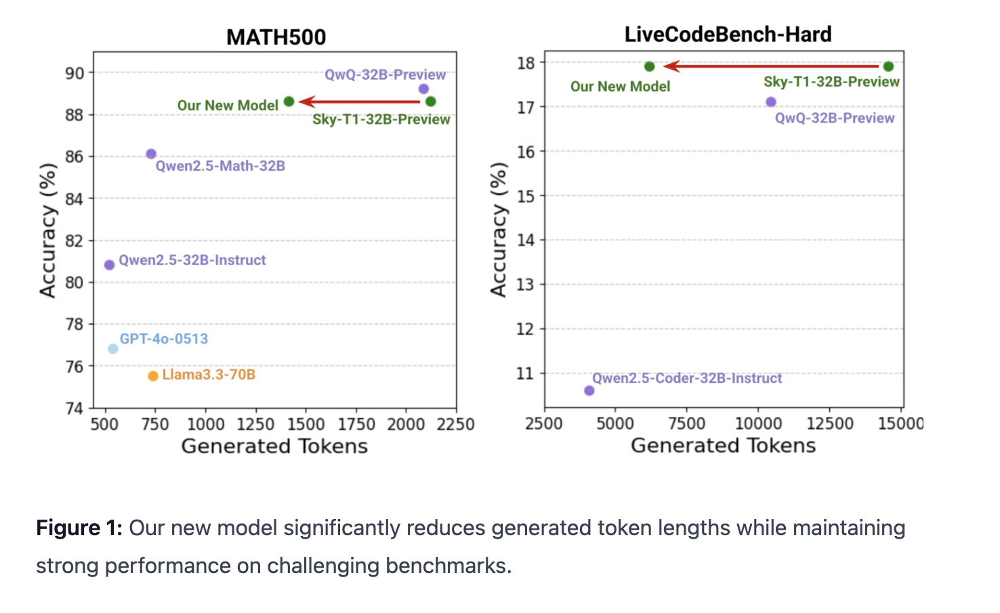

# Berkeley Sky Computing Lab Introduces Sky-T1-32B-Flash: A New Reasoning Language Model that Significantly Reduces Overthinking, Slashing Inference Costs on Challenging Questions by up to 57%

> Artificial intelligence models have advanced significantly in recent years, particularly in tasks requiring reasoning, such as mathematics, programming, and scientific problem-solving. However, these advancements come with challenges: computational inefficiency and a tendency to overthink. Overthinking in AI occurs when models engage in overly lengthy reasoning, leading to increased inference costs and slower response times without […]

Artificial intelligence models have advanced significantly in recent years, particularly in tasks requiring reasoning, such as mathematics, programming, and scientific problem-solving. However, these advancements come with challenges: computational inefficiency and a tendency to overthink. Overthinking in [AI](https://www.marktechpost.com/2025/01/13/what-is-artificial-intelligence-ai-2/) occurs when models engage in overly lengthy reasoning, leading to increased inference costs and slower response times without substantial gains in accuracy. This issue becomes especially problematic in tasks involving complex, multi-step reasoning, where large-scale models often produce verbose outputs. As demand for efficient AI systems grows, addressing these inefficiencies has become a critical focus for researchers.

Inference costs present another challenge, especially for organizations relying on large models. The high computational expense limits accessibility and broader adoption, creating barriers for smaller research groups and developers. Furthermore, the lack of open access to robust AI models and training resources compounds these issues, hindering innovation and collaboration. A solution requires balancing computational efficiency, accuracy, and accessibility.

### Introducing Sky-T1-32B-Flash by NovaSky Lab

NovaSky Lab, a research initiative from UC Berkeley, has introduced Sky-T1-32B-Flash, a reasoning language model designed to address these challenges. This is a 32B reasoning model, preference-optimized on top of Sky-T1-32B-Preview. The model’s performance is on par with the o1-preview model in both mathematics and coding tasks, while reducing generation lengths by up to 57% compared to Sky-T1-32B-Preview.Sky-T1-32B-Flash reduces overthinking, cutting inference costs on complex reasoning tasks by up to 57% while maintaining accuracy. The model performs consistently across diverse domains, including mathematics, coding, science, and general knowledge.

A notable feature of Sky-T1-32B-Flash is its cost efficiency. Training the model costs approximately $275 using 8 NVIDIA H100 GPUs, based on Lambda Cloud pricing, making it one of the most economical large models to date. In addition, NovaSky Lab has prioritized transparency by open-sourcing the entire development pipeline. This includes data generation and pre-processing workflows, preference optimization methods, evaluation scripts, and the release of model weights and datasets. These efforts enable researchers to reproduce results, experiment with improvements, and contribute to the model’s evolution.

Sky-T1-32B-Flash is more than a new entry in the field of language models; it represents a deliberate effort to address inefficiencies and make advanced AI research more accessible. By reducing computational demands and fostering collaboration, NovaSky Lab aims to push the boundaries of cost-effective AI development.

### Technical Innovations and Benefits

Sky-T1-32B-Flash’s ability to reduce overthinking stems from its optimized design and advanced preference optimization techniques. These methods guide the model toward concise, high-quality outputs, eliminating unnecessary computation while maintaining performance on complex tasks.

The model also benefits from efficient data generation and pre-processing workflows. These workflows ensure high-quality datasets that enhance reasoning capabilities across various domains. In addition, the evaluation framework used for Sky-T1-32B-Flash provides reliable benchmarks, enabling consistent performance assessments.

One of the standout aspects of Sky-T1-32B-Flash is its scalability and affordability. Requiring just $275 for training on 8 NVIDIA H100 GPUs, the model demonstrates that cutting-edge research need not be financially restrictive. This accessibility paves the way for smaller organizations and academic institutions to conduct meaningful AI research without extensive computational resources.

### Results and Insights

Sky-T1-32B-Flash delivers impressive results. By reducing inference costs by up to 57%, it achieves significant computational efficiency without compromising performance. The model’s accuracy remains high across tasks in mathematics, science, and coding, striking a critical balance between efficiency and reliability.

The open-source nature of Sky-T1-32B-Flash further amplifies its utility. Researchers and developers gain access to a comprehensive pipeline, from data generation to evaluation, allowing them to replicate results and explore potential improvements. The availability of model weights and datasets encourages the broader AI community to build on this foundation and tackle new challenges.

Evaluation insights highlight the model’s ability to handle diverse and complex reasoning tasks effectively. For example, in fields like mathematics and coding, where precision and logical consistency are crucial, Sky-T1-32B-Flash consistently delivers concise and accurate outputs. This reliability positions the model as a valuable tool for both academic research and industry applications.

### Conclusion

Sky-T1-32B-Flash addresses key challenges in AI development, including overthinking and high inference costs, setting a new standard for efficiency and accessibility. Its ability to reduce computational waste while maintaining accuracy across various domains makes it a practical and impactful tool for real-world applications.

The open-sourcing of the entire development pipeline marks a pivotal step toward democratizing AI research. By sharing methodologies, model weights, and datasets, NovaSky Lab fosters a culture of collaboration and transparency, encouraging innovation across the AI community. Sky-T1-32B-Flash is not merely a model but a comprehensive framework for building efficient, high-performing AI systems.

---

Check out **_the [Model on Hugging Face](https://huggingface.co/NovaSky-AI/Sky-T1-32B-Flash) and [Blog](https://novasky-ai.github.io/posts/reduce-overthinking/)._** All credit for this research goes to the researchers of this project. Also, don’t forget to follow us on **[Twitter](https://x.com/intent/follow?screen_name=marktechpost)** and join our **[Telegram Channel](https://arxiv.org/abs/2406.09406)** and [**LinkedIn Gr**](https://www.linkedin.com/groups/13668564/)[**oup**](https://www.linkedin.com/groups/13668564/). Don’t Forget to join our **[70k+ ML SubReddit](https://www.reddit.com/r/machinelearningnews/)**.

**🚨[ [Recommended Read] Nebius AI Studio expands with vision models, new language models, embeddings and LoRA](https://nebius.com/blog/posts/studio-embeddings-vision-and-language-models?utm_medium=newsletter&utm_source=marktechpost&utm_campaign=embedding-post-ai-studio) **_(Promoted)_
