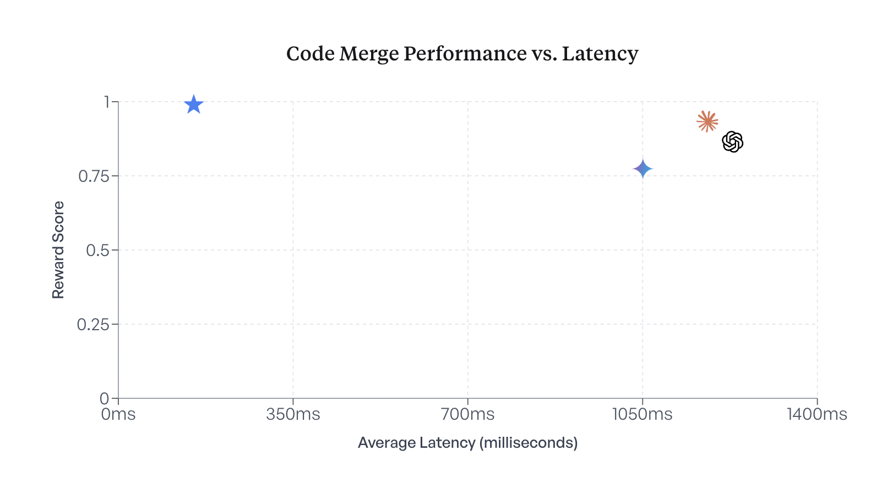

# Better Code Merging with Less Compute: Meet Osmosis-Apply-1.7B from Osmosis AI

> Osmosis AI has open-sourced Osmosis-Apply-1.7B, a fine-tuned variant of Qwen3-1.7B, designed to perform highly accurate and structured code merge tasks. Drawing inspiration from IDE agents like Cursor’s “instant apply,” Osmosis-Apply-1.7B is optimized for context-sensitive, function-level code edits. The model achieves strong performance with fewer parameters compared to much larger foundation models by leveraging code-specific formatting […]

Osmosis AI has open-sourced _Osmosis-Apply-1.7B_, a fine-tuned variant of Qwen3-1.7B, designed to perform highly accurate and structured code merge tasks. Drawing inspiration from IDE agents like Cursor’s “instant apply,” Osmosis-Apply-1.7B is optimized for context-sensitive, function-level code edits. The model achieves strong performance with fewer parameters compared to much larger foundation models by leveraging code-specific formatting tags, a high-quality dataset, and Model Context Protocol (MCP) integration.

### Purpose-Built for Code Merge Tasks

Unlike general-purpose LLMs that struggle with diff application and semantic merging, Osmosis-Apply-1.7B is trained specifically to apply structured edits at the function or block level. The model takes three structured inputs: (1) the original code, (2) the set of edits or diffs, and (3) the expected merge format. It then returns a revised code block where the change is applied within `<edit>` tags nested in a `<code>` block. This format aligns with production-grade expectations and simplifies validation.

### Training and Reward Structure

Osmosis-Apply-1.7B was fine-tuned on approximately 100,000 real-world commits from the [_commitpackft_ dataset](https://huggingface.co/datasets/bigcode/commitpackft), representing under 15% of the full corpus. Each training sample was structured to represent practical developer workflows. A reward-based post-training system was used:

- Full match (including formatting): reward = 1.0

- Semantic match (ignoring blank lines): reward = 0.2

- Incorrect or failed match: reward = 0.0

This reward schema reinforces high-fidelity outputs while allowing for some leniency in stylistic variation, closely mimicking how code reviews operate in practice.

### Benchmark Results

Osmosis AI benchmarked the model using a 10,000-sample evaluation from the _commitpackft_ dataset. The average reward scores demonstrate strong performance relative to larger LLMs:

ModelReward ScoreOsmosis-Apply-1.7B0.9805Claude 4 Sonnet0.9328GPT-3.5-turbo0.8639Gemini-2.5-Flash0.7745

These results highlight the model’s strength in applying localized changes while preserving semantics, formatting, and structure.

### MCP Integration for Developer Workflows

A key feature of the model is its native support for the _Model Context Protocol (MCP)_, enabling structured context invocation with file hierarchies, function names, and edit tags. The model adheres to the `apply-code` MCP spec, allowing seamless use in CLI tools and IDE agents. It returns changes scoped at the function level and marks edits using well-structured XML-style tags, which simplifies diff tracking and downstream tooling.

### Developer Tooling and Use Cases

Osmosis AI has also released a reference implementation that supports both local inference and integration with services like vLLM or Gulp Server. The tooling includes CLI-based usage examples, MCP server implementation, and safe deployment guides.

**Key use cases include:**

- IDE agents offering “instant apply” for user-specified changes

- CI bots applying auto-refactor or review-based changes

- Dataset generation pipelines for downstream fine-tuning

- Code transformation tools with structure-aware merging logic

### Format and Deployment

The model outputs edits wrapped in `<code>` and `<edit>` tags to ensure compatibility with automated validators. Inference-ready versions of the model are provided in multiple formats including `safetensors` and `GGUF` for efficient deployment. Osmosis-Apply-1.7B can be hosted locally or served in quantized mode for optimized inference on constrained hardware.

### Availability and License

Osmosis-Apply-1.7B is available under the Apache-2.0 license and hosted on both [Hugging Face](https://huggingface.co/osmosis-ai/Osmosis-Apply-1.7B) and [GitHub](https://github.com/Gulp-AI/Osmosis-Apply-1.7B-MCP). The release includes all necessary scripts for inference, examples for MCP-compliant deployment, and structured formatting guides.

### Conclusion

By open-sourcing Osmosis-Apply-1.7B, Osmosis AI addresses a key need for function-level, structure-aware code editing models. Unlike foundation models, this specialized model combines compact size with precision and format alignment. Its MCP integration, reward-based fine-tuning, and syntactic structure support make it an ideal candidate for real-world developer tooling.

---

Check out the** _[GitHub Page](https://github.com/Gulp-AI/Osmosis-Apply-1.7B-MCP), [Hugging Face Page](https://huggingface.co/osmosis-ai/Osmosis-Apply-1.7B) and [Technical Details](https://osmosis.ai/blog/code-merge-release)._** All credit for this research goes to the researchers of this project. Also, feel free to follow us on **[Twitter](https://x.com/intent/follow?screen_name=marktechpost)**, **[Youtube](https://www.youtube.com/@Marktechpost)** and **[Spotify](https://open.spotify.com/show/1d5n4iy6LLTRo4khzTgKCp)** and don’t forget to join our **[100k+ ML SubReddit](https://www.reddit.com/r/machinelearningnews/)** and Subscribe to **[our Newsletter](https://www.airesearchinsights.com/subscribe)**.
