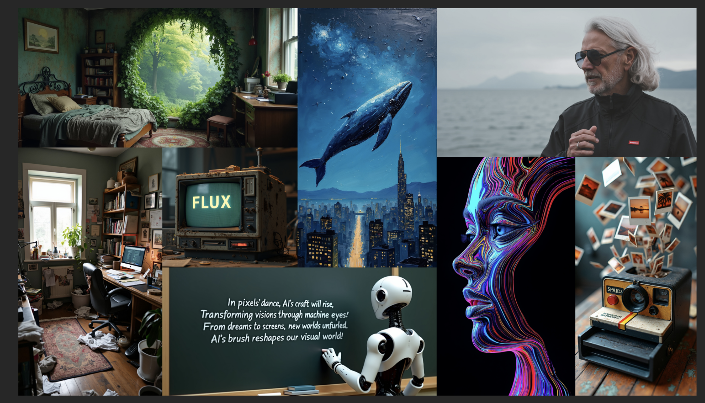

# Black Forest Labs Open-Source FLUX.1: A 12 Billion Parameter Rectified Flow Transformer Capable of Generating Images from Text Descriptions

> In a seminal announcement, Black Forest Labs has emerged as a new player in the generative AI landscape. With deep roots in the research community, this innovative company aims to revolutionize the field of generative deep learning models, particularly focusing on media such as images and videos. Their mission is clear: to push the boundaries […]

In a seminal announcement, Black Forest Labs has emerged as a new player in the generative AI landscape. With deep roots in the research community, this innovative company aims to revolutionize the field of generative deep learning models, particularly focusing on media such as images and videos. Their mission is clear: to push the boundaries of creativity, efficiency, and diversity in AI-generated content. Black Forest Labs envisions generative AI as a cornerstone of future technologies and is committed to making their models accessible to a broad audience. By doing so, they hope to educate the public and foster trust in the safety of these advanced models. As their inaugural offering, **_[Black Forest Labs ](https://blackforestlabs.ai/)has unveiled the FLUX.1 suite_**, a collection of cutting-edge models designed to redefine the possibilities of text-to-image synthesis.

*_Image Source: https://blackforestlabs.ai/announcing-black-forest-labs/_*

**The FLUX.1 suite represents a significant leap forward in text-to-image synthesis. This innovative collection of models sets new benchmarks in several key areas:**

• Image detail: Producing stunningly crisp and intricate visuals

• Prompt adherence: Accurately translating text descriptions into visual representations

• Style diversity: Offering a wide range of artistic and stylistic options

• Scene complexity: Handling intricate and multifaceted image compositions

To cater to various user needs, FLUX.1 is available in **three distinct variants:**

**• FLUX.1 [pro]: The flagship model, offering top-tier performance for professional applications**

**• FLUX.1 [dev]: An open-weight model for non-commercial use, balancing quality and efficiency**

**• FLUX.1 [schnell]: A swift model designed for local development and personal projects**

*_Image Source: https://blackforestlabs.ai/announcing-black-forest-labs/_*

Each variant is accessible through different platforms and licensing options, ensuring that users from various backgrounds can harness the power of FLUX.1 for their specific requirements.

*_Image Source: https://blackforestlabs.ai/announcing-black-forest-labs/_*

Building on the foundation of flow matching, FLUX.1 models employ a sophisticated hybrid architecture. This design incorporates multimodal and parallel diffusion transformer blocks, scaled to an impressive _12 billion parameters_. The integration of rotary positional embeddings and parallel attention layers enhances both performance and hardware efficiency, setting FLUX.1 apart from previous state-of-the-art diffusion models in the field of generative AI.

FLUX.1 has established itself as a frontrunner in image synthesis technology, setting new benchmarks across various model classes. The FLUX.1 [pro] and [dev] variants have surpassed popular competitors like Midjourney v6.0, DALL·E 3 (HD), and SD3-Ultra in critical aspects such as visual quality, prompt adherence, size and aspect ratio flexibility, typography, and output diversity. Even the FLUX.1 [schnell] model, designed for rapid processing, outperforms not only its direct competitors but also robust non-distilled models. A key strength of the FLUX.1 suite is its ability to maintain the full spectrum of output diversity from pretraining, offering significantly enhanced creative possibilities compared to existing state-of-the-art models in the field.

*_Image Source: https://blackforestlabs.ai/announcing-black-forest-labs/_*

**FLUX.1 boasts several key features that set it apart in the generative AI landscape:**

• Premium output quality and precise prompt adherence, rivaling closed-source alternatives

• FLUX.1 [schnell] employs latent adversarial diffusion distillation, enabling high-quality image generation in just 1-4 steps

• Released under the Apache 2.0 license, allowing for versatile use across personal, scientific, and commercial applications.

These features combine to make FLUX.1 a powerful and accessible tool for a wide range of image synthesis needs.

To facilitate adoption and development, Black Forest Labs has provided a reference implementation and sampling code for FLUX.1 [schnell] in a dedicated GitHub repository. This resource serves as an excellent starting point for developers and creatives looking to utilize the capabilities of FLUX.1 [schnell] in their projects, encouraging innovation and experimentation with this advanced text-to-image model.

Building on the accessible nature of FLUX.1, Black Forest Labs has streamlined the local setup process. For those eager to experiment with the model on their own machines, the following step-by-step guide provides a straightforward installation method:

This simple setup process allows developers and enthusiasts to quickly integrate FLUX.1 into their local environments, facilitating hands-on exploration and development with this cutting-edge text-to-image model.

While FLUX.1 represents a significant advancement in text-to-image synthesis, it’s important to acknowledge its limitations and intended use. The model is not designed to provide factual information and may inadvertently amplify societal biases. Its output quality can vary depending on prompting style. Users must adhere to strict ethical guidelines, avoiding any illegal activities, exploitation of minors, dissemination of false information, harassment, non-consensual content creation, or automated decision-making that impacts individuals’ rights. The model should not be used for large-scale disinformation campaigns or to generate personal identifiable information that could harm others. These restrictions ensure responsible use of this powerful AI tool.

Black Forest Labs has introduced FLUX.1, a suite of cutting-edge text-to-image synthesis models. Available in three variants ([pro], [dev], and [schnell]), FLUX.1 sets new benchmarks in image detail, prompt adherence, style diversity, and scene complexity. The models use a hybrid architecture with 12 billion parameters, surpassing competitors like Midjourney v6.0 and DALL·E 3 in various aspects. FLUX.1 is released under the Apache 2.0 license, allowing for versatile applications. While powerful, users must adhere to ethical guidelines to ensure responsible use. Black Forest Labs aims to revolutionize generative AI and make it accessible to a broad audience.

---

Check out the **[Details, ](https://blackforestlabs.ai/announcing-black-forest-labs/)[GitHub,](https://github.com/black-forest-labs/flux?tab=readme-ov-file)[FLUX.1 [pro]](https://replicate.com/black-forest-labs/flux-pro), [FLUX.1 [dev]](https://huggingface.co/black-forest-labs/FLUX.1-dev), and [FLUX.1 [schnell]](https://huggingface.co/black-forest-labs/FLUX.1-schnell).** All credit for this research goes to the researchers of this project. Also, don’t forget to follow us on **[Twitter](https://twitter.com/Marktechpost)** and join our **[Telegram Channel](https://pxl.to/at72b5j)** and [**LinkedIn Gr**](https://www.linkedin.com/groups/13668564/)[**oup**](https://www.linkedin.com/groups/13668564/). **If you like our work, you will love our**[** newsletter..**](https://marktechpost-newsletter.beehiiv.com/subscribe)

Don’t Forget to join our **[47k+ ML SubReddit](https://www.reddit.com/r/machinelearningnews/)**

**Find Upcoming [AI Webinars here](https://www.marktechpost.com/ai-webinars-list-llms-rag-generative-ai-ml-vector-database/)**
