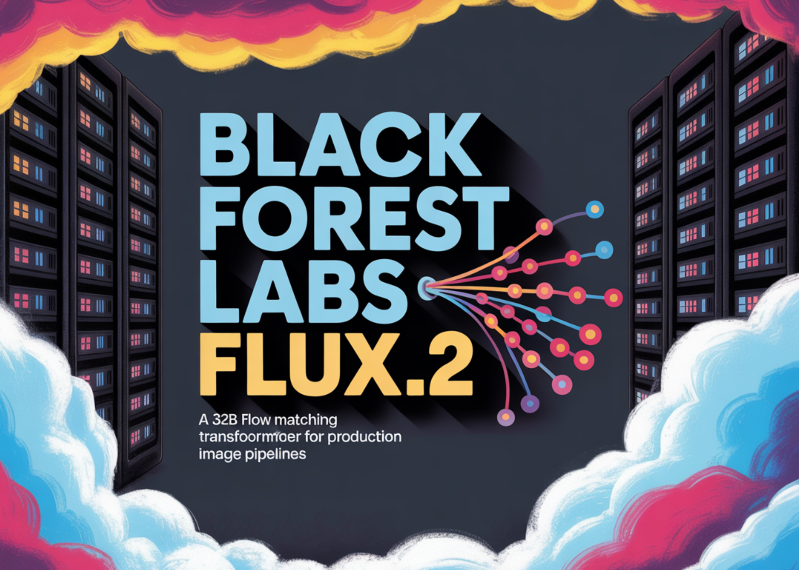

# Black Forest Labs Releases FLUX.2: A 32B Flow Matching Transformer for Production Image Pipelines

> Black Forest Labs has released FLUX.2, its second generation image generation and editing system. FLUX.2 targets real world creative workflows such as marketing assets, product photography, design layouts, and complex infographics, with editing support up to 4 megapixels and strong control over layout, logos, and typography. FLUX.2 product family and FLUX.2 [dev] The FLUX.2 family […]

Black Forest Labs has released FLUX.2, its second generation image generation and editing system. FLUX.2 targets real world creative workflows such as marketing assets, product photography, design layouts, and complex infographics, with editing support up to 4 megapixels and strong control over layout, logos, and typography.

### FLUX.2 product family and FLUX.2 [dev]

**The FLUX.2 family spans hosted APIs and open weights:**

- **FLUX.2 [pro]** is the managed API tier. It targets state of the art quality relative to closed models, with high prompt adherence and low inference cost, and is available in the BFL Playground, BFL API, and partner platforms.

- **FLUX.2 [flex]** exposes parameters such as number of steps and guidance scale, so developers can trade off latency, text rendering accuracy, and visual detail.

- **FLUX.2 [dev]** is the open weight checkpoint, derived from the base FLUX.2 model. It is described as the most powerful open weight image generation and editing model, combining text to image and multi image editing in one checkpoint, with 32 billion parameters.

- **FLUX.2 [klein]** is a coming open source Apache 2.0 variant, size distilled from the base model for smaller setups, with many of the same capabilities.

All variants support image editing from text and multiple references in a single model, which removes the need to maintain separate checkpoints for generation and editing.

### Architecture, latent flow, and the FLUX.2 VAE

FLUX.2 uses a latent flow matching architecture. The core design couples a **Mistral-3 24B vision language model** with a **rectified flow transformer** that operates on latent image representations. The vision language model provides semantic grounding and world knowledge, while the transformer backbone learns spatial structure, materials, and composition.

The model is trained to map noise latents to image latents under text conditioning, so the same architecture supports both text driven synthesis and editing. For editing, latents are initialized from existing images, then updated under the same flow process while preserving structure.

A new **FLUX.2 VAE** defines the latent space. It is designed to balance learnability, reconstruction quality, and compression, and is released separately on Hugging Face under an Apache 2.0 license. This autoencoder is the backbone for all FLUX.2 flow models and can also be reused in other generative systems.

*https://bfl.ai/blog/flux-2*

### Capabilities for production workflows

The FLUX.2 Docs and Diffusers integration highlight several key capabilities:

- **Multi reference support**: FLUX.2 can combine up to 10 reference images to maintain character identity, product appearance, and style across outputs.

- **Photoreal detail at 4MP**: the model can edit and generate images up to 4 megapixels, with improved textures, skin, fabrics, hands, and lighting suitable for product shots and photo like use cases.

- **Robust text and layout rendering**: it can render complex typography, infographics, memes, and user interface layouts with small legible text, which is a common weakness in many older models.

- **World knowledge and spatial logic**: the model is trained for more grounded lighting, perspective, and scene composition, which reduces artifacts and the synthetic look.

*https://bfl.ai/blog/flux-2*

### Key Takeaways

- FLUX.2 is a 32B latent flow matching transformer that unifies text to image, image editing, and multi reference composition in a single checkpoint.

- FLUX.2 [dev] is the open weight variant, paired with the Apache 2.0 FLUX.2 VAE, while the core model weights use the FLUX.2-dev Non Commercial License with mandatory safety filtering.

- The system supports up to 4 megapixel generation and editing, robust text and layout rendering, and up to 10 visual references for consistent characters, products, and styles.

- Full precision inference requires more than 80GB VRAM, but 4 bit and FP8 quantized pipelines with offloading make FLUX.2 [dev] usable on 18GB to 24GB GPUs and even 8GB cards with sufficient system RAM.

### Editorial Notes

FLUX.2 is an important step for open weight visual generation, since it combines a 32B rectified flow transformer, a Mistral 3 24B vision language model, and the FLUX.2 VAE into a single high fidelity pipeline for text to image and editing. The clear VRAM profiles, quantized variants, and strong integrations with Diffusers, ComfyUI, and Cloudflare Workers make it practical for real workloads, not only benchmarks. This release pushes open image models closer to production grade creative infrastructure.

---

Check out the **[Technical details](https://bfl.ai/blog/flux-2), [Model weight](https://huggingface.co/black-forest-labs/FLUX.2-dev) and [Repo](https://github.com/black-forest-labs/flux2)**. Feel free to check out our **[GitHub Page for Tutorials, Codes and Notebooks](https://github.com/Marktechpost/AI-Tutorial-Codes-Included)**. Also, feel free to follow us on **[Twitter](https://x.com/intent/follow?screen_name=marktechpost)** and don’t forget to join our **[100k+ ML SubReddit](https://www.reddit.com/r/machinelearningnews/)** and Subscribe to **[our Newsletter](https://www.aidevsignals.com/)**. Wait! are you on telegram? **[now you can join us on telegram as well.](https://t.me/machinelearningresearchnews)**
