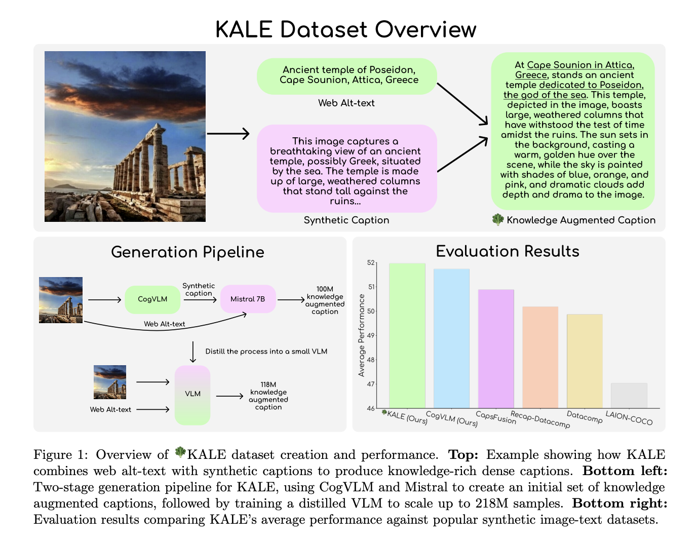

# BLIP3-KALE: An Open-Source Dataset of 218 Million Image-Text Pairs Transforming Image Captioning with Knowledge-Augmented Dense Descriptions

> Image captioning has seen remarkable progress, but significant challenges remain, especially in creating captions that are both descriptive and factually accurate. Traditional image caption datasets, such as those relying purely on synthetic captions generated by vision-language models (VLMs) or web-scraped alt-text, often fall short in either rich descriptive detail or factual grounding. This shortcoming limits […]

Image captioning has seen remarkable progress, but significant challenges remain, especially in creating captions that are both descriptive and factually accurate. Traditional image caption datasets, such as those relying purely on synthetic captions generated by vision-language models (VLMs) or web-scraped alt-text, often fall short in either rich descriptive detail or factual grounding. This shortcoming limits the applicability of these datasets for tasks requiring nuanced understanding and real-world knowledge integration. Furthermore, these datasets frequently contain noisy or incomplete information, leading to lower performance across multimodal tasks. Bridging the gap between detailed descriptions and factual accuracy has been a persistent challenge that researchers have aimed to overcome.

BLIP3-KALE is an innovative open-source dataset comprising 218 million image-text pairs, designed to address the limitations of earlier image caption datasets. It features knowledge-augmented dense captions that combine web-scale factual knowledge with detailed image descriptions. KALE leverages the strengths of both synthetic captioning and real-world information from web alt-text to generate highly informative image descriptions. This two-stage approach enriches synthetic image captions with real-world context, providing a new benchmark for creating factual, dense image captions at scale. The dataset is publicly available at [Hugging Face](https://huggingface.co/datasets/Salesforce/blip3-kale).

KALE uses a two-stage pipeline to generate its knowledge-augmented dense captions. In Stage 1, the team used CogVLM-17B, a powerful vision-language model, to generate dense image captions from the Datacomp-1B dataset. These captions were further enriched by prompting the Mistral language model to add real-world context, ensuring that the captions not only describe the visual content comprehensively but also include relevant factual information. This stage produced an initial pool of 100 million knowledge-augmented captions.

Stage 2 involved scaling up the dataset. The enriched captions generated in Stage 1 were used to train a distilled vision-language model similar to the LLaVA architecture. This model was trained on image patch embeddings and the original captions to efficiently generate knowledge-augmented captions for an additional 118 million images. The resulting dataset, KALE, is significantly larger than previous knowledge-augmented datasets like CapsFusion, featuring 218 million samples with an average of 67.26 words per caption—nearly triple the density of some earlier datasets. The two-stage approach also ensured that the resulting dataset maintained a high level of factual accuracy while significantly reducing the computational cost of the caption generation process.

The introduction of BLIP3-KALE is a significant advancement for the field of multimodal AI. KALE not only addresses the issue of noisy and incomplete captions but also sets a new standard for density and factual grounding in image descriptions. Its captions are more descriptive and knowledge-rich compared to other datasets, which makes KALE an invaluable resource for training vision-language models that need to handle complex tasks requiring a combination of visual understanding and world knowledge.

In terms of results, models trained on KALE demonstrated impressive performance across several vision-language benchmarks, including TextVQA, VQAv2, and ScienceQA. KALE achieved the highest average performance at 51.96%, outperforming other open-source synthetic datasets such as CapsFusion and ReCap-Datacomp. Notably, KALE excelled on TextVQA (59.92%) and VQAv2 (70.10%), proving its efficacy in enhancing the performance of models on visual question-answering tasks. These results underscore KALE’s ability to provide comprehensive and contextually enriched data, which helps train more capable and generalizable vision-language models.

BLIP3-KALE represents a step forward in the field of image captioning by bridging the gap between descriptive synthetic captions and factual alt-text. Its two-stage pipeline for combining synthetic captions with real-world knowledge has resulted in a dataset that is both large in scale and rich in detail. By providing knowledge-augmented dense captions, KALE has set a new benchmark for training advanced multimodal AI systems, demonstrating notable improvements across a wide range of vision-language tasks. However, challenges like occasional hallucinations in text-dense images remain, highlighting the need for future research to refine and scale the KALE approach further. This dataset paves the way for more reliable, knowledge-enhanced AI systems capable of deeper visual and contextual understanding.

---

Check out the **[Paper](https://arxiv.org/abs/2411.07461)** and **[Dataset on HuggingFace](https://huggingface.co/datasets/Salesforce/blip3-kale)**. All credit for this research goes to the researchers of this project. Also, don’t forget to follow us on **[Twitter](https://twitter.com/Marktechpost)** and join our **[Telegram Channel](https://pxl.to/at72b5j)** and [**LinkedIn Gr**](https://www.linkedin.com/groups/13668564/)[**oup**](https://www.linkedin.com/groups/13668564/). **If you like our work, you will love our**[** newsletter..**](https://marktechpost-newsletter.beehiiv.com/subscribe) Don’t Forget to join our **[55k+ ML SubReddit](https://www.reddit.com/r/machinelearningnews/)**.

**[[FREE AI WEBINAR](https://landing.deepset.ai/webinar-implementing-idp-with-genai-in-financial-services?utm_campaign=2411%20-%20webinar%20-%20credX%20-%20IDP%20with%20GenAI%20in%20Financial%20Services&utm_source=marktechpost&utm_medium=newsletter)] ****[Implementing Intelligent Document Processing with GenAI in Financial Services and Real Estate Transactions](https://landing.deepset.ai/webinar-implementing-idp-with-genai-in-financial-services?utm_campaign=2411%20-%20webinar%20-%20credX%20-%20IDP%20with%20GenAI%20in%20Financial%20Services&utm_source=marktechpost&utm_medium=newsletter)**
