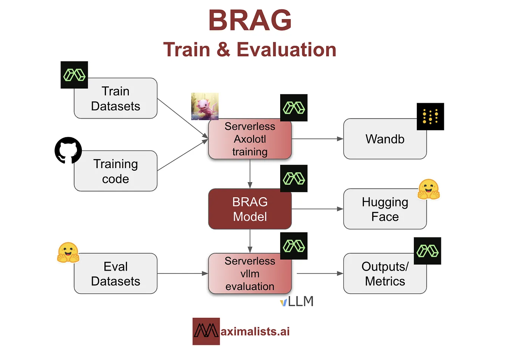

# BRAG Released: High-Performance SLMs (Small Language Models) Specifically Trained for RAG Tasks Under $25 Each

> BRAG is a series of high-performance Retrieval Augmented Generation (RAG) models developed by Maximalists AI Researcher. The BRAG models are a family of small language models (SLMs) designed to offer cost-effective, high-performance alternatives in AI-driven language processing. These models have been trained at an impressively low cost of under $25 each, positioning them as efficient […]

[**BRAG **](https://themaximalists.substack.com/p/brag)is a series of high-performance Retrieval Augmented Generation (RAG) models developed by Maximalists AI Researcher. The BRAG models are a family of small language models ([SLMs](https://www.marktechpost.com/2025/01/12/what-are-small-language-models-slms/)) designed to offer cost-effective, high-performance alternatives in AI-driven language processing. These models have been trained at an impressively low cost of under $25 each, positioning them as efficient and economical solutions in artificial intelligence.

The BRAG models were created in response to the need for efficient and high-performing language models that do not require the extensive computational resources typically associated with large-scale models like those from Nvidia and OpenAI. The primary motivation behind BRAG was to develop a series of models that could match or exceed the performance of leading models such as Cohere’s Command R+, Qwen2, Llama3.1, and Llama3 Instruct while keeping the training costs minimal.

**The BRAG series includes four models: **

- [**BRAG-Qwen2-7b-v0.1**](https://huggingface.co/collections/maximalists/brag-v01-66aefc10e3a6c29c496c7476)

- [**BRAG-Llama-3.1-8b-v0.1**](https://huggingface.co/collections/maximalists/brag-v01-66aefc10e3a6c29c496c7476)

- [**BRAG-Llama-3-8b-v0.1**](https://huggingface.co/collections/maximalists/brag-v01-66aefc10e3a6c29c496c7476)

- [**BRAG-Qwen2-1.5b-v0.1**](https://huggingface.co/collections/maximalists/brag-v01-66aefc10e3a6c29c496c7476)

These models are chosen based on their performance in open benchmarks and ability to balance efficiency and capability. The models underwent a two-stage fine-tuning process inspired by Nvidia’s ChatQA approach, which involves initial training on general instruction datasets followed by [RAG](https://www.marktechpost.com/2024/11/25/retrieval-augmented-generation-rag-deep-dive-into-25-different-types-of-rag/)-specific datasets.

*[**Image Source**](https://themaximalists.substack.com/p/brag)*

The BRAG models are particularly noteworthy for their performance relative to their size. The 1.5B models offer an excellent balance of performance and efficiency. In comparison, the 7B and 8B models can handle more complex tasks, such as long context understanding, tabular data interpretation, and mathematical reasoning. This strategic selection of models and training methodology allowed Maximalists to optimize performance while managing costs effectively.

The BRAG model training involved LoRA (Low-Rank Adaptation) and QLoRA (quantized LoRA) techniques. LoRA enables faster training with reduced computational demands by simplifying the adaptation matrices. In contrast, QLoRA compresses weight parameters to 4-bit precision, significantly reducing memory footprint and facilitating training on consumer-grade GPUs.

*[**Image Source**](https://themaximalists.substack.com/p/brag)*

The models were evaluated using the ChatRAG-Bench, a benchmark designed to assess conversational QA and RAG capabilities across various document types and question formats. The evaluation metrics included F1-Score and Exact Match Accuracy, which provided insights into the models’ ability to generate precise and contextually relevant responses.

*[**Image Source**](https://themaximalists.substack.com/p/brag)*

During the training process, several challenges were encountered, including handling long documents, interpreting tabular data, and addressing domain-specific queries. These issues were mitigated through careful dataset selection and experimentation with various data combinations. For instance, including datasets like DROP, Quoref, and SQuAD helped improve the models’ capabilities in handling complex and diverse data types. The F1 score metric, while widely accepted, was noted to have limitations in capturing semantic nuances and context. This highlighted the need for more holistic and context-aware evaluation metrics to better gauge model performance.

In conclusion, the Maximalists plan to enhance BRAG models by improving RAG performance and tabular data handling and introducing citation generation for better interpretability. They also aim to refine query rewriting techniques to improve search accuracy and relevance. The development of BRAG was supported by credits from Modal Labs, which facilitated cost-effective experimentation. By leveraging innovative training techniques and strategic model selection, BRAG has demonstrated that top-tier performance can be achieved with minimal resource expenditure, paving the way for more accessible and efficient AI solutions.

---

Check out the **[Models](https://huggingface.co/collections/maximalists/brag-v01-66aefc10e3a6c29c496c7476) **and **[Details](https://themaximalists.substack.com/p/brag)**. All credit for this research goes to the researchers of this project. Also, don’t forget to follow us on **[Twitter](https://twitter.com/Marktechpost)** and join our **[Telegram Channel](https://pxl.to/at72b5j)** and [**LinkedIn Gr**](https://www.linkedin.com/groups/13668564/)[**oup**](https://www.linkedin.com/groups/13668564/). **If you like our work, you will love our**[** newsletter..**](https://marktechpost-newsletter.beehiiv.com/subscribe)

Don’t Forget to join our **[47k+ ML SubReddit](https://www.reddit.com/r/machinelearningnews/)**

**Find Upcoming [AI Webinars here](https://www.marktechpost.com/ai-webinars-list-llms-rag-generative-ai-ml-vector-database/)**
