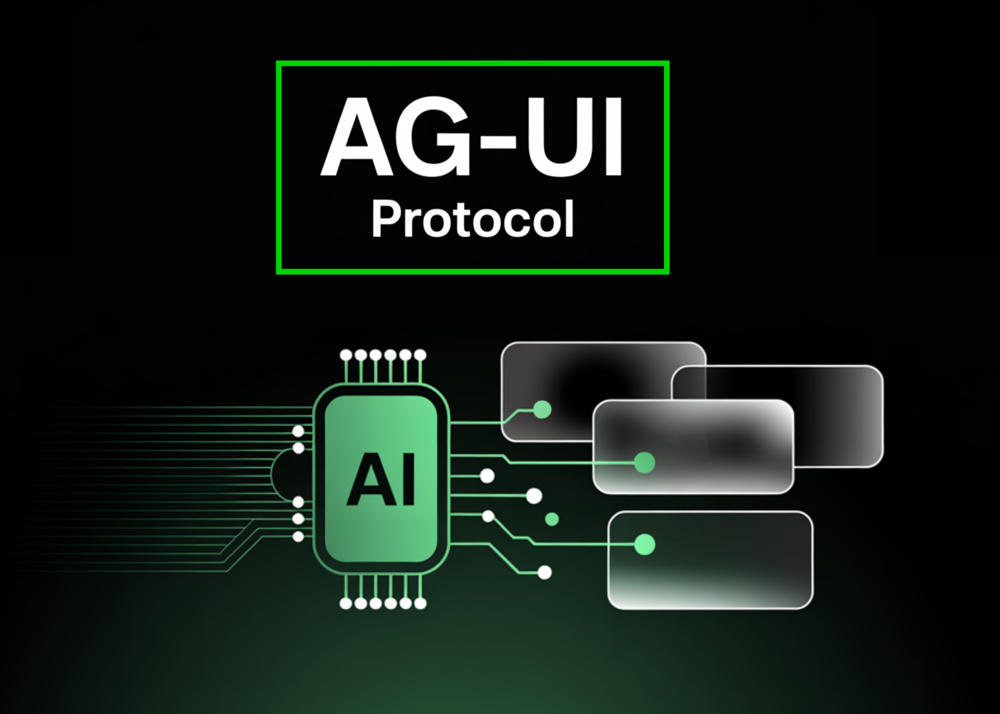

# Bringing AI Agents Into Any UI: The AG-UI Protocol for Real-Time, Structured Agent–Frontend Streams

> AI agents are no longer just chatbots that spit out answers. They’re evolving into complex systems that can reason step by step, call APIs, update dashboards, and collaborate with humans in real time. But this raises a key question: how should agents talk to user interfaces? Ad-hoc sockets and custom APIs can work for prototypes, […]

AI agents are no longer just chatbots that spit out answers. They’re evolving into complex systems that can reason step by step, call APIs, update dashboards, and collaborate with humans in real time. But this raises a key question: **how should agents talk to user interfaces?**


Ad-hoc sockets and custom APIs can work for prototypes, but they don’t scale. Each project reinvents how to stream outputs, manage tool calls, or handle user corrections. That’s exactly the gap the **[AG-UI (Agent–User Interaction) Protocol](https://pxl.to/e8vvx)** aims to fill.

### What AG-UI Brings to the Table

[AG-UI](https://pxl.to/e8vvx) is a **streaming event protocol** designed for agent-to-UI communication. Instead of returning a single blob of text, agents emit a **continuous sequence of JSON events**:

- TEXT_MESSAGE_CONTENT for streaming responses token by token.

- TOOL_CALL_START / ARGS / END for external function calls.

- STATE_SNAPSHOT and STATE_DELTA for keeping UI state in sync with the backend.

- Lifecycle events (RUN_STARTED, RUN_FINISHED) to frame each interaction.

All of this flows over standard transports like **HTTP SSE** or **WebSockets**, so developers don’t have to build custom protocols. The frontend subscribes once and can render partial results, update charts, and even send user corrections mid-run.

This [design makes AG-UI](https://github.com/orgs/ag-ui-protocol/projects/1) more than a messaging layer—it’s a **contract** between agents and UIs. Backend frameworks can evolve, UIs can change, but as long as they speak AG-UI, everything stays interoperable.

### First-Party and Partner Integrations


One reason [AG-UI](https://pxl.to/e8vvx) is gaining traction is its breadth of supported integrations. Instead of leaving developers to wire everything manually, many agent frameworks already ship with AG-UI support.

- **Mastra** (TypeScript): Native [AG-UI](https://pxl.to/e8vvx) support with strong typing, ideal for finance and data-driven copilots.

- **LangGraph**: AG-UI integrated into orchestration workflows so every node emits structured events.

- **CrewAI**: Multi-agent coordination exposed to UIs via AG-UI, letting users follow and guide “agent crews.”

- **Agno**: Full-stack multi-agent systems with [AG-UI](https://pxl.to/e8vvx)-ready backends for dashboards and ops tools.

- **LlamaIndex**: Adds interactive data retrieval workflows with live evidence streaming to UIs.

- **Pydantic AI**: Python SDK with [AG-UI](https://pxl.to/e8vvx) baked in, plus example apps like the AG-UI Dojo.

- **CopilotKit**: Frontend toolkit offering React components that subscribe to AG-UI streams.

Other integrations are **in progress**—like AWS Bedrock Agents, Google ADK, and Cloudflare Agents—which will make AG-UI accessible on major cloud platforms. Language SDKs are also expanding: Kotlin support is complete, while .NET, Go, Rust, Nim, and Java are in development.

### Real-World Use Cases

Healthcare, finance, and analytics teams use [AG-UI](https://pxl.to/e8vvx) to turn critical data streams into live, context-rich interfaces: clinicians see patient vitals update without page reloads, stock traders trigger a stock-analysis agent and watch results stream inline, and analysts view a LangGraph-powered dashboard that visualizes charting plans token by token as the agent reasons.

Beyond data display, [AG-UI](https://pxl.to/e8vvx) simplifies workflow automation. Common patterns—data migration, research summarization, form-filling—are reduced to a single SSE event stream instead of custom sockets or polling loops. Because agents emit only STATE_DELTA patches, the UI refreshes just the pieces that changed, cutting bandwidth and eliminating jarring reloads. The same mechanism powers 24/7 customer-support bots that show typing indicators, tool-call progress, and final answers within one chat window, keeping users engaged throughout the interaction.

For developers, the protocol enables code-assistants and multi-agent applications with minimal glue code. Experiences that mirror GitHub Copilot—real-time suggestions streaming into editors—are built by simply listening to [AG-UI](https://pxl.to/e8vvx) events. Frameworks such as LangGraph, CrewAI, and Mastra already emit the spec’s 16 event types, so teams can swap back-end agents while the front-end remains unchanged. This decoupling speeds prototyping across domains: tax software can show optimistic deduction estimates while validation runs in the background, and a CRM page can autofill client details as an agent returns structured data to a Svelte + Tailwind UI.

### AG-UI Dojo

CopilotKit has also recently introduced **[AG-UI Dojo](https://www.copilotkit.ai/blog/introducing-the-ag-ui-dojo)**, a “learning-first” suite of minimal, runnable demos that teach and validate AG-UI integrations end-to-end. Each demo includes a live preview, code, and linked docs, covering six primitives needed for production agent UIs: agentic chat (streaming + tool hooks), human-in-the-loop planning, agentic and tool-based generative UI, shared state, and predictive state updates for real-time collaboration. Teams can use the Dojo as a checklist to troubleshoot event ordering, payload shape, and UI–agent state sync before shipping, reducing integration ambiguity and debugging time.

You can play around with the [Dojo here](https://dojo.ag-ui.com/), [Dojo source code](https://go.copilotkit.ai/ag-ui-dojo) and more technical details on the [Dojo are available in the blog](https://www.copilotkit.ai/blog/introducing-the-ag-ui-dojo)

### Roadmap and Community Contributions

The [**public roadmap**](https://go.copilotkit.ai/ag-ui-roadmap) shows where AG-UI is heading and where developers can plug in:

- **SDK maturity**: Ongoing investment in TypeScript and Python SDKs, with expansion into more languages.

- **Debugging and developer tools**: Better error handling, observability, and lifecycle event clarity.

- **Performance and transports**: Work on large payload handling and alternative streaming transports beyond SSE/WS.

- **Sample apps and playgrounds**: The **AG-UI Dojo** demonstrates building blocks for UIs and is expanding with more patterns.

On the contribution side, the community has added integrations, improved SDKs, expanded documentation, and built demos. Pull requests across frameworks like Mastra, LangGraph, and Pydantic AI have come from both maintainers and external contributors. This collaborative model ensures [AG-UI](https://pxl.to/e8vvx) is shaped by real developer needs, not just spec writers.

### Summary

[AG-UI](https://pxl.to/e8vvx) is emerging as the **default interaction protocol for agent UIs**. It standardizes the messy middle ground between agents and frontends, making applications more responsive, transparent, and maintainable.

With first-party integrations across popular frameworks, community contributions shaping the roadmap, and tooling like the AG-UI Dojo lowering the barrier to entry, the ecosystem is maturing fast.

Launch [AG-UI](https://pxl.to/e8vvx) with a single command, choose your agent framework, and be prototyping in under five minutes.

Copy CodeCopiedUse a different Browser
```
npx create-ag-ui-app@latest 
#then 

#For details and patterns, see the quickstart blog: go.copilotkit.ai/ag-ui-cli-blog.
```

---

### FAQs

#### FAQ 1: What problem does AG-UI solve?

[AG-UI](https://pxl.to/e8vvx) standardizes how agents communicate with user interfaces. Instead of ad-hoc APIs, it defines a clear event protocol for streaming text, tool calls, state updates, and lifecycle signals—making interactive UIs easier to build and maintain.

#### FAQ 2: Which frameworks already support AG-UI?

[AG-UI](https://pxl.to/e8vvx) has first-party integrations with Mastra, LangGraph, CrewAI, Agno, LlamaIndex, and Pydantic AI. Partner integrations include CopilotKit on the frontend. Support for AWS Bedrock Agents, Google ADK, and additional languages like .NET, Go, and Rust is in progress.

#### FAQ 3: How does AG-UI differ from REST APIs?

REST works for single request–response tasks. [AG-UI](https://pxl.to/e8vvx) is designed for interactive agents—it supports streaming output, incremental updates, tool usage, and user input during a run, which REST cannot handle natively.

#### FAQ 4: What transports does AG-UI use?

By default, [AG-UI](https://pxl.to/e8vvx) runs over HTTP Server-Sent Events (SSE). It also supports WebSockets, and the roadmap includes exploration of alternative transports for high-performance or binary data use cases.

#### FAQ 5: How can developers get started with AG-UI?

You can install official SDKs (TypeScript, Python) or use supported frameworks like Mastra or Pydantic AI. The **AG-UI Dojo** provides working examples and UI building blocks to experiment with event streams.

[](https://www.marktechpost.com/wp-content/uploads/2025/09/1000x1000-info-3-scaled.png)

---

_Thanks to the [CopilotKit](https://pxl.to/e8vvx) team for the thought leadership/ Resources for this article. [CopilotKit](https://pxl.to/e8vvx) team has supported us in this content/article._
