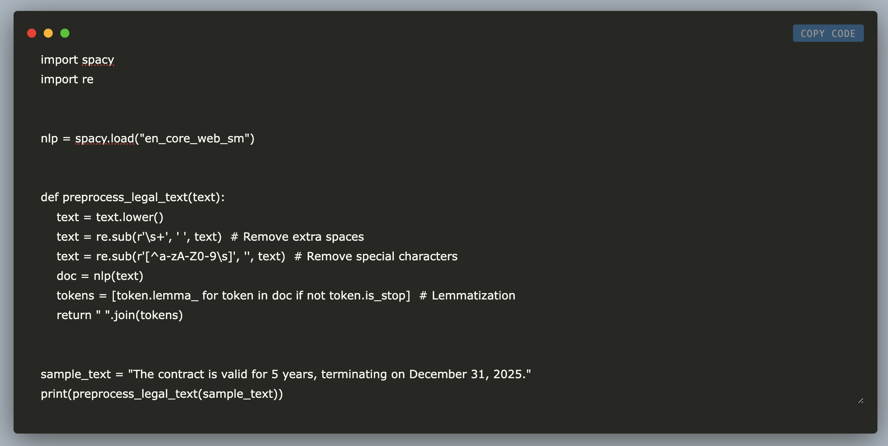

# Building a Legal AI Chatbot: A Step-by-Step Guide Using bigscience/T0pp LLM, Open-Source NLP Models, Streamlit, PyTorch, and Hugging Face Transformers

> In this tutorial, we will build an efficient Legal AI CHatbot using open-source tools. It provides a step-by-step guide to creating a chatbot using bigscience/T0pp LLM, Hugging Face Transformers, and PyTorch. We will walk you through setting up the model, optimizing performance using PyTorch, and ensuring an efficient and accessible AI-powered legal assistant. First, we […]

In this tutorial, we will build an efficient Legal AI CHatbot using open-source tools. It provides a step-by-step guide to creating a chatbot using [bigscience/T0pp LLM](https://huggingface.co/bigscience/T0pp), Hugging Face Transformers, and PyTorch. We will walk you through setting up the model, optimizing performance using PyTorch, and ensuring an efficient and accessible AI-powered legal assistant.

Copy CodeCopiedUse a different Browser
```
from transformers import AutoModelForSeq2SeqLM, AutoTokenizer

model_name = "bigscience/T0pp"  # Open-source and available
tokenizer = AutoTokenizer.from_pretrained(model_name)
model = AutoModelForSeq2SeqLM.from_pretrained(model_name)

```

First, we load bigscience/T0pp, an open-source LLM, using Hugging Face Transformers. It initializes a tokenizer for text preprocessing and loads the AutoModelForSeq2SeqLM, enabling the model to perform text generation tasks such as answering legal queries.

Copy CodeCopiedUse a different Browser
```
import spacy
import re

nlp = spacy.load("en_core_web_sm")

def preprocess_legal_text(text):
    text = text.lower()
    text = re.sub(r'\s+', ' ', text)  # Remove extra spaces
    text = re.sub(r'[^a-zA-Z0-9\s]', '', text)  # Remove special characters
    doc = nlp(text)
    tokens = [token.lemma_ for token in doc if not token.is_stop]  # Lemmatization
    return " ".join(tokens)

sample_text = "The contract is valid for 5 years, terminating on December 31, 2025."
print(preprocess_legal_text(sample_text))
```

Then, we preprocess legal text using spaCy and regular expressions to ensure cleaner and more structured input for NLP tasks. It first converts text to lowercase, removes extra spaces and special characters using regex, and then tokenizes and lemmatizes the text using spaCy’s NLP pipeline. Additionally, it filters out stop words to retain only meaningful terms, making it ideal for legal text processing in AI applications. The cleaned text is more efficient for machine learning and language models like bigscience/T0pp, improving accuracy in legal chatbot responses.

Copy CodeCopiedUse a different Browser
```
def extract_legal_entities(text):
    doc = nlp(text)
    entities = [(ent.text, ent.label_) for ent in doc.ents]
    return entities

sample_text = "Apple Inc. signed a contract with Microsoft on June 15, 2023."
print(extract_legal_entities(sample_text))
```

Here, we extract legal entities from text using spaCy’s Named Entity Recognition (NER) capabilities. The function processes the input text with spaCy’s NLP model, identifying and extracting key entities such as organizations, dates, and legal terms. It returns a list of tuples, each containing the recognized entity and its category (e.g., organization, date, or law-related term).

Copy CodeCopiedUse a different Browser
```
import faiss
import numpy as np
import torch
from transformers import AutoModel, AutoTokenizer

embedding_model = AutoModel.from_pretrained("sentence-transformers/all-MiniLM-L6-v2")
embedding_tokenizer = AutoTokenizer.from_pretrained("sentence-transformers/all-MiniLM-L6-v2")

def embed_text(text):
    inputs = embedding_tokenizer(text, return_tensors="pt", padding=True, truncation=True)
    with torch.no_grad():
        output = embedding_model(**inputs)
    embedding = output.last_hidden_state.mean(dim=1).squeeze().cpu().numpy()  # Ensure 1D vector
    return embedding

legal_docs = [
    "A contract is legally binding if signed by both parties.",
    "An NDA prevents disclosure of confidential information.",
    "A non-compete agreement prohibits working for a competitor."
]

doc_embeddings = np.array([embed_text(doc) for doc in legal_docs])

print("Embeddings Shape:", doc_embeddings.shape)  # Should be (num_samples, embedding_dim)

index = faiss.IndexFlatL2(doc_embeddings.shape[1])  # Dimension should match embedding size
index.add(doc_embeddings)

query = "What happens if I break an NDA?"
query_embedding = embed_text(query).reshape(1, -1)  # Reshape for FAISS
_, retrieved_indices = index.search(query_embedding, 1)

print(f"Best matching legal text: {legal_docs[retrieved_indices[0][0]]}")
```

With the above code, we build a legal document retrieval system using FAISS for efficient semantic search. It first loads the MiniLM embedding model from Hugging Face to generate numerical representations of text. The embed_text function processes legal documents and queries by computing contextual embeddings using MiniLM. These embeddings are stored in a FAISS vector index, allowing fast similarity searches.

Copy CodeCopiedUse a different Browser
```
def legal_chatbot(query):
    inputs = tokenizer(query, return_tensors="pt", padding=True, truncation=True)
    output = model.generate(**inputs, max_length=100)
    return tokenizer.decode(output[0], skip_special_tokens=True)

query = "What happens if I break an NDA?"
print(legal_chatbot(query))
```

Finally, we define a Legal AI Chatbot as generating responses to legal queries using a pre-trained language model. The legal_chatbot function takes a user query, processes it using the tokenizer, and generates a response with the model. The response is then decoded into readable text, removing any special tokens. When a query like “What happens if I break an NDA?” is input, the chatbot provides a relevant AI-generated legal response.

In conclusion, by integrating bigscience/T0pp LLM, Hugging Face Transformers, and PyTorch, we have demonstrated how to build a powerful and scalable Legal AI Chatbot using open-source resources. This project is a solid foundation for creating reliable AI-powered legal tools, making legal assistance more accessible and automated.

---

Here is the **_[Colab Notebook](https://colab.research.google.com/drive/1Xg992ld9ErcFVrn32aZ1pCftC1AEz-YG)_** for the above project. Also, don’t forget to follow us on **[Twitter](https://x.com/intent/follow?screen_name=marktechpost)** and join our **[Telegram Channel](https://arxiv.org/abs/2406.09406)** and [**LinkedIn Gr**](https://www.linkedin.com/groups/13668564/)[**oup**](https://www.linkedin.com/groups/13668564/). Don’t Forget to join our **[80k+ ML SubReddit](https://www.reddit.com/r/machinelearningnews/)**.

**[🚨 **](https://pxl.to/82homag)[Recommended Read- LG AI Research Releases NEXUS: An Advanced System Integrating Agent AI System and Data Compliance Standards to Address Legal Concerns in AI Datasets](https://www.marktechpost.com/2025/02/16/lg-ai-research-releases-nexus-an-advanced-system-integrating-agent-ai-system-and-data-compliance-standards-to-address-legal-concerns-in-ai-datasets/)
