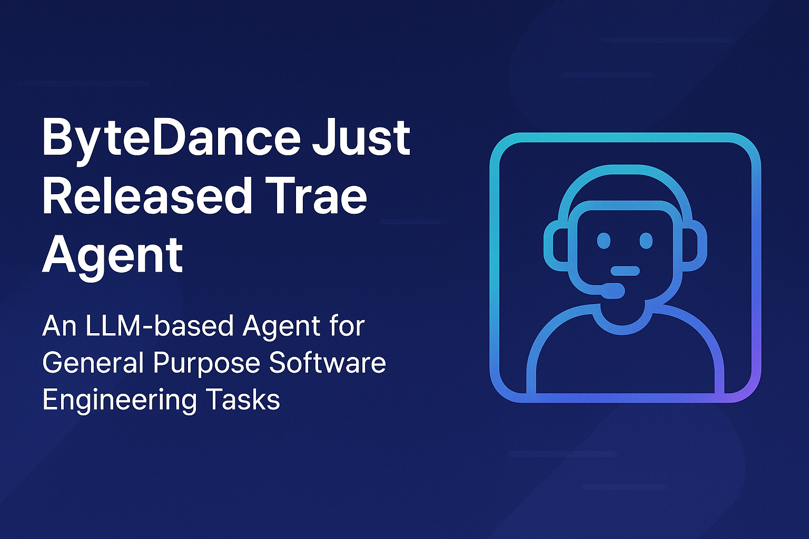

# ByteDance Just Released Trae Agent: An LLM-based Agent for General Purpose Software Engineering Tasks

> ByteDance, the Chinese tech giant behind TikTok and other global platforms, has officially released Trae Agent, a general-purpose software engineering agent powered by large language models (LLMs). Designed to execute complex programming tasks via natural language prompts, Trae Agent offers a highly capable and extensible Command-Line Interface (CLI), redefining how developers can interact with their […]

ByteDance, the Chinese tech giant behind TikTok and other global platforms, has officially released _Trae Agent_, a general-purpose software engineering agent powered by large language models (LLMs). Designed to execute complex programming tasks via natural language prompts, Trae Agent offers a highly capable and extensible Command-Line Interface (CLI), redefining how developers can interact with their systems.

### What is Trae Agent?

Trae Agent is an autonomous, LLM-powered agent tailored to streamline the software development process. It acts like a senior software engineer, capable of:

- Systematic debugging and reproduction of issues

- Writing production-grade code based on best practices

- Navigating and understanding large, unfamiliar codebases

- Generating and applying accurate bug fixes

- Providing real-time interactive support for development tasks

Through a natural language interface, developers can simply describe what they want, and Trae Agent will interpret and execute using underlying tools. This approach significantly lowers the barrier to entry for managing and modifying complex codebases.

### Interactive CLI with Multimodal Model Support

The core of Trae Agent lies in its interactive CLI interface. This interface allows users to:

- Communicate in plain English

- Trigger advanced workflows such as code navigation, patch generation, and testing

- Receive concise, real-time feedback using Lakeview—an embedded model that summarizes actions performed by the agent

Trae Agent supports multiple backend LLM providers, including OpenAI and Anthropic. Current integrations include Claude-4-Sonnet, Claude-4-Opus, Claude-3.7-Sonnet, and Gemini-2.5-Pro. This gives users flexibility in model selection based on context and performance needs.

### SOTA Performance on SWE-bench Verified

Trae Agent has achieved state-of-the-art (SOTA) performance on SWE-bench Verified, a rigorous benchmark evaluating software engineering agents on real-world bug-fixing tasks. This is made possible through an efficient single-agent patch generation system that includes the following components:

#### 1. str_replace_based_edit_tool

Enables the agent to view, create, and edit files and directories. This tool forms the backbone of code manipulation, essential for generating accurate patches.

#### 2. bash Interface

Provides a persistent shell environment where the agent can execute commands, capture terminal outputs, and assess runtime errors, simulating a developer’s command-line workflow.

#### 3. sequential_thinking Module

Enhances the agent’s cognitive capabilities. It structures problem-solving steps by enabling iterative reasoning, hypothesis generation, and verification, similar to a human engineer’s thought process.

#### 4. ckg_tools (Code Knowledge Graph Tools)

Constructs a semantic knowledge graph for the entire codebase. This allows the agent to efficiently search and reason about classes, functions, and file structures.

#### 5. task_done Signal

Indicates the end of a task and provides a structured summary, essential for ensuring clarity and transparency in automation.

### Key Capabilities

Trae Agent’s architecture is designed to tackle real-world engineering challenges with precision and autonomy. It is particularly suited for:

- **Debugging**: Trae Agent can trace error roots through systematic reproduction, guided by its structured reasoning model.

- **Codebase Navigation**: Using the internal code graph and powerful search, it quickly identifies where changes need to be made.

- **Fix Generation**: With just one prompt, Trae Agent can produce and apply code patches. These patches are not just syntactic fixes—they are validated through logical checks and testing.

- **Cross-Model Compatibility**: Support for multiple LLM providers ensures flexibility and resilience across different deployment contexts.

### Open Source and Ecosystem

Trae Agent is open-sourced under the MIT license, making it accessible for developers, researchers, and enterprise teams. The source code is available on [GitHub](https://github.com/bytedance/trae-agent), along with setup instructions, architecture explanations, and usage examples.

This release is part of ByteDance’s broader effort to drive innovation in AI-assisted development tooling, with Trae Agent positioned as a foundational tool for building autonomous agents in software engineering domains.

### Use Cases

Some promising applications of Trae Agent include:

- Automating routine maintenance tasks in legacy codebases

- Real-time collaborative programming in team environments

- Continuous integration and deployment (CI/CD) pipeline automation

- Teaching assistant for coding bootcamps or onboarding new engineers

### Conclusion

In conclusion, Trae Agent represents a significant step forward in autonomous software engineering tools, blending LLM capabilities with a structured, tool-augmented CLI environment. With its support for multiple model backends, real-time summarization, and state-of-the-art performance on SWE-bench Verified, it offers a promising framework for automating complex development workflows. While the project is currently in its alpha stage, it is under active development by the ByteDance team, with ongoing enhancements expected in model integration, task orchestration, and broader developer tooling support. Developers and researchers are encouraged to explore, contribute, and provide feedback via the open-source repository.

---

Check out the** _[GitHub Page.](https://github.com/bytedance/trae-agent)_** All credit for this research goes to the researchers of this project. Also, feel free to follow us on **[Twitter](https://x.com/intent/follow?screen_name=marktechpost)**, **[Youtube](https://www.youtube.com/@Marktechpost)** and **[Spotify](https://open.spotify.com/show/1d5n4iy6LLTRo4khzTgKCp)** and don’t forget to join our **[100k+ ML SubReddit](https://www.reddit.com/r/machinelearningnews/)** and Subscribe to **[our Newsletter](https://www.airesearchinsights.com/subscribe)**.
