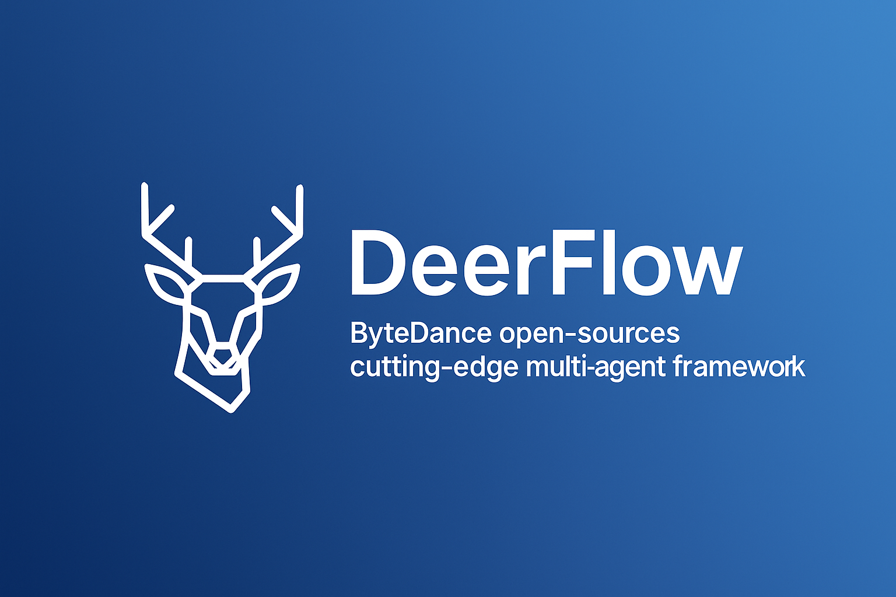

# ByteDance Open-Sources DeerFlow: A Modular Multi-Agent Framework for Deep Research Automation

> ByteDance has released DeerFlow, an open-source multi-agent framework designed to enhance complex research workflows by integrating the capabilities of large language models (LLMs) with domain-specific tools. Built on top of LangChain and LangGraph, DeerFlow offers a structured, extensible platform for automating sophisticated research tasks—from information retrieval to multimodal content generation—within a collaborative human-in-the-loop setting. Tackling […]

ByteDance has released **DeerFlow**, an open-source multi-agent framework designed to enhance complex research workflows by integrating the capabilities of large language models (LLMs) with domain-specific tools. Built on top of **LangChain** and **LangGraph**, DeerFlow offers a structured, extensible platform for automating sophisticated research tasks—from information retrieval to multimodal content generation—within a collaborative human-in-the-loop setting.

### Tackling Research Complexity with Multi-Agent Coordination

Modern research involves not just understanding and reasoning, but also synthesizing insights from diverse data modalities, tools, and APIs. Traditional monolithic LLM agents often fall short in these scenarios, as they lack the modular structure to specialize and coordinate across distinct tasks.

DeerFlow addresses this by adopting a **multi-agent architecture**, where each agent serves a specialized function such as task planning, knowledge retrieval, code execution, or report synthesis. These agents interact through a directed graph built using LangGraph, allowing for robust task orchestration and data flow control. The architecture is both hierarchical and asynchronous—capable of scaling complex workflows while remaining transparent and debuggable.

### Deep Integration with LangChain and Research Tools

At its core, DeerFlow leverages LangChain for LLM-based reasoning and memory handling, while extending its functionality with toolchains purpose-built for research:

- **Web Search & Crawling**: For real-time knowledge grounding and data aggregation from external sources.

- **Python REPL & Visualization**: To enable data processing, statistical analysis, and code generation with execution validation.

- **MCP Integration**: Compatibility with ByteDance’s internal Model Control Platform, enabling deeper automation pipelines for enterprise applications.

- **Multimodal Output Generation**: Beyond textual summaries, DeerFlow agents can co-author slides, generate podcast scripts, or draft visual artifacts.

This modular integration makes the system particularly well-suited for research analysts, data scientists, and technical writers aiming to combine reasoning with execution and output generation.

### Human-in-the-Loop as a First-Class Design Principle

Unlike conventional autonomous agents, DeerFlow embeds **human feedback and interventions** as an integral part of the workflow. Users can review agent reasoning steps, override decisions, or redirect research paths at runtime. This fosters reliability, transparency, and alignment with domain-specific goals—attributes critical for real-world deployment in academic, corporate, and R&D environments.

### Deployment and Developer Experience

DeerFlow is engineered for flexibility and reproducibility. The setup supports modern environments with **Python 3.12+** and **Node.js 22+**. It uses `uv` for Python environment management and `pnpm` for managing JavaScript packages. The installation process is well-documented and includes preconfigured pipelines and example use cases to help developers get started quickly.

Developers can extend or modify the default agent graph, integrate new tools, or deploy the system across cloud and local environments. The codebase is actively maintained and welcomes community contributions under the permissive MIT license.

### Conclusion

DeerFlow represents a significant step toward scalable, agent-driven automation for complex research tasks. Its multi-agent architecture, LangChain integration, and focus on human-AI collaboration set it apart in a rapidly evolving ecosystem of LLM tools. For researchers, developers, and organizations seeking to operationalize AI for research-intensive workflows, DeerFlow offers a robust and modular foundation to build upon.

---

Check out the** [GitHub Page](https://github.com/bytedance/deer-flow) and [Project Page](https://deerflow.tech/).** Also, don’t forget to follow us on **[Twitter](https://x.com/intent/follow?screen_name=marktechpost)**.

**Here’s a brief overview of what we’re building at Marktechpost:**

- **ML News Community –[ r/machinelearningnews](https://www.reddit.com/r/machinelearningnews/) (92k+ members)**

- **Newsletter– [airesearchinsights.com/](https://minicon.marktechpost.com/)(30k+ subscribers)**

- **miniCON AI Events – [minicon.marktechpost.com](https://minicon.marktechpost.com/)**

- **AI Reports & Magazines – [magazine.marktechpost.com](https://magazine.marktechpost.com/)**

- **AI Dev & Research News – [marktechpost.com](https://marktechpost.com/) (1M+ monthly readers)**

- **[Partner with us](https://forms.gle/cnXafrh6Be8UigQ68)**
