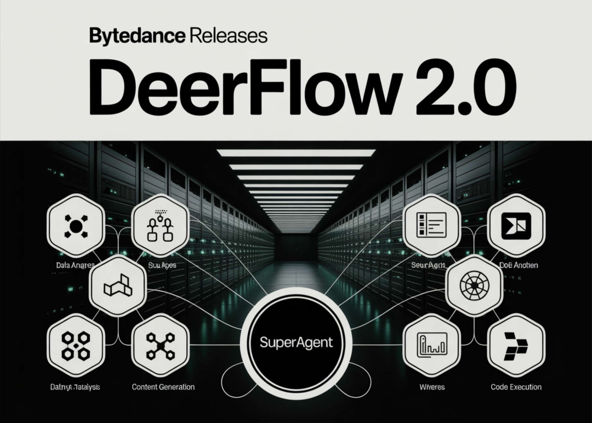

# ByteDance Releases DeerFlow 2.0: An Open-Source SuperAgent Harness that Orchestrates Sub-Agents, Memory, and Sandboxes to do Complex Tasks

> The era of the ‘Copilot’ is officially getting an upgrade. While the tech world has spent the last two years getting comfortable with AI that suggests code or drafts emails, ByteDance team is moving the goalposts. They released DeerFlow 2.0, a newly open-sourced ‘SuperAgent’ framework that doesn’t just suggest work; it executes it. DeerFlow is […]

The era of the ‘Copilot’ is officially getting an upgrade. While the tech world has spent the last two years getting comfortable with AI that suggests code or drafts emails, ByteDance team is moving the goalposts. They released **DeerFlow** 2.0, a newly open-sourced ‘SuperAgent’ framework that doesn’t just suggest work; it executes it. DeerFlow is designed to research, code, build websites, create slide decks, and generate video content autonomously.

### The Sandbox: An AI with a Computer of Its Own

The most significant differentiator for DeerFlow is its approach to execution. Most AI agents operate within the constraints of a text-box interface, sending queries to an API and returning a string of text. If you want that code to run, you—the human—have to copy, paste, and debug it.

DeerFlow flips this script. It operates within a **real, isolated Docker container**.

For software developers, the implications are massive. This isn’t an AI ‘hallucinating’ that it ran a script; it is an agent with a full filesystem, a bash terminal, and the ability to read and write actual files. When you give DeerFlow a task, it doesn’t just suggest a Python script to analyze a CSV—it spins up the environment, installs the dependencies, executes the code, and hands you the resulting chart.

By providing the AI with its own ‘computer,’ ByteDance team has solved one of the biggest friction points in agentic workflows: the hand-off. Because it has stateful memory and a persistent filesystem, DeerFlow can remember your specific writing styles, project structures, and preferences across different sessions.

### Multi-Agent Orchestration: Divide, Conquer, and Converge

The ‘magic’ of DeerFlow lies in its orchestration layer. It utilizes a **SuperAgent harness**—a lead agent that acts as a project manager.

When a complex prompt is received—for example, _‘Research the top 10 AI startups in 2026 and build me a comprehensive presentation_‘—DeerFlow doesn’t try to do it all in one linear thought process. Instead, it employs task decomposition:

- **The Lead Agent** breaks the prompt into logical sub-tasks.

- **Sub-agents** are spawned in parallel. One might handle web scraping for funding data, another might conduct competitor analysis, and a third might generate relevant images.

- **Convergence:** Once the sub-agents complete their tasks in their respective sandboxes, the results are funneled back to the lead agent.

- **Final Delivery:** A final agent compiles the data into a polished deliverable, such as a slide deck or a full web application.

This parallel processing significantly reduces the time-to-delivery for ‘heavy’ tasks that would traditionally take a human researcher or developer hours to synthesize.

### From Research Tool to Full-Stack Automation

Interestingly, DeerFlow wasn’t originally intended to be this expansive. It started its life at ByteDance as a specialized deep research tool. However, as the internal community began utilizing it, they pushed the boundaries of its capabilities.

Users began leveraging its Docker-based execution to build automated data pipelines, spin up real-time dashboards, and even create full-scale web applications from scratch. Recognizing that the community wanted an execution engine rather than just a search tool, ByteDance rewrote the framework from the ground up.

The result is DeerFlow 2.0, a versatile framework that can handle:

- **Deep Web Research:** Gathering cited sources across the entire web.

- **Content Creation:** Generating reports with integrated charts, images, and videos.

- **Code Execution:** Running Python scripts and bash commands in a secure environment.

- **Asset Generation:** Creating complete slide decks and UI components.

### Key Takeaways

- **Execution-First Sandbox:** Unlike traditional AI agents, DeerFlow operates in an isolated **Docker-based sandbox**. This gives the agent a real filesystem, a bash terminal, and the ability to execute code and run commands rather than just suggesting them.

- **Hierarchical Multi-Agent Orchestration:** The framework uses a ‘SuperAgent’ lead to break down complex tasks into sub-tasks. It spawns **parallel sub-agents** to handle different components—such as scraping data, generating images, or writing code—before converging the results into a final deliverable.

- **The ‘SuperAgent’ Pivot:** Originally a deep research tool, DeerFlow 2.0 was **entirely rewritten** to become a task-agnostic harness. It can now build full-stack web applications, generate professional slide decks, and automate complex data pipelines autonomously.

- **Complete Model Agnosticism:** DeerFlow is designed to be **LLM-neutral**. It integrates with any OpenAI-compatible API, allowing engineers to swap between models like GPT-4, Claude 3.5, Gemini 1.5, or even local models via DeepSeek and Ollama without changing the underlying agent logic.

- **Stateful Memory & Persistence:** The agent features a **persistent memory system** that tracks user preferences, writing styles, and project context across multiple sessions. This allows it to function as a long-term ‘AI employee’ rather than a one-off session tool.

---

Check out **[GitHub Repo](https://github.com/bytedance/deer-flow). **Also, feel free to follow us on **[Twitter](https://x.com/intent/follow?screen_name=marktechpost)** and don’t forget to join our **[120k+ ML SubReddit](https://www.reddit.com/r/machinelearningnews/)** and Subscribe to **[our Newsletter](https://www.aidevsignals.com/)**. Wait! are you on telegram? **[now you can join us on telegram as well.](https://t.me/machinelearningresearchnews)**
