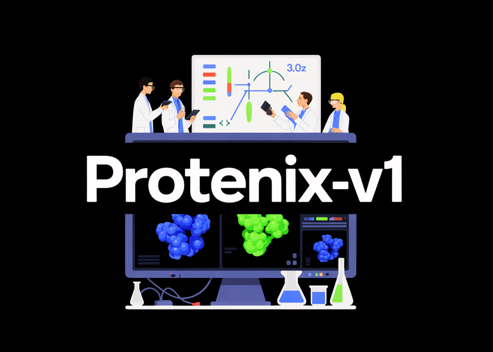

# ByteDance Releases Protenix-v1: A New Open-Source Model Achieving AF3-Level Performance in Biomolecular Structure Prediction

> How close can an open model get to AlphaFold3-level accuracy when it matches training data, model scale and inference budget? ByteDance has introduced Protenix-v1, a comprehensive AlphaFold3 (AF3) reproduction for biomolecular structure prediction, released with code and model parameters under Apache 2.0. The model targets AF3-level performance across protein, DNA, RNA and ligand structures while […]

How close can an open model get to AlphaFold3-level accuracy when it matches training data, model scale and inference budget? ByteDance has introduced **Protenix-v1**, a comprehensive **AlphaFold3 (AF3) reproduction** for biomolecular structure prediction, released with **code and model parameters under Apache 2.0**. The model targets **AF3-level performance** across protein, DNA, RNA and ligand structures while keeping the entire stack open and extensible for research and production.

The core release also ships with **PXMeter v1.0.0**, an evaluation toolkit and dataset suite for **transparent benchmarking on more than 6k complexes** with **time-split and domain-specific subsets**.

### What is Protenix-v1?

Protenix is described as **‘Protenix: Protein + X**‘, a foundation model for **high-accuracy biomolecular structure prediction**. It predicts **all-atom 3D structures for complexes that can include:**

- Proteins

- Nucleic acids (DNA and RNA)

- Small-molecule ligands

The research team defines Protenix as a **comprehensive AF3 reproduction**. It re-implements the AF3-style diffusion architecture for all-atom complexes and exposes it in a trainable PyTorch codebase.

**The project is released as a full stack:**

- Training and inference code

- Pre-trained model weights

- Data and MSA pipelines

- A browser-based **Protenix Web Server** for interactive use

### AF3-level performance under matched constraints

As per the research team **Protenix-v1 (protenix_base_default_v1.0.0)** is **‘the first fully open-source model that outperforms AlphaFold3 across diverse benchmark sets while adhering to the same training data cutoff, model scale, and inference budget as AlphaFold3.**‘

**The important constraints are:**

- **Training data cutoff**: 2021-09-30, aligned with AF3’s PDB cutoff.

- **Model scale**: Protenix-v1 itself has **368M parameters**; AF3 scale is matched but not disclosed.

- **Inference budget**: comparisons use similar sampling budgets and runtime constraints.

*https://github.com/bytedance/Protenix*

On challenging targets such as **antigen–antibody complexes**, increasing the **number of sampled candidates** from several to hundreds yields **consistent log-linear improvements in accuracy**. This gives a clear and documented **inference-time scaling behavior** rather than a single fixed operating point.

### PXMeter v1.0.0: Evaluation for 6k+ complexes

To support these claims, the research team released **PXMeter v1.0.0**, an open-source toolkit for **reproducible structure prediction benchmarks**.

**PXMeter provides:**

- A **manually curated benchmark dataset**, with non-biological artifacts and problematic entries removed

- **Time-split and domain-specific subsets** (for example, antibody–antigen, protein–RNA, ligand complexes)

- A **unified evaluation framework** that computes metrics such as complex LDDT and DockQ across models

The associated PXMeter research paper, _‘[Revisiting Structure Prediction Benchmarks with PXMeter](https://www.biorxiv.org/content/10.1101/2025.07.17.664878v1),_‘ evaluates **Protenix, AlphaFold3, Boltz-1 and Chai-1** on the same curated tasks, and shows how different dataset designs affect model ranking and perceived performance.

### How Protenix fits into the broader stack?

**Protenix is part of a small ecosystem of related projects:**

- **PXDesign**: a binder design suite built on the Protenix foundation model. It reports **20–73% experimental hit rates** and **2–6× higher success** than methods such as AlphaProteo and RFdiffusion, and is accessible via the Protenix Server.

- **Protenix-Dock**: a **classical protein–ligand docking framework** that uses empirical scoring functions rather than deep nets, tuned for rigid docking tasks.

- **Protenix-Mini** and follow-on work such as **Protenix-Mini+**: lightweight variants that reduce inference cost using architectural compression and few-step diffusion samplers, while keeping accuracy within a few percent of the full model on standard benchmarks.

Together, these components cover structure prediction, docking, and design, and share interfaces and formats, which simplifies integration into downstream pipelines.

### Key Takeaways

- **AF3-class, fully open model**: Protenix-v1 is an AF3-style all-atom biomolecular structure predictor with open code and weights under Apache 2.0, targeting proteins, DNA, RNA and ligands.

- **Strict AF3 alignment for fair comparison**: Protenix-v1 matches AlphaFold3 on critical axes: training data cutoff (2021-09-30), model scale class and comparable inference budget, enabling fair AF3-level performance claims.

- **Transparent benchmarking with PXMeter v1.0.0**: PXMeter provides a curated benchmark suite over 6k+ complexes with time-split and domain-specific subsets plus unified metrics (for example, complex LDDT, DockQ) for reproducible evaluation.

- **Verified inference-time scaling behavior**: Protenix-v1 shows log-linear accuracy gains as the number of sampled candidates increases, giving a documented latency–accuracy trade-off rather than a single fixed operating point.

---

Check out the **[Repo](https://github.com/bytedance/Protenix) and [Try it here](https://protenix-server.com/login).** Also, feel free to follow us on **[Twitter](https://x.com/intent/follow?screen_name=marktechpost)** and don’t forget to join our **[100k+ ML SubReddit](https://www.reddit.com/r/machinelearningnews/)** and Subscribe to **[our Newsletter](https://www.aidevsignals.com/)**. Wait! are you on telegram? **[now you can join us on telegram as well.](https://t.me/machinelearningresearchnews)**
