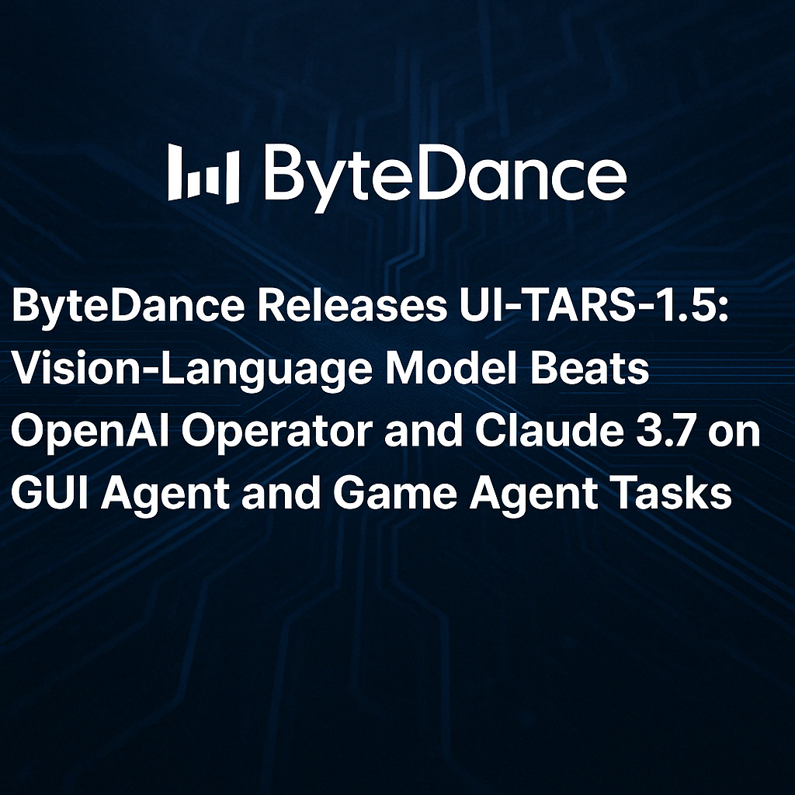

# ByteDance Releases UI-TARS-1.5: An Open-Source Multimodal AI Agent Built upon a Powerful Vision-Language Model

> ByteDance has released UI-TARS-1.5, an updated version of its multimodal agent framework focused on graphical user interface (GUI) interaction and game environments. Designed as a vision-language model capable of perceiving screen content and performing interactive tasks, UI-TARS-1.5 delivers consistent improvements across a range of GUI automation and game reasoning benchmarks. Notably, it surpasses several leading […]

ByteDance has released UI-TARS-1.5, an updated version of its multimodal agent framework focused on graphical user interface (GUI) interaction and game environments. Designed as a vision-language model capable of perceiving screen content and performing interactive tasks, UI-TARS-1.5 delivers consistent improvements across a range of GUI automation and game reasoning benchmarks. Notably, it surpasses several leading models—including OpenAI’s Operator and Anthropic’s Claude 3.7—in both accuracy and task completion across multiple environments.

The release continues ByteDance’s research direction of building native agent models, aiming to unify perception, cognition, and action through an integrated architecture that supports direct engagement with GUI and visual content.

### A Native Agent Approach to GUI Interaction

Unlike tool-augmented LLMs or function-calling architectures, UI-TARS-1.5 is trained end-to-end to perceive visual input (screenshots) and generate native human-like control actions, such as mouse movement and keyboard input. This positions the model closer to how human users interact with digital systems.

UI-TARS-1.5 builds on its predecessor by introducing several architectural and training enhancements:

- **Perception and Reasoning Integration**: The model jointly encodes screen images and textual instructions, supporting complex task understanding and visual grounding. Reasoning is supported via a multi-step “think-then-act” mechanism, which separates high-level planning from low-level execution.

- **Unified Action Space**: The action representation is designed to be platform-agnostic, enabling a consistent interface across desktop, mobile, and game environments.

- **Self-Evolution via Replay Traces**: The training pipeline incorporates reflective online trace data. This allows the model to iteratively refine its behavior by analyzing previous interactions—reducing reliance on curated demonstrations.

These improvements collectively enable UI-TARS-1.5 to support long-horizon interaction, error recovery, and compositional task planning—important capabilities for realistic UI navigation and control.

### Benchmarking and Evaluation

The model has been evaluated on several benchmark suites that assess agent behavior in both GUI and game-based tasks. These benchmarks offer a standard way to assess model performance across reasoning, grounding, and long-horizon execution.

*https://seed-tars.com/1.5/*

#### GUI Agent Tasks

- **OSWorld (100 steps)**: UI-TARS-1.5 achieves a success rate of 42.5%, outperforming OpenAI Operator (36.4%) and Claude 3.7 (28%). The benchmark evaluates long-context GUI tasks in a synthetic OS environment.

- **Windows Agent Arena (50 steps)**: Scoring 42.1%, the model significantly improves over prior baselines (e.g., 29.8%), demonstrating robust handling of desktop environments.

- **Android World**: The model reaches a 64.2% success rate, suggesting generalizability to mobile operating systems.

#### Visual Grounding and Screen Understanding

- **ScreenSpot-V2**: The model achieves 94.2% accuracy in locating GUI elements, outperforming Operator (87.9%) and Claude 3.7 (87.6%).

- **ScreenSpotPro**: In a more complex grounding benchmark, UI-TARS-1.5 scores 61.6%, considerably ahead of Operator (23.4%) and Claude 3.7 (27.7%).

These results show consistent improvements in screen understanding and action grounding, which are critical for real-world GUI agents.

#### Game Environments

- **Poki Games**: UI-TARS-1.5 achieves a 100% task completion rate across 14 mini-games. These games vary in mechanics and context, requiring models to generalize across interactive dynamics.

- **Minecraft (MineRL)**: The model achieves 42% success on mining tasks and 31% on mob-killing tasks when using the “think-then-act” module, suggesting it can support high-level planning in open-ended environments.

### Accessibility and Tooling

UI-TARS-1.5 is open-sourced under the Apache 2.0 license and is available through several deployment options:

- **GitHub Repository**: [github.com/bytedance/UI-TARS](https://github.com/bytedance/UI-TARS)

- **Pretrained Model**: Available via Hugging Face at [ByteDance-Seed/UI-TARS-1.5-7B](https://huggingface.co/ByteDance-Seed/UI-TARS-1.5-7B)

- **UI-TARS Desktop**: A downloadable agent tool enabling natural language control over desktop environments ([link](https://github.com/bytedance/UI-TARS-desktop))

In addition to the model, the project offers detailed documentation, replay data, and evaluation tools to facilitate experimentation and reproducibility.

### Conclusion

UI-TARS-1.5 is a technically sound progression in the field of multimodal AI agents, particularly those focused on GUI control and grounded visual reasoning. Through a combination of vision-language integration, memory mechanisms, and structured action planning, the model demonstrates strong performance across a diverse set of interactive environments.

Rather than pursuing universal generality, the model is tuned for task-oriented multimodal reasoning—targeting the real-world challenge of interacting with software through visual understanding. Its open-source release provides a practical framework for researchers and developers interested in exploring native agent interfaces or automating interactive systems through language and vision.

---

Also, don’t forget to follow us on **[Twitter](https://x.com/intent/follow?screen_name=marktechpost)** and join our **[Telegram Channel](https://arxiv.org/abs/2406.09406)** and [**LinkedIn Gr**](https://www.linkedin.com/groups/13668564/)[**oup**](https://www.linkedin.com/groups/13668564/). Don’t Forget to join our **[90k+ ML SubReddit](https://www.reddit.com/r/machinelearningnews/)**.

[**🔥 [Register Now] miniCON Virtual Conference on AGENTIC AI: FREE REGISTRATION + Certificate of Attendance + 4 Hour Short Event (May 21, 9 am- 1 pm PST) + Hands on Workshop**](https://minicon.marktechpost.com/)
