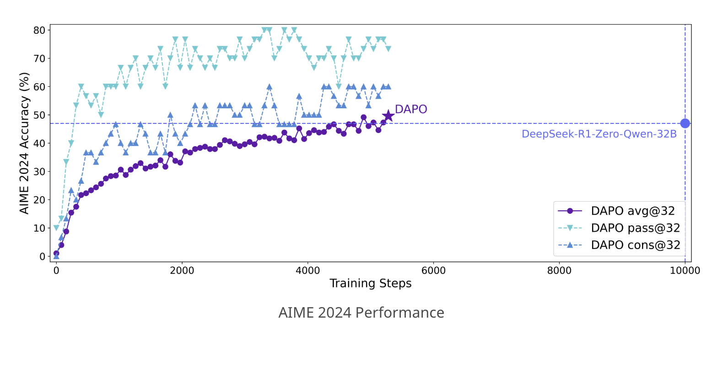

# ByteDance Research Releases DAPO: A Fully Open-Sourced LLM Reinforcement Learning System at Scale

> Reinforcement learning (RL) has become central to advancing Large Language Models (LLMs), empowering them with improved reasoning capabilities necessary for complex tasks. However, the research community faces considerable challenges in reproducing state-of-the-art RL techniques due to incomplete disclosure of key training details by major industry players. This opacity has limited the progress of broader scientific […]

Reinforcement learning (RL) has become central to advancing Large Language Models (LLMs), empowering them with improved reasoning capabilities necessary for complex tasks. However, the research community faces considerable challenges in reproducing state-of-the-art RL techniques due to incomplete disclosure of key training details by major industry players. This opacity has limited the progress of broader scientific efforts and collaborative research.

Researchers from ByteDance, Tsinghua University, and the University of Hong Kong recently introduced DAPO (Dynamic Sampling Policy Optimization), an open-source large-scale reinforcement learning system designed for enhancing the reasoning abilities of Large Language Models. The DAPO system seeks to bridge the gap in reproducibility by openly sharing all algorithmic details, training procedures, and datasets. Built upon the verl framework, DAPO includes training codes and a thoroughly prepared dataset called DAPO-Math-17K, specifically designed for mathematical reasoning tasks.

DAPO’s technical foundation includes four core innovations aimed at resolving key challenges in reinforcement learning. The first, “Clip-Higher,” addresses the issue of entropy collapse, a situation where models prematurely settle into limited exploration patterns. By carefully managing the clipping ratio in policy updates, this technique encourages greater diversity in model outputs. “Dynamic Sampling” counters inefficiencies in training by dynamically filtering samples based on their usefulness, thus ensuring a more consistent gradient signal. The “Token-level Policy Gradient Loss” offers a refined loss calculation method, emphasizing token-level rather than sample-level adjustments to better accommodate varying lengths of reasoning sequences. Lastly, “Overlong Reward Shaping” introduces a controlled penalty for excessively long responses, gently guiding models toward concise and efficient reasoning.

In practical experimentation, DAPO has demonstrated significant improvements. Evaluations on the American Invitational Mathematics Examination (AIME) 2024 benchmark show that DAPO-trained models achieved a score of 50 points using the Qwen2.5-32B base model, improving on previous methods such as DeepSeek-R1-Zero-Qwen-32B, which achieved 47 points. Notably, DAPO attained this improvement with approximately half the training steps, underscoring the efficiency of the proposed methods. A systematic analysis revealed incremental enhancements from each introduced technique, moving from a baseline of 30 points (using GRPO alone) up to 50 points with the full DAPO methodology.

Beyond quantitative results, DAPO’s training dynamics provided insights into the model’s evolving reasoning patterns. Initially, the models showed little reflective behavior, often proceeding linearly through tasks without reconsideration of previous steps. However, with ongoing training, the models progressively exhibited more reflective behaviors, demonstrating a form of iterative self-review. This shift highlights the capability of reinforcement learning not only to enhance existing reasoning pathways but also to cultivate entirely new cognitive strategies over time.

In conclusion, the open-sourcing of DAPO represents a meaningful contribution to the reinforcement learning community, removing barriers previously created by inaccessible methodologies. By clearly documenting and providing comprehensive access to the system’s techniques, dataset, and code, this collaborative initiative invites further research and innovation. The combined efforts of ByteDance, Tsinghua University, and the University of Hong Kong showcase the potential of transparent and cooperative research to advance the collective understanding and practical capabilities of large-scale reinforcement learning systems.

---

Check out **_the [Paper](https://dapo-sia.github.io/static/pdf/dapo_paper.pdf) and [Project Page](https://dapo-sia.github.io/)._** All credit for this research goes to the researchers of this project. Also, feel free to follow us on **[Twitter](https://x.com/intent/follow?screen_name=marktechpost)** and don’t forget to join our **[80k+ ML SubReddit](https://www.reddit.com/r/machinelearningnews/)**.
