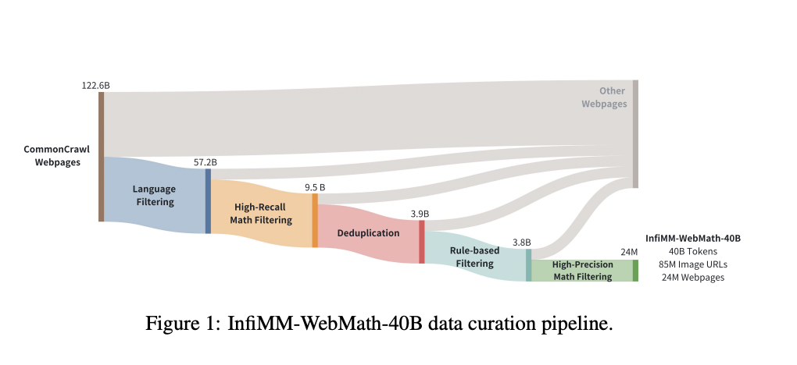

# ByteDance Researchers Release InfiMM-WebMath-40B: An Open Multimodal Dataset Designed for Complex Mathematical Reasoning

> Artificial intelligence has significantly enhanced complex reasoning tasks, particularly in specialized domains such as mathematics. Large Language Models (LLMs) have gained attention for their ability to process large datasets and solve intricate problems. The mathematical reasoning capabilities of these models have vastly improved over the years. This progress has been driven by advancements in training […]

Artificial intelligence has significantly enhanced complex reasoning tasks, particularly in specialized domains such as mathematics. Large Language Models (LLMs) have gained attention for their ability to process large datasets and solve intricate problems. The mathematical reasoning capabilities of these models have vastly improved over the years. This progress has been driven by advancements in training techniques, such as Chain-of-Thought (CoT) prompting, and diverse datasets, allowing these models to solve various mathematical problems, from simple arithmetic to complex high-school competition-level tasks. The growing sophistication of LLMs has made them indispensable tools in fields where advanced reasoning is required. Still, the quality and scale of available pre-training datasets have limited their full potential, especially for open-source projects.

A key issue that hinders the development of mathematical reasoning in LLMs is the lack of comprehensive multimodal datasets that integrate text and visual data, such as diagrams, equations, and geometric figures. Most mathematical knowledge is expressed through textual explanations and visual elements. While proprietary models like GPT-4 and Claude 3.5 Sonnet have leveraged extensive private datasets for pre-training, the open-source community has struggled to keep up due to the scarcity of high-quality, publicly available datasets. Without these resources, it is difficult for open-source models to advance in handling the complex reasoning tasks that proprietary models tackle. This gap in multimodal datasets has made it challenging for researchers to train models that can handle text-based and visual reasoning tasks.

Several approaches have been used to train LLMs for mathematical reasoning, but most focus on text-only datasets. For instance, proprietary datasets like WebMath and MathMix have provided billions of text tokens for training models like GPT-4, but they do not address the visual elements of mathematics. Open-source datasets like OpenWebMath and DeepSeekMath have also been introduced, but they are primarily focused on mathematical text rather than integrating visual and textual data. While these datasets have advanced LLMs in specific areas of math, such as arithmetic and algebra, they fall short when it comes to complex, multimodal reasoning tasks that require integrating visual elements with text. This limitation has led to developing models that perform well on text-based tasks but struggle with multimodal problems that combine written explanations with diagrams or equations.

Researchers from ByteDance and the Chinese Academy of Sciences introduced [**InfiMM-WebMath-40B**](https://huggingface.co/datasets/Infi-MM/InfiMM-WebMath-40B), a comprehensive dataset that offers a large-scale multimodal resource specifically designed for mathematical reasoning. This dataset includes 24 million web pages, 85 million associated image URLs, and approximately 40 billion text tokens extracted and filtered from the CommonCrawl repository. The research team meticulously filtered the data to ensure the inclusion of high-quality, relevant content, making it the first of its kind in the open-source community. By combining textual and visual mathematical data, InfiMM-WebMath-40B offers an unprecedented resource for training Multimodal Large Language Models (MLLMs), enabling them to process and reason with more complex mathematical concepts than ever.

The dataset was constructed using a rigorous data processing pipeline. Researchers began with 122 billion web pages, filtered to 24 million web documents, ensuring the content focused on mathematics and science. FastText, a language identification tool, filtered out non-English and non-Chinese content. The dataset’s multimodal nature required special attention to image extraction and the alignment of images with their corresponding text. In total, 85 million image URLs were extracted, filtered, and paired with relevant mathematical content, creating a dataset that integrates visual and textual elements to enhance the mathematical reasoning capabilities of LLMs.

The performance of models trained on InfiMM-WebMath-40B has significantly improved compared to previous open-source datasets. In evaluations conducted on benchmarks such as MathVerse and We-Math, models trained using this dataset outperformed others in their ability to process both text and visual information. For instance, despite utilizing only 40 billion tokens, the researchers’ model, InfiMM-Math, performed comparably to proprietary models that used 120 billion tokens. On the MathVerse benchmark, InfiMM-Math demonstrated superior performance in text-dominant, text-lite, and vision-intensive categories, outperforming many open-source models with much larger datasets. Similarly, on the We-Math benchmark, the model achieved remarkable results, demonstrating its capability to handle multimodal tasks and setting a new standard for open-source LLMs.

In conclusion, InfiMM-WebMath-40B, offering a large-scale, multimodal dataset, must address more data for training open-source models to handle complex reasoning tasks involving text and visual data. The dataset’s meticulous construction and combination of 40 billion text tokens with 85 million image URLs provide a robust foundation for the next generation of Multimodal Large Language Models. The performance of models trained on InfiMM-WebMath-40B highlights the importance of integrating visual elements with textual data to improve mathematical reasoning capabilities. This dataset bridges the gap between proprietary and open-source models and paves the way for future research to enhance AI’s ability to solve complex mathematical problems.

---

Check out the **[Paper](https://arxiv.org/abs/2409.12568)** and **[Dataset](https://huggingface.co/datasets/Infi-MM/InfiMM-WebMath-40B)**. All credit for this research goes to the researchers of this project. Also, don’t forget to follow us on **[Twitter](https://twitter.com/Marktechpost)** and join our **[Telegram Channel](https://pxl.to/at72b5j)** and [**LinkedIn Gr**](https://www.linkedin.com/groups/13668564/)[**oup**](https://www.linkedin.com/groups/13668564/). **If you like our work, you will love our**[** newsletter..**](https://marktechpost-newsletter.beehiiv.com/subscribe)

Don’t Forget to join our **[50k+ ML SubReddit](https://www.reddit.com/r/machinelearningnews/)**

**[⏩ ⏩ FREE AI WEBINAR: ‘SAM 2 for Video: How to Fine-tune On Your Data’ (Wed, Sep 25, 4:00 AM – 4:45 AM EST)](https://encord.com/webinar/sam2-for-video/?utm_medium=affiliate&utm_source=newsletter&utm_campaign=marktechpost&utm_content=sam2video)**
