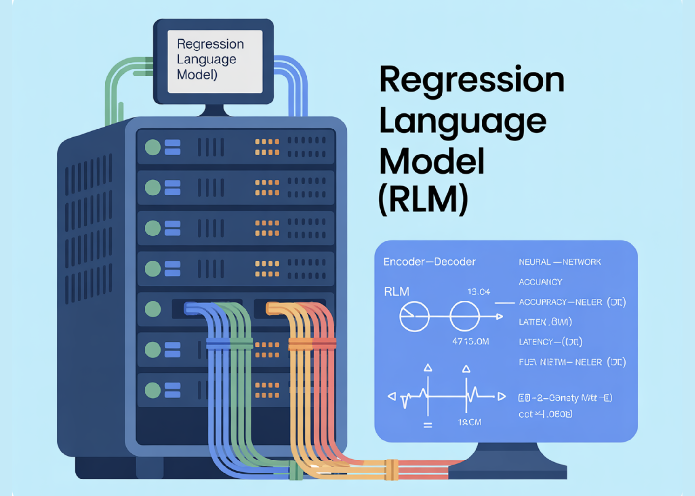

# Can a Small Language Model Predict Kernel Latency, Memory, and Model Accuracy from Code? A New Regression Language Model (RLM) Says Yes

> Researchers from Cornell and Google introduce a unified Regression Language Model (RLM) that predicts numeric outcomes directly from code strings—covering GPU kernel latency, program memory usage, and even neural network accuracy and latency—without hand-engineered features. A 300M-parameter encoder–decoder initialized from T5-Gemma achieves strong rank correlations across heterogeneous tasks and languages, using a single text-to-number decoder […]

**Researchers from Cornell and Google introduce a unified Regression Language Model (RLM) that predicts numeric outcomes directly from code strings—covering GPU kernel latency, program memory usage, and even neural network accuracy and latency—without hand-engineered features.** A 300M-parameter encoder–decoder initialized from T5-Gemma achieves strong rank correlations across heterogeneous tasks and languages, using a single text-to-number decoder that emits digits with constrained decoding.

### What exactly is new?

- **Unified code-to-metric regression**: One RLM predicts (i) peak memory from high-level code (Python/C/C++ and more), (ii) latency for Triton GPU kernels, and (iii) accuracy and hardware-specific latency from ONNX graphs—by reading raw text representations and decoding numeric outputs. No feature engineering, graph encoders, or zero-cost proxies are required.

- **Concrete results**: Reported correlations include **Spearman ρ ≈ 0.93** on APPS LeetCode memory, **ρ ≈ 0.52** for Triton kernel latency, **ρ > 0.5** average across **17 CodeNet languages**, and **Kendall τ ≈ 0.46** across five classic NAS spaces—competitive with and in some cases surpassing graph-based predictors.

- **Multi-objective decoding**: Because the decoder is autoregressive, the model conditions later metrics on earlier ones (e.g., accuracy → per-device latencies), capturing realistic trade-offs along Pareto fronts.

*https://arxiv.org/abs/2509.26476*

### Why is this important?

Performance prediction pipelines in compilers, GPU kernel selection, and NAS typically rely on bespoke features, syntax trees, or GNN encoders that are brittle to new ops/languages. Treating regression as **next-token prediction over numbers** standardizes the stack: tokenize inputs as plain text (source code, Triton IR, ONNX), then decode calibrated numeric strings digit-by-digit with constrained sampling. This reduces maintenance cost and improves transfer to new tasks via fine-tuning.

### Data and benchmarks

- **Code-Regression dataset (HF)**: Curated to support **code-to-metric** tasks spanning APPS/LeetCode runs, Triton kernel latencies (KernelBook-derived), and CodeNet memory footprints.

- **NAS/ONNX suite**: Architectures from NASBench-101/201, FBNet, Once-for-All (MB/PN/RN), Twopath, Hiaml, Inception, and NDS are exported to **ONNX text** to predict accuracy and device-specific latency.

### How does it work?

- **Backbone**: Encoder–decoder with a **T5-Gemma** encoder initialization (~300M params). Inputs are raw strings (code or ONNX). Outputs are numbers emitted as **sign/exponent/mantissa digit tokens**; constrained decoding enforces valid numerals and supports uncertainty via sampling.

- **Ablations**: (i) Language pretraining accelerates convergence and improves Triton latency prediction; (ii) **decoder-only numeric emission** outperforms MSE regression heads even with y-normalization; (iii) learned tokenizers specialized for ONNX operators increase effective context; (iv) longer contexts help; (v) scaling to a larger Gemma encoder further improves correlation with adequate tuning.

- **Training code.** The **regress-lm** library provides text-to-text regression utilities, constrained decoding, and multi-task pretraining/fine-tuning recipes.

### Stats that matters

- **APPS (Python) memory:** Spearman **ρ > 0.9**.

- **CodeNet (17 languages) memory:** average **ρ > 0.5**; strongest languages include C/C++ (~0.74–0.75).

- **Triton kernels (A6000) latency:** **ρ ≈ 0.52**.

- **NAS ranking:** average **Kendall τ ≈ 0.46** across NASNet, Amoeba, PNAS, ENAS, DARTS; competitive with FLAN and GNN baselines.

### Key Takeaways

- Unified code-to-metric regression works. A single ~300M-parameter T5Gemma-initialized model (“RLM”) predicts: (a) memory from high-level code, (b) Triton GPU kernel latency, and (c) model accuracy + device latency from ONNX—directly from text, no hand-engineered features.

- The research shows Spearman ρ > 0.9 on APPS memory, ≈0.52 on Triton latency, >0.5 average across 17 CodeNet languages, and Kendall-τ ≈ 0.46 on five NAS spaces.

- Numbers are decoded as text with constraints. Instead of a regression head, RLM emits numeric tokens with constrained decoding, enabling multi-metric, autoregressive outputs (e.g., accuracy followed by multi-device latencies) and uncertainty via sampling.

- The **Code-Regression** dataset unifies APPS/LeetCode memory, Triton kernel latency, and CodeNet memory; the **regress-lm** library provides the training/decoding stack.

### Our Comments

It is very interesting how this work reframes performance prediction as text-to-number generation: a compact T5Gemma-initialized RLM reads source (Python/C++), Triton kernels, or ONNX graphs and emits calibrated numerics via constrained decoding. The reported correlations—APPS memory (ρ>0.9), Triton latency on RTX A6000 (~0.52), and NAS Kendall-τ ≈0.46—are strong enough to matter for compiler heuristics, kernel pruning, and multi-objective NAS triage without bespoke features or GNNs. The open dataset and library make replication straightforward and lower the barrier to fine-tuning on new hardware or languages.

---

Check out the[ **Paper**](https://arxiv.org/abs/2509.26476)**, [GitHub Page](https://github.com/google-deepmind/regress-lm) **and** [Dataset Card](https://huggingface.co/datasets/akhauriyash/Code-Regression)**. Feel free to check out our **[GitHub Page for Tutorials, Codes and Notebooks](https://github.com/Marktechpost/AI-Tutorial-Codes-Included)**. Also, feel free to follow us on **[Twitter](https://x.com/intent/follow?screen_name=marktechpost)** and don’t forget to join our **[100k+ ML SubReddit](https://www.reddit.com/r/machinelearningnews/)** and Subscribe to **[our Newsletter](https://www.aidevsignals.com/)**. Wait! are you on telegram? **[now you can join us on telegram as well.](https://t.me/machinelearningresearchnews)**
