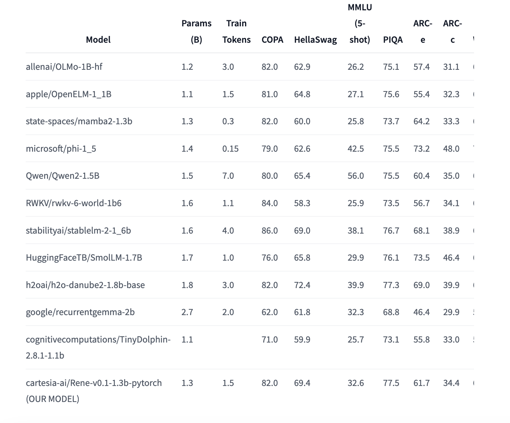

# Cartesia AI Released Rene: A Groundbreaking 1.3B Parameter Open-Source Small Language Model Transforming Natural Language Processing Applications

> Cartesia AI has made a notable contribution with the release of Rene, a 1.3 billion-parameter language model. This open-source model, built upon a hybrid architecture combining Mamba-2’s feedforward and sliding window attention layers, is a milestone development in natural language processing (NLP). By leveraging a massive dataset and cutting-edge architecture, Rene stands poised to contribute […]

Cartesia AI has made a notable contribution with the release of** **[**Rene**](https://huggingface.co/cartesia-ai/Rene-v0.1-1.3b-pytorch), a 1.3 billion-parameter language model. This open-source model, built upon a hybrid architecture combining Mamba-2’s feedforward and sliding window attention layers, is a milestone development in natural language processing (NLP). By leveraging a massive dataset and cutting-edge architecture, Rene stands poised to contribute to various applications, from text generation to complex language understanding tasks.

**The Architecture and Training of Rene**

Rene’s architecture is one of its most distinguishing features. The model is built upon the Mamba-2 framework, which integrates feedforward and sliding window attention layers. This hybrid approach allows the model to effectively manage long-range dependencies and context, which are crucial for understanding and generating coherent text. The sliding window attention mechanism, in particular, helps Rene maintain focus on relevant sections of text while processing large amounts of data, making it more efficient in tasks that require contextual understanding.

*[**Image Source**](https://cartesia.ai/blog/2024-08-27-on-device)*

Training a model of this scale requires an extensive dataset, and Cartesia AI has utilized the Dolma-1.7 dataset, comprising 1.5 trillion tokens, to pretrain Rene. This vast amount of data ensures the model is well-equipped to handle various language tasks. Using the allenai/OLMo-1B-hf tokenizer further enhances Rene’s capabilities, efficiently processing and generating text in multiple languages and dialects.

**Performance and Benchmarking**

Rene has been evaluated against several common NLP benchmarks. These benchmarks, including COPA (Choice of Plausible Alternatives) and HellaSwag, are standard metrics for assessing a model’s reasoning and common sense capabilities. Rene’s performance, as detailed in Cartesia AI’s documentation, shows competitive results across these benchmarks, positioning it as a strong contender among other large-scale language models.

*[**Image Source**](https://cartesia.ai/blog/2024-08-27-on-device)*

However, it is important to note that Rene is a base model that has not undergone any alignment or instruction tuning. As a result, while it demonstrates impressive capabilities, it does not come with built-in moderation or safety mechanisms. Cartesia AI advises users to implement appropriate guardrails and moderation mechanisms tailored to their specific needs to ensure responsible and ethical use of the model. This transparency about the model’s limitations is crucial, especially in an era where the ethical deployment of AI systems is under increasing scrutiny.

**Applications and Usage**

Rene is versatile in its applications, ranging from simple text generation to complex tasks like language comprehension and reasoning. The model is particularly well-suited for use in environments that require large-scale language understanding, such as content creation, automated customer support, and data analysis.

The model is available in PyTorch, making it accessible to many developers and researchers who rely on this popular deep-learning framework. For those working on Mac computers, Cartesia AI has also provided a native MLX version, ensuring that Rene can be used across different platforms without compatibility issues.

**Looking Ahead: The Future of Rene and Cartesia AI**

The release of Rene marks a significant milestone for Cartesia AI as they continue to develop real-time multimodal intelligence solutions for various devices. As an open-source project, Rene offers the broader AI community an opportunity to explore and expand upon its capabilities. Researchers and developers are encouraged to build on Rene, contribute to its development, and explore new applications that leverage its unique architecture and extensive training.

In conclusion, Rene with its hybrid architecture, extensive training, and open-source accessibility, Rene is set to play a pivotal role in the future of AI-driven language understanding. While users must remain vigilant about its limitations and the need for responsible use, Rene’s potential applications are vast and varied, offering exciting possibilities for the future of AI technology.

---

Check out the **[Model Card](https://huggingface.co/cartesia-ai/Rene-v0.1-1.3b-pytorch).** All credit for this research goes to the researchers of this project. Also, don’t forget to follow us on **[Twitter](https://twitter.com/Marktechpost)** and join our **[Telegram Channel](https://www.zyphra.com/post/zamba2-mini)** and [**LinkedIn Gr**](https://www.linkedin.com/groups/13668564/)[**oup**](https://www.linkedin.com/groups/13668564/). **If you like our work, you will love our**[** newsletter..**](https://marktechpost-newsletter.beehiiv.com/subscribe)

Don’t Forget to join our **[50k+ ML SubReddit](https://www.reddit.com/r/machinelearningnews/)**

Here is a highly recommended webinar from our sponsor: **[‘Building Performant AI Applications with NVIDIA NIMs and Haystack’](https://landing.deepset.ai/webinar-nvidia-nims-and-haystack?utm_campaign=2409-campaign-nvidia-nims-and-haystack-&utm_source=marktechpost&utm_medium=banner-ad-desktop)**
