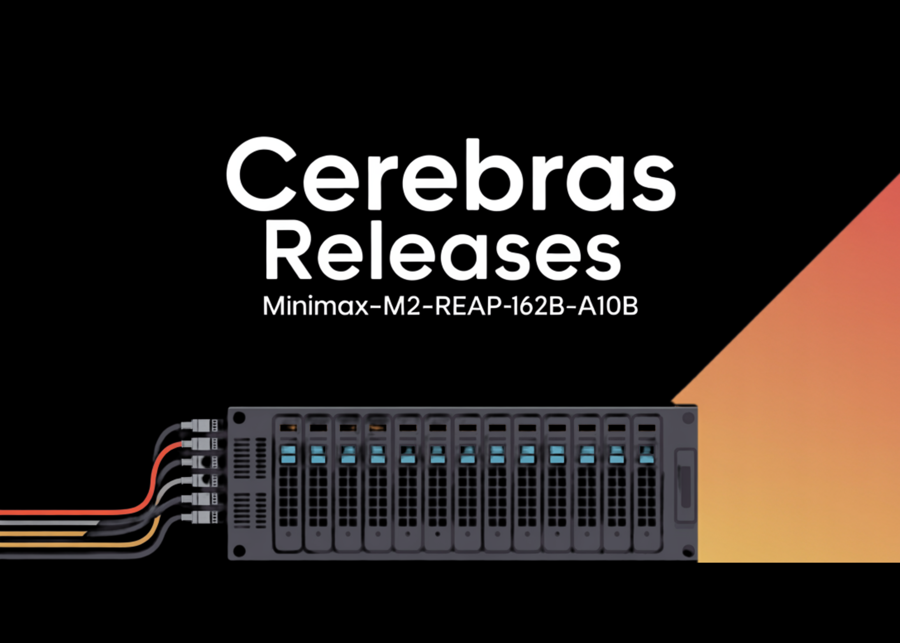

# Cerebras Releases MiniMax-M2-REAP-162B-A10B: A Memory Efficient Version of MiniMax-M2 for Long Context Coding Agents

> Cerebras has released MiniMax-M2-REAP-162B-A10B, a compressed Sparse Mixture-of-Experts (SMoE) Causal Language Model derived from MiniMax-M2, using the new Router weighted Expert Activation Pruning (REAP) method. The model keeps the behavior of the original 230B total, 10B active MiniMax M2, while pruning experts and reducing memory for deployment focused workloads such as coding agents and tool […]

Cerebras has released **[MiniMax-M2-REAP-162B-A10B](https://huggingface.co/cerebras/MiniMax-M2-REAP-162B-A10B)**, a compressed **Sparse Mixture-of-Experts (SMoE) Causal Language Model** derived from **MiniMax-M2**, using the new **Router weighted Expert Activation Pruning (REAP)** method. The model keeps the behavior of the original **230B total, 10B active** MiniMax M2, while pruning experts and reducing memory for deployment focused workloads such as coding agents and tool calling.

### Architecture and core specifications

**MiniMax-M2-REAP-162B-A10B has these key properties:**

- **Base model**: MiniMax-M2

- **Compression method**: REAP, Router weighted Expert Activation Pruning

- **Total parameters**: 162B

- **Active parameters per token**: 10B

- **Layers**: 62 transformer blocks

- **Attention heads per layer**: 48

- **Experts**: 180 experts, obtained by pruning a 256 expert configuration

- **Activated experts per token**: 8

- **Context length**: 196,608 tokens

- **License**: modified MIT, derived from MiniMaxAI MiniMax M2

The SMoE design means that the model stores 162B parameters, but each token only routes through a small set of experts, so the **effective compute cost per token is similar to a 10B dense model**. MiniMax M2 itself is positioned as an MoE model built for coding and agentic workflows, with 230B total parameters and 10B active, which this checkpoint inherits.

### How REAP compresses MiniMax-M2?

MiniMax-M2-REAP-162B-A10B is created by applying **REAP** uniformly across all MoE blocks of MiniMax M2, at a **30 percent expert pruning rate**.

The **[REAP](https://arxiv.org/abs/2510.13999v1)** method defines a saliency score for each expert that combines:

- **Router gate values**: How often and how strongly the router selects that expert

- **Expert activation norms**: The magnitude of the expert output when active

Experts that contribute minimally to the layer output, under this combined criterion, are removed. The remaining experts keep their original weights and the router keeps separate gates for each of them. This is one shot compression, there is no extra fine tuning after pruning in the method definition.

A core theoretical result in the [REAP’s research paper](https://arxiv.org/abs/2510.13999v1) is that **expert merging** with summed gates causes **functional subspace collapse**. When experts are merged, the router loses its independent, input dependent control over those experts, so a single merged expert must approximate an input dependent mixture that was originally expressed through multiple experts. The research team proves that, whenever the router policy depends on the input and the experts are not identical, this introduces irreducible error. In contrast, pruning removes some experts but preserves independent control of the survivors, so the error scales with the gate weight of the removed experts.

Across a set of SMoE models in the **20B to 1T parameter range**, REAP consistently outperforms expert merging and other pruning criteria on **generative benchmarks** such as code generation, mathematical reasoning and tool calling, especially at **50 percent compression**.

### Accuracy under 30 percent expert pruning

**The MiniMax-M2-REAP-162B-A10B model gets compared on three checkpoints on standard coding, reasoning and agentic benchmarks: **

- **MiniMax-M2 (230B, base model)**

- **MiniMax-M2-REAP-172B-A10B, 25 percent pruning**

- **MiniMax-M2-REAP-162B-A10B, 30 percent pruning**

*https://huggingface.co/cerebras/MiniMax-M2-REAP-162B-A10B*

On **coding benchmarks** such as HumanEval, HumanEval Plus, MBPP and MBPP Plus, the 162B REAP model stays very close to the base model. HumanEval sits around **90% range**, and MBPP stays in the **80**% range, with the 172B and 162B models essentially tracking the original MiniMax-M2 within a few points.

On **reasoning benchmarks** such as AIME 25 and MATH 500, there are small shifts between the three models, but there is no collapse at 30 percent pruning and the 162B checkpoint remains competitive with the base model.

On tool calling and agentic evaluation, represented by τ2 bench in a telecom setting, the 162B REAP model again matches the base model within small variance. The model card explicitly states that this checkpoint keeps almost identical performance while being about 30 percent lighter in parameter count.

These results line up with the broader [REAP study](https://arxiv.org/abs/2510.13999v1), which reports **near lossless compression** for code generation and tool calling on several large SMoE architectures when pruning experts using the REAP criterion.

### Deployment, memory usage and observed throughput

Cerebras provides a direct **vLLM** serve example and positions MiniMax-M2-REAP-162B-A10B as a **drop in model** for the existing MiniMax M2 integration.

Copy CodeCopiedUse a different Browser
```
vllm serve cerebras/MiniMax-M2-REAP-162B-A10B \
    --tensor-parallel-size 8 \
    --tool-call-parser minimax_m2 \
    --reasoning-parser minimax_m2_append_think \
    --trust-remote-code \
    --enable_expert_parallel \
    --enable-auto-tool-choice
```

If the run hits memory limits, the card recommends lowering `--max-num-seqs`, for example to `64`, to keep batch size in check on a given GPU.

### Key Takeaways

- **SMoE architecture with efficient compute**: MiniMax-M2-REAP-162B-A10B is a Sparse Mixture of Experts model with 162B total parameters and 10B active parameters per token, so the compute cost per token is close to a 10B dense model while keeping frontier scale capacity.

- **REAP expert pruning keeps behavior of MiniMax-M2**: The model is produced by applying REAP Router weighted Expert Activation Pruning to MiniMax-M2 at roughly 30 percent expert pruning, pruning experts based on router gate values and expert activation norms while leaving surviving experts and router structure intact.

- **Near lossless accuracy at 30 percent compression**: On coding benchmarks such as HumanEval and MBPP, and on reasoning benchmarks such as AIME25 and MATH 500, the 162B REAP variant tracks the 230B MiniMax-M2 and a 172B REAP variant within a few points, showing near lossless compression for code, reasoning and tool use.

- **Pruning outperforms expert merging for generative SMoE**: The REAP study shows that pruning experts using a saliency criterion avoids the functional subspace collapse seen with expert merging in generative tasks, and performs better across large SMoE models in the 22B to about 1T parameter range.

### Comparison Table

*Image source: Marktechpost.com*

### Editorial Comments

Cerebras’ release of **MiniMax-M2-REAP-162B-A10B** is a strong signal that **Router weighted Expert Activation Pruning** is ready for real workloads, not just as a research curiosity. The checkpoint shows that a **30 percent expert pruning** schedule can keep **MiniMax-M2 230B-A10B** behavior almost intact while cutting memory and preserving long context coding, reasoning and tool calling performance, which is exactly what SMoE researchers need for practical deployment. Overall, Cerebras is quietly turning expert pruning into production infrastructure for frontier class SMoE models.

---

Check out the **[Model Weights](https://huggingface.co/cerebras/MiniMax-M2-REAP-162B-A10B)**. Feel free to check out our **[GitHub Page for Tutorials, Codes and Notebooks](https://github.com/Marktechpost/AI-Tutorial-Codes-Included)**. Also, feel free to follow us on **[Twitter](https://x.com/intent/follow?screen_name=marktechpost)** and don’t forget to join our **[100k+ ML SubReddit](https://www.reddit.com/r/machinelearningnews/)** and Subscribe to **[our Newsletter](https://www.aidevsignals.com/)**. Wait! are you on telegram? **[now you can join us on telegram as well.](https://t.me/machinelearningresearchnews)**
