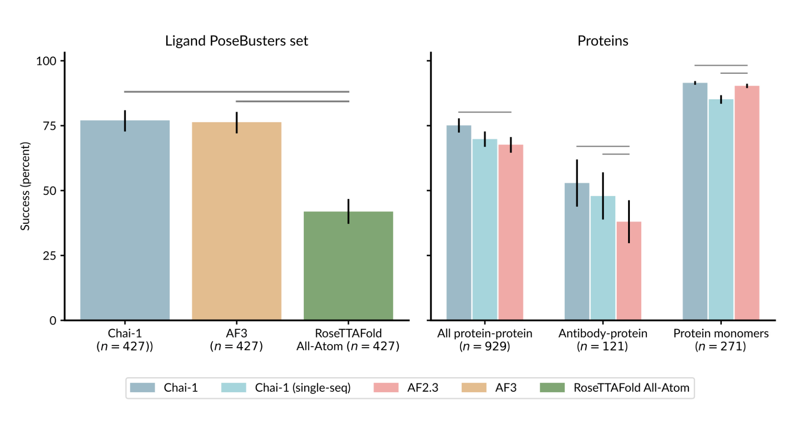

# Chai-1 Released by Chai Discovery Team: A Groundbreaking Multi-Modal Foundation Model Set to Transform Drug Discovery and Biological Engineering with Revolutionary Molecular Structure Prediction

> The Chai Discovery team announced the launch of Chai-1, a groundbreaking multi-modal foundation model designed to predict molecular structures with unprecedented accuracy. This release marks a major advancement in molecular biology and drug discovery, with the model boasting state-of-the-art capabilities across a diverse range of tasks. As a freely available tool, Chai-1 opens new avenues […]

The Chai Discovery team announced the launch of [**Chai-1**](https://www.chaidiscovery.com/blog/introducing-chai-1), a groundbreaking multi-modal foundation model designed to predict molecular structures with unprecedented accuracy. This release marks a major advancement in molecular biology and drug discovery, with the model boasting state-of-the-art capabilities across a diverse range of tasks. As a freely available tool, Chai-1 opens new avenues for research and commercial applications, particularly in drug discovery.

**A New Era in Molecular Structure Prediction**

The core achievement of Chai-1 is its ability to predict complex molecular interactions involving proteins, small molecules, DNA, RNA, and even covalent modifications. This comprehensive scope makes it one of the most versatile tools for molecular structure prediction today. Unlike previous models, which often required multiple sequence alignments (MSAs) for effective predictions, Chai-1 can operate in single-sequence mode without significant loss of accuracy. This breakthrough enables users to predict biomolecular structures more efficiently, particularly when working with multimers.

In benchmark tests, Chai-1 demonstrated a 77% success rate on the PoseBusters benchmark, outperforming AlphaFold3, which achieved a 76% success rate. Furthermore, Chai-1 achieved a Cα LDDT (Local Distance Difference Test) score of 0.849 on the CASP15 protein monomer structure prediction set, surpassing the performance of the ESM3-98B model, which scored 0.801. These results place Chai-1 at the cutting edge of molecular structure prediction, challenging the dominance of existing tools like AlphaFold.

*[**Image Source**](https://www.chaidiscovery.com/blog/introducing-chai-1)*

One of the model’s most impressive features is its ability to predict multimer structures without relying on MSAs. While AlphaFold-Multimer, an MSA-based model, achieved an acceptable DockQ prediction rate of 67.7%, Chai-1 outperformed it with a 69.8% success rate. This represents great optimism, as Chai-1 is the first model to predict multimer structures using single sequences at the same quality level as AlphaFold-Multimer.

**Multi-Modal Capabilities and Enhanced Accuracy**

Chai-1’s multi-modal nature is another key factor that differentiates it from its competitors. It can integrate new data, such as restraints from laboratory experiments, to enhance its predictive accuracy. This feature is useful for tasks like antibody engineering, where even small amounts of data, such as a few contact points or pocket residues, can dramatically improve the accuracy of antibody-antigen structure predictions. This makes Chai-1 a highly valuable tool for researchers looking to leverage AI in biological engineering.

The Chai Discovery team has provided comprehensive technical documentation that outlines the model’s capabilities and potential applications. For example, the report details how epitope conditioning, using just a handful of contacts or residues, can double the accuracy of antibody-antigen predictions. Such advancements make it possible to engineer antibodies with much greater precision, a critical need in drug discovery and development.

*[**Image Source**](https://www.chaidiscovery.com/blog/introducing-chai-1)*

**Accessibility for the Global Research Community**

One of the most exciting aspects of the Chai-1 release is its accessibility. The model is free through a web interface, making it accessible to a wide audience, including researchers, academic institutions, and pharmaceutical companies. Furthermore, Chai-1’s code and model weights are available as a software library for non-commercial use, allowing developers and researchers to incorporate them into their projects. By providing these resources freely, the Chai Discovery team fosters a collaborative approach to advancing molecular biology and drug discovery.

This open-access philosophy aligns with the team’s broader mission to transform biology from a science into an engineering discipline. The Chai Discovery team hopes to drive innovation and accelerate drug development by partnering with research institutions and the pharmaceutical industry. The team believes that by making advanced AI tools like Chai-1 widely available, the entire ecosystem will benefit from shared knowledge and resources.

**A Vision for the Future**

Chai-1 represents just the beginning of the Chai Discovery team’s ambitious plans. The team, composed of pioneers from leading AI and biotech organizations such as OpenAI, Meta FAIR, and Google X, has been at the forefront of AI-driven biology research. Many team members have previously held leadership roles in drug discovery companies, contributing to advancing over a dozen drug programs.

The release of Chai-1 marks a milestone in their journey to revolutionize the field of molecular biology. However, the team is already considering the next generation of AI foundation models. Their ultimate goal is to build models that can predict and reprogram the interactions between biochemical molecules, the fundamental building blocks of life. This vision could transform how scientists approach biological research and engineering, enabling the development of new treatments and therapies at an accelerated pace.

While the release of Chai-1 is a major achievement, the Chai Discovery team quickly acknowledges that this is just the beginning. Over the coming months, they plan to continue refining Chai-1 and developing new models that push the boundaries of what is possible in molecular structure prediction.

**Industry Support and Future Collaborations**

The development of Chai-1 was made possible through the support of numerous industry partners, including Dimension, Thrive Capital, OpenAI, Conviction, Neo, and Amplify Partners. Individual contributors such as Anna and Greg Brockman, Blake Byers, Fred Ehrsam, and others played a crucial role in the model’s development. The Chai Discovery team expressed their gratitude for this support, which has enabled them to bring Chai-1 to the global research community. The team remains committed to building partnerships with researchers, academic institutions, and industry leaders. These collaborations will be critical to the success of future projects as the team works to create AI models that can predict, manipulate, and reprogram molecular interactions in previously unimaginable ways.

**Conclusion**

The release of Chai-1 by the Chai Discovery team marks a milestone in molecular structure prediction. With its cutting-edge capabilities, multi-modal functionality, and accessibility to the global research community, Chai-1 has the potential to revolutionize drug discovery and biological engineering.

---

Check out the **[Paper ](https://chaiassets.com/chai-1/paper/technical_report_v1.pdf)and [Github](https://github.com/chaidiscovery/chai-lab?tab=readme-ov-file), and [try it here.](https://lab.chaidiscovery.com/auth/login?callbackUrl=https%3A%2F%2Flab.chaidiscovery.com%2Fdashboard)** All credit for this research goes to the researchers of this project. Also, don’t forget to follow us on **[Twitter](https://twitter.com/Marktechpost)** and [**LinkedIn**](https://www.linkedin.com/company/marktechpost/?viewAsMember=true). Join our **[Telegram Channel](https://www.zyphra.com/post/zamba2-mini)**.

**If you like our work, you will love our**[** newsletter..**](https://marktechpost-newsletter.beehiiv.com/subscribe)

Don’t Forget to join our **[50k+ ML SubReddit](https://www.reddit.com/r/machinelearningnews/)**

> [LG AI Research Open-Sources EXAONEPath: Transforming Histopathology Image Analysis with a 285M Patch-level Pre-Trained Model for Variety of Medical Prediction, Reducing Genetic Testing Time and Costs](https://www.marktechpost.com/2024/09/09/lg-ai-research-open-sources-exaonepath-transforming-histopathology-image-analysis-with-a-285m-patch-level-pre-trained-model-for-variety-of-medical-prediction-reducing-genetic-testing-time-and-costs/)
