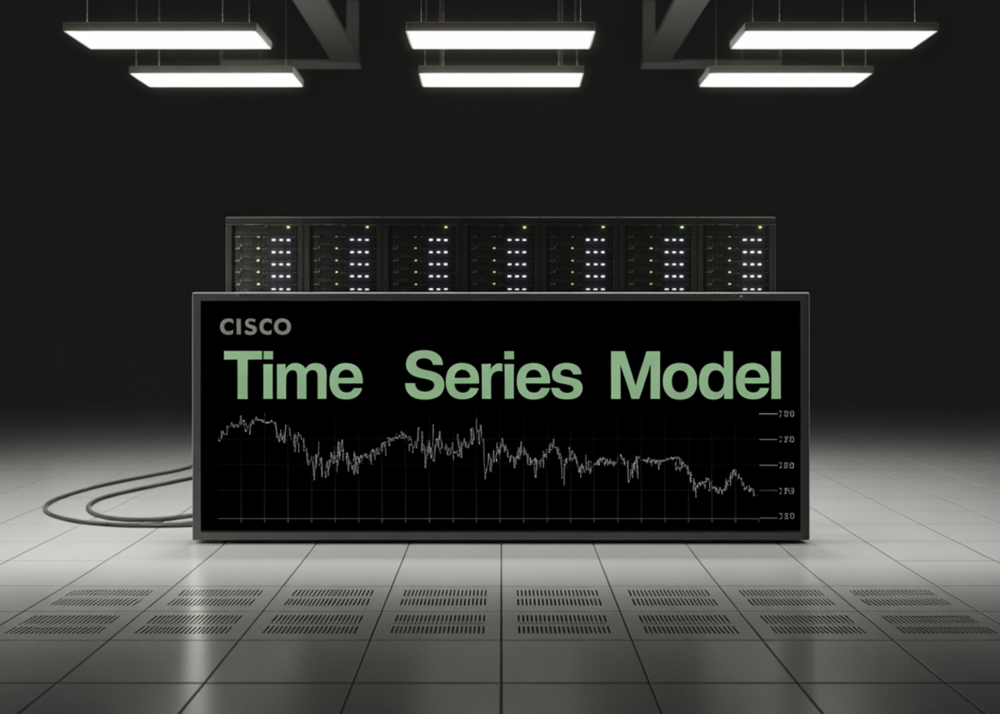

# Cisco Released Cisco Time Series Model: Their First Open-Weights Foundation Model based on Decoder-only Transformer Architecture

> Cisco and Splunk have introduced the Cisco Time Series Model, a univariate zero shot time series foundation model designed for observability and security metrics. It is released as an open weight checkpoint on Hugging Face under an Apache 2.0 license, and it targets forecasting workloads without task specific fine tuning. The model extends TimesFM 2.0 […]

Cisco and Splunk have introduced the **Cisco Time Series Model**, a univariate zero shot time series foundation model designed for observability and security metrics. It is released as an open weight checkpoint on Hugging Face under an Apache 2.0 license, and it targets forecasting workloads without task specific fine tuning. The model extends TimesFM 2.0 with an explicit multiresolution architecture that fuses coarse and fine history in one context window.

*https://arxiv.org/pdf/2511.19841*

### Why observability needs multiresolution context?

Production metrics are not simple single scale signals. Weekly patterns, long term growth and saturation are visible only at coarse resolutions. Saturation events, traffic spikes and incident dynamics show up at 1 minute or 5 minute resolution. The common time series foundation models work at a single resolution with context windows between 512 and 4096 points, while TimesFM 2.5 extends this to 16384 points. For 1 minute data this still covers at most a couple of weeks and often less.

This is a problem in observability where data platforms often retain only old data in aggregated form. Fine grained samples expire and survive only as 1 hour rollups. Cisco Time Series Model is built for this storage pattern. It treats coarse history as a first class input that improves forecasts at the fine resolution. The architecture operates directly on a multiresolution context instead of pretending that all inputs live on a single grid.

*https://arxiv.org/pdf/2511.19841*

### Multiresolution input and forecasting objective

Formally, the model consumes a pair of contexts, (xc, xf). The coarse context (x_c) and the fine context (x_f) each have length up to 512. The spacing of (xc) is fixed at 60 times the spacing of (xf). A typical observability setup uses 512 hours of 1 hour aggregates and 512 minutes of 1 minute values. Both series terminate at the same forecast cut point. The model predicts a horizon of 128 points at the fine resolution, with a mean and a set of quantiles from 0.1 to 0.9.

### Architecture, TimesFM core with resolution embeddings

Internally, Cisco Time Series Model reuses the TimesFM patch based decoder stack. The inputs are normalized, patched into non overlapping chunks, and passed through a residual embedding block. The transformer core consists of 50 decoder only layers. A final residual block maps tokens back to the horizon. The research team remove positional embeddings and instead rely on patch ordering, the multiresolution structure and a new resolution embedding to encode structure.

Two additions make the architecture multiresolution aware. A special token, often called ST in the report, is inserted between the coarse and fine token streams. It lives in sequence space and marks the boundary between resolutions. Resolution embeddings, often called RE, are added in model space. One embedding vector is used for all coarse tokens and another for all fine tokens. Ablation studies in the paper show that both components improve quality, especially in long context scenarios.

The decode procedure is also multiresolution. The model outputs mean and quantile forecasts for the fine resolution horizon. During long horizon decoding, newly predicted fine points are appended to the fine context. Aggregates of these predictions update the coarse context. This creates an autoregressive loop in which both resolutions evolve together during forecasting.

*https://arxiv.org/pdf/2511.19841*

### Training data and recipe

Cisco Time Series Model is trained by continued pretraining on top of TimesFM weights. The final model has 500 million parameters. Training uses AdamW for biases, norms and embeddings, and Muon for the hidden layers, with cosine learning rate schedules. The loss combines mean squared error on the mean forecast with quantile loss over the quantiles from 0.1 to 0.9. The team trains for 20 epochs and picks the best checkpoint by validation loss.

The dataset is large and skewed toward observability. The Splunk team reports about 400 million metrics time series from their own Splunk Observability Cloud deployments, collected at 1 minute resolution over 13 months and partly aggregated to 5 minute resolution. The research team states that the final corpus contains more than 300 billion unique data points, with about 35 percent 1 minute observability, 16.5 percent 5 minute observability, 29.5 percent GIFT Eval pretraining data, 4.5 percent Chronos datasets and 14.5 percent synthetic KernelSynth series.

### Benchmark results on observability and GIFT Eval

The research team evaluate the model on two main benchmarks. The first is an observability dataset derived from Splunk metrics at 1 minute and 5 minute resolution. The second is a filtered version of GIFT Eval, where datasets that leak TimesFM 2.0 training data are removed.

On observability data at 1 minute resolution with 512 fine steps, Cisco Time Series Model using a 512 multiresolution context reduces mean absolute error from 0.6265 for TimesFM 2.5 and 0.6315 for TimesFM 2.0 to 0.4788, with similar improvements in mean absolute scaled error and continuous ranked probability score. Similar gains appear at 5 minute resolution. Across both resolutions, the model outperforms Chronos 2, Chronos Bolt, Toto and AutoARIMA baselines under the normalized metrics used in the paper.

On the filtered GIFT Eval benchmark, Cisco Time Series Model matches the base TimesFM 2.0 model and performs competitively with TimesFM-2.5, Chronos-2 and Toto. The key claim is not universal dominance but preservation of general forecasting quality while adding a strong advantage on long context windows and observability workloads.

*https://arxiv.org/pdf/2511.19841*

### Key Takeaways

- Cisco Time Series Model is a univariate zero shot time series foundation model that extends the TimesFM 2.0 decoder only backbone with a multiresolution architecture for observability and security metrics.

- The model consumes a multiresolution context, with a coarse series and a fine series, each up to 512 steps long, where the coarse resolution is 60 times the fine resolution, and it predicts 128 fine resolution steps with mean and quantile outputs.

- Cisco Time Series Model is trained on more than 300B data points, with more than half from observability, mixing Splunk machine data, GIFT Eval, Chronos datasets and synthetic KernelSynth series, and it has about 0.5B parameters.

- On observability benchmarks at 1 minute and 5 minute resolutions, the model achieves lower error than TimesFM 2.0’s, Chronos and other baselines, while retaining competitive performance on the general purpose GIFT Eval benchmark.

---

Check out the **[Paper](https://arxiv.org/pdf/2511.19841), [Blog](https://www.splunk.com/en_us/blog/artificial-intelligence/introducing-the-cisco-time-series-model.html)** and **[Model Card on HF](https://huggingface.co/cisco-ai/cisco-time-series-model-1.0-preview)**. Feel free to check out our **[GitHub Page for Tutorials, Codes and Notebooks](https://github.com/Marktechpost/AI-Tutorial-Codes-Included)**. Also, feel free to follow us on **[Twitter](https://x.com/intent/follow?screen_name=marktechpost)** and don’t forget to join our **[100k+ ML SubReddit](https://www.reddit.com/r/machinelearningnews/)** and Subscribe to **[our Newsletter](https://www.aidevsignals.com/)**. Wait! are you on telegram? **[now you can join us on telegram as well.](https://t.me/machinelearningresearchnews)**
