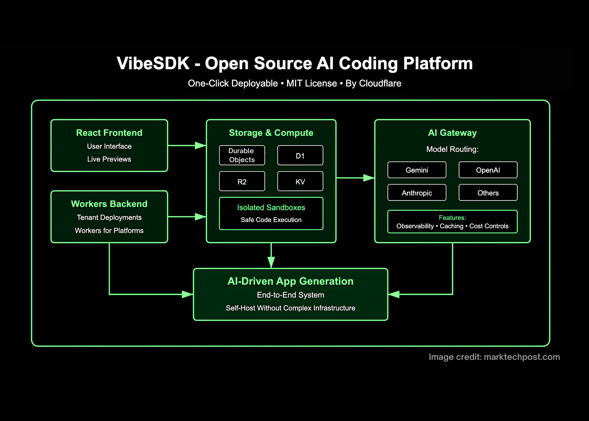

# CloudFlare AI Team Just Open-Sourced ‘VibeSDK’ that Lets Anyone Build and Deploy a Full AI Vibe Coding Platform with a Single Click

> CloudFlare AI team just open-sourced VibeSDK, a full-stack “vibe coding” platform that you can deploy end-to-end with a single click on Cloudflare’s network or GitHub Repo Fork. It packages code generation, safe execution, live preview, and multi-tenant deployment so teams can run their own internal or customer-facing AI app builder without stitching together infrastructure. What’s […]

CloudFlare AI team just open-sourced **[VibeSDK](https://github.com/cloudflare/vibesdk?tab=readme-ov-file)**, a full-stack “vibe coding” platform that you can deploy end-to-end with a single click on Cloudflare’s network or GitHub Repo Fork. It packages code generation, safe execution, live preview, and multi-tenant deployment so teams can run their own internal or customer-facing AI app builder without stitching together infrastructure.

### What’s actually in the box?

**VibeSDK **is a production-oriented reference implementation, not a toy UI. The repo (MIT-licensed) ships a React+Vite front end, Workers back end with Durable Objects for agent coordination, D1 (SQLite) via Drizzle, R2 for template storage, KV for sessions, and a “Deploy to Cloudflare” flow. It integrates Cloudflare Sandboxes/Containers for isolated builds and previews, and uses Workers for Platforms to publish each generated app as an isolated Worker with its own URL.

*https://blog.cloudflare.com/deploy-your-own-ai-vibe-coding-platform/*

### How code moves through the system?

- A user describes the app; the agent generates files and writes them into a per-user sandbox.

- The sandbox installs deps and starts a dev [server](https://www.marktechpost.com/2025/08/08/proxy-servers-explained-types-use-cases-trends-in-2025-technical-deep-dive/); the SDK exposes a public preview URL.

- Logs/errors stream back to the agent for iterative fixes.

- A deployment sandbox runs `wrangler deploy` to publish the app into a Workers-for-Platforms dispatch namespace, giving each app its own tenant-isolated Worker.

### Models and routing

By default, VibeSDK uses Google’s Gemini 2.5 family for planning, codegen, and debugging, but all LLM calls go through **Cloudflare AI Gateway**. That enables unified routing across providers (OpenAI/Anthropic/Google/etc.), response caching for common requests, per-provider token/latency observability, and cost tracking. Swapping or mixing models is a config choice, not an architectural rewrite.

*https://blog.cloudflare.com/deploy-your-own-ai-vibe-coding-platform/*

### Safety and multitenancy

The design assumes untrusted, AI-generated code: every build runs in an isolated container or sandbox with fast start, controlled egress, and preview URLs; production deployment is multi-tenant by design (per-app Worker isolation, usage limits, and optional outbound firewalling). This model scales to “thousands or millions” of user apps without cross-tenant access.

### Is it really one click—and can I take my code to GitHub or my own account?

The Cloudflare provides a [live demo ](https://blog.cloudflare.com/deploy-your-own-ai-vibe-coding-platform/)and a one-click deploy button. Once running, users can export generated projects to their own Cloudflare account or a GitHub repo for continued development—useful if you want to move work off the hosted instance or bring your own CI.

### Why should platform teams care about “vibe coding” now?

“Vibe coding” shifts effort from hand-coding to supervising generative agents. VibeSDK hardens that pattern with a concrete, reproducible architecture: safe code execution, preview feedback loops, and cheap global deployment. For companies exploring AI builders for customers or internal teams, this replaces a weeks-to-months integration project with a baseline platform you can fork and specialize. For context, Cloudflare also documents the approach as a formal reference architecture so you can swap pieces (e.g., containers vs. sandboxes) without losing the system’s guarantees.

*https://marktechpost.com/*

### Summary

Cloudflare’s VibeSDK turns “vibe coding” from demo to deployable substrate: a one-click stack that routes LLM calls through AI Gateway, executes AI-generated code in isolated sandboxes/containers, and publishes tenant-scoped [Cloudflare Workers](https://www.cloudflare.com/developer-platform/products/workers/) via Workers for Platforms; paired with project export and a formal reference architecture, it gives teams a reproducible path to ship AI app builders without re-inventing the runtime or safety model.

---

Check out the **[Technical details](https://blog.cloudflare.com/deploy-your-own-ai-vibe-coding-platform/)** and **[GitHub Page](https://github.com/cloudflare/vibesdk?tab=readme-ov-file)**. Feel free to check out our **[GitHub Page for Tutorials, Codes and Notebooks](https://github.com/Marktechpost/AI-Tutorial-Codes-Included)**. Also, feel free to follow us on **[Twitter](https://x.com/intent/follow?screen_name=marktechpost)** and don’t forget to join our **[100k+ ML SubReddit](https://www.reddit.com/r/machinelearningnews/)** and Subscribe to **[our Newsletter](https://www.aidevsignals.com/)**.

**For content partnership/promotions on marktechpost.com, please [TALK to us](https://calendly.com/marktechpost/marktechpost-promotion-call)**
